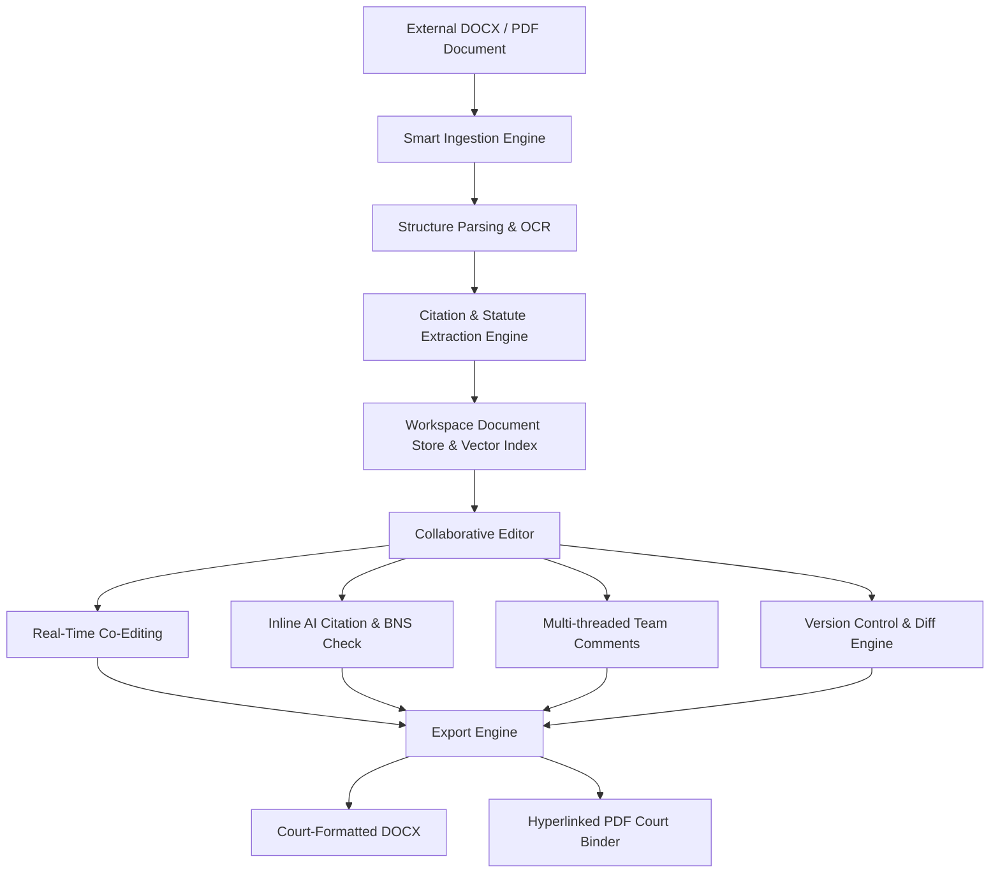
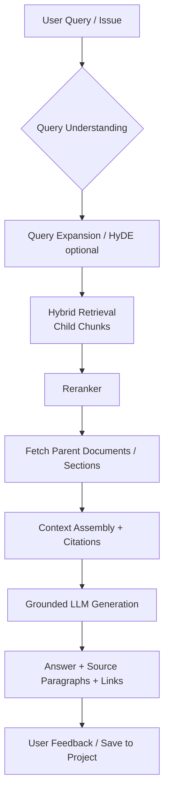
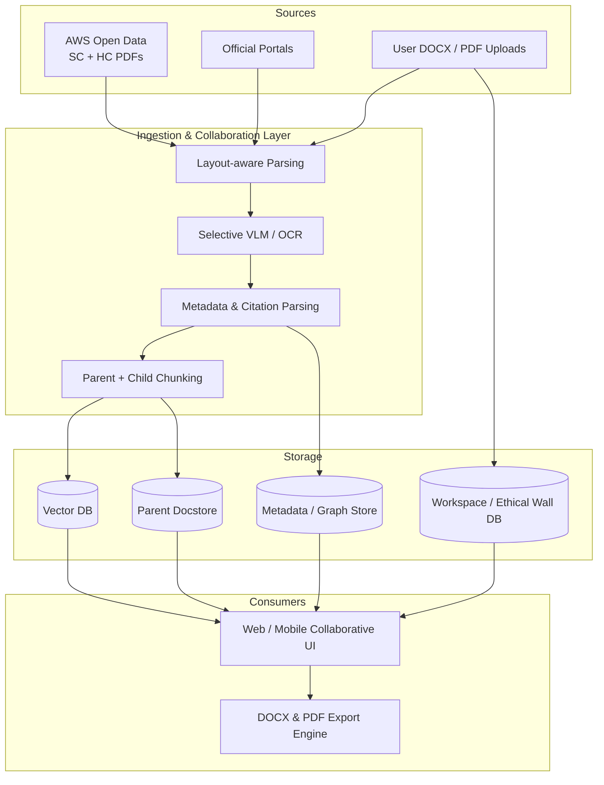

# Requirements Document  
## AI-Powered Legal Research & Practice Support Platform  
### Focus: Indian Judiciary (Judgments, Case Law, Practice Workflows)

**Document Version:** 1.6  
**Date:** 07 August 2026  
**Status:** Updated Draft (Added Team Sharing, Collaborative Review Comments, Version History, Word/PDF Import-Export & Differentiation vs Google Drive/SharePoint)  
**Domain:** Indian Legal Profession (Litigation, Research, Advisory)

---

## 1. Purpose & Scope

This document captures functional and non-functional requirements for an **AI-native legal platform** centred on high-quality retrieval and analysis of Indian court judgments (Supreme Court, High Courts, and selected District/State court material), combined with practical workflows for different roles in the legal profession.

The system leverages advanced RAG techniques (including parent-child / small-to-big retrieval, hybrid search, metadata enrichment, and grounded generation) to deliver precise, citation-backed answers rather than generic summaries.

**Primary Goal:** Become the most accurate and context-rich judgment research layer for Indian law while remaining complementary to official systems (eCourts / NJDG) and established research databases (SCC Online, Manupatra, Indian Kanoon).

**Out of Scope (Phase 1):** Full case management system, e-filing, accounting, or replacement of official court portals.

### 1.1 Key Product Decisions

| Decision Area | Choice |
|---------------|--------|
| **Corpus Priority** | High Courts + State/District courts are mandatory. Scope sequenced by effort and volume. Also support **B2C research mode without LLMs** (pure hybrid/keyword search + structured extracts + filters). |
| **Primary Users (MVP)** | Solo practitioners and small firms first. Larger firms later (higher revenue potential). |
| **Business Model** | All three planned: Freemium (B2C + light professional), Seat-based (firms), API / Enterprise. |
| **Data Strategy** | Prefer public / open datasets and official portals. Avoid expensive commercial eCourts data feeds for historical bulk. |
| **Languages** | Indic language support increases scope. Prefer **translation-as-a-service** rather than full native multilingual RAG from day one. |
| **Priority Practice Areas** | **Constitutional** and **Criminal** first. |
| **Collaboration & Interoperability** | Built-in legal-native collaboration (Ethical walls, AI-verified comments, Word/PDF import/export) positioned to outperform generic cloud drives (Google Drive / SharePoint). |

---

## 2. User Personas

User would be able to register and login as the following user types:

| Persona | Description | Primary Needs |
|---------|-------------|---------------|
| **1. Paralegal / Law Clerk / Legal Researcher** | Supports advocates with research, drafting, case preparation, and document organisation | Fast, accurate precedent finding; structured extracts; citation verification; bulk research; DOCX import/export |
| **2. Lawyer / Advocate** (Junior → Senior / Partner) | Handles client cases, arguments, opinions, strategy | Deep ratio analysis, distinguishing cases, argument mapping, draft assistance with grounded inline comments & history |
| **3. Law Firm Administrator / IT Admin** | Manages firm subscriptions, user seats, ethical walls, and workspace security policies | Role management, security auditing, client case isolation, compliance enforcement |
| **4. Other Stakeholders** | • Judicial Officers / Judges<br>• Law Students & Academics<br>• In-house Counsel / Corporate Legal<br>• Litigants (self-represented) / Knowledge Managers | Quick reliable research, teaching aids, risk assessment, collaborative case folders, accessible explanations |

**MVP Focus:** Solo/small-firm lawyers + paralegals + B2C researchers (non-LLM mode).

---

## 2.1 What Each User Can Do (Simple Language)

This section explains the platform in everyday terms from the point of view of the people who will use it.

### A Paralegal / Law Clerk should be able to:

- Search for relevant judgments quickly using normal English questions (not only exact keywords).
- Filter results by court, year, judge, case type, or law/section mentioned.
- See the important parts of a judgment clearly (parties, issues, what the court decided, and the final order) without reading the full 50–100 pages every time.
- Get the surrounding context of any important paragraph so the meaning is clear.
- Save research into folders or projects for each case.
- Export clean lists of cases with proper citations (including parallel citations across SCC, AIR, and Neutral Citations) into Word (.docx) or PDF, and generate court-ready compilation index tables.
- Import Word (.docx) drafts from advocates and automatically extract citations and section tags.
- Check whether a case has been followed, distinguished, or overruled later.
- Work on many research questions at once and keep everything organised.
- Use the system without needing advanced technical knowledge.

### A Lawyer / Advocate should be able to:

- Ask research questions in plain language and get answers that always show the exact source paragraph from the judgment.
- Perform fast mobile courtroom lookups on smartphones during live court hearings.
- Share draft petitions and research briefs with team members, controlling who can view, comment, or edit.
- Leave multi-threaded review comments linked to specific paragraphs, with AI automatically checking if referenced citations are still valid.
- View step-by-step version history with full side-by-side diffs to see changes made by junior advocates or senior partners.
- Quickly find cases that support or go against a particular legal point.
- Distinguish one case from another and see the key differences.
- Upload their own case papers and research only within that case.
- Import Word documents from clients or opposing parties and instantly highlight potential legal risks or invalid citations.
- Export finalized drafts to Word (.docx) or PDF matching exact Indian High Court / Supreme Court margin and typography guidelines.
- Get help preparing a first draft of a synopsis, list of dates, issues, or written submissions formatted to standard Indian court filing templates — with every point linked to a real judgment.
- Automatically bridge older criminal precedents (IPC / CrPC / IEA) to current statutory provisions (BNS / BNSS / BSA).
- See how a particular judge or bench has decided similar issues in the past (presented carefully and factually).
- Continue a research conversation over multiple turns without losing earlier context.
- Switch between a simple search mode (no AI answers) and a deeper AI-assisted mode when needed.
- Trust that the system will say “not enough material” instead of making up citations.

### A Law Firm Administrator / Compliance Admin should be able to:

- Set up ethical walls between team practice groups to prevent conflict-of-interest document sharing.
- Audit all document view, edit, export, and comment activities for regulatory compliance.
- Manage guest access permissions for external Senior Counsel or client in-house teams, ensuring external users are strictly limited to View/Comment permissions (No Edit access) and validated via organization OAuth email authentication.
- Enforce DLP (Data Loss Prevention) rules prohibiting unencrypted exports of sensitive client cases.

### A Law Student or Academic should be able to:

- Search and read judgments easily for assignments and research papers.
- See how a legal principle has developed over time through key cases.
- Get simple explanations of complex judgments when needed.
- Download or cite cases correctly for academic work in DOCX or PDF.

### An In-house Counsel or Corporate Legal team should be able to:

- Quickly check the strength of a legal position using past judgments.
- Keep internal notes and opinions in a private, searchable space with enterprise-grade data isolation guarantees.
- Collaborate with external advocates via shared project folders with granular permission controls and track changes.
- Review draft submissions prepared by external counsel using inline AI-verified comments.
- Share relevant authorities with external counsel in a clean format.

### A Litigant or Member of the Public (B2C) should be able to:

- Search judgments using simple language without any legal training (with automatic layperson-to-legal query expansion).
- Find and read the main points of a case without paying for AI answers (free non-AI research mode).
- Instantly view 1-sentence verdict outcome status tags (e.g., `[Bail Granted]`, `[Petition Dismissed]`).
- Understand the basic outcome and reasoning of a judgment in clearer language when available.
- Download or share the judgment link easily.

### A Judicial Officer (read-only view) should be able to:

- Search and read judgments for reference during or after hearings.
- View a dedicated **Precedent Validity Timeline** showing how higher Benches have treated a precedent over time.
- Use the system only for research — not for generating arguments or drafts against the court.

---

## 2.2 Locked-In User Journeys (Pre-Implementation Baseline)

For complete end-to-end user journey flows, UI interaction paths, outcomes, and permission boundaries, refer to the dedicated specification:  
📁 [USER_JOURNEYS_BELLA_PARALEGAL_AND_JOHN_LAWYER.md](file:///Users/vivekjain/projects/enterprise-llm-gateway/epic/legal_platform_stories/USER_JOURNEYS_BELLA_PARALEGAL_AND_JOHN_LAWYER.md)

### Key Journey Summary:

1. **Bella (Paralegal) Journeys**:
   - **J0: Case Workspace Creation & Team Access Setup**: Initializes `Case C-2026-089` (`State v. Ram Sharma`), configures metadata, assigns RBAC roles (`@John` Owner, `@Bella` Editor), executes firm conflict check, and provisions folder structure.
   - **J1: Fast Hybrid Search & Structured Extraction**: Executes non-LLM searches with court/judge filters, expands parent chunks, extracts ratio decidendi, and saves items to Case Folders.
   - **J2: Word (.docx) Ingestion & Citation Parsing**: Uploads `.docx` briefs, resolves automated citation health checks (`🟢 Good Law` vs `🔴 Overruled`), converts IPC sections to BNS/BNSS equivalents, and `@mentions` team members.
   - **J3: Court Binder Compilation & PDF Export**: Selects brief + 6 judgments, configures Supreme Court / High Court margin/header templates, auto-generates paginated hyperlinked Index Tables, and exports court-ready PDF binders.

2. **John (Lawyer / Partner) Journeys**:
   - **J1: Grounded Conversational AI & Distinguishing Precedents**: Asks complex legal questions with paragraph-anchored citations, triggers "Distinguish Precedent" side-by-side comparative grids, and appends analysis directly to active petition drafts.
   - **J2: Mobile Courtroom Mode**: Performs 3-second low-bandwidth mobile lookups during live hearings, displaying large-font binding ratio extracts and citation validity badges.
   - **J3: Collaborative Review, Visual Diff & Filing Export**: Reviews inline comments, compares draft versions via side-by-side visual diff, approves revision snapshots (`v2.0`), and exports Supreme Court filing-compliant `.docx` files.

---

## 3. Functional Requirements

Requirements are grouped by persona where relevant, then cross-cutting features.  
Each requirement includes:

- **Criticality**: High / Medium / Low  
- **Effort**: Low / Medium / High (implementation effort)  
- **Technical Complexity**: Low / Medium / High  
- **Reasoning**: Why it matters

### 3.1 Requirements for Paralegals / Law Clerks / Legal Researchers

| ID | Requirement | Criticality | Effort | Tech Complexity | Reasoning |
|----|-------------|-------------|--------|-----------------|-----------|
| P-01 | Semantic + Hybrid search over full judgment corpus with filters (Court, Year, Bench, Judges, Case Type, Statutes cited, Outcome keywords) | High | Medium | Medium | Core value. Keyword-only tools miss conceptual matches; hybrid + rich metadata dramatically improves recall of relevant authorities. |
| P-02 | Parent-Child (Small-to-Big) retrieval: retrieve precise child chunks, return coherent parent sections (facts + issues + reasoning + holding) | High | Medium | Medium-High | Prevents fragmented answers. Critical for legal text where ratio spans multiple paragraphs. |
| P-03 | Structured extraction: Parties, Issues framed, Ratio decidendi, Holdings, Statutes applied, Precedents followed/distinguished, Final order | High | High | High | Saves hours of manual reading. Enables downstream drafting and knowledge bases. |
| P-04 | Citation network & “followed / distinguished / overruled” mapping | High | High | High | Essential for understanding precedential strength. Differentiates from plain full-text search. |
| P-05 | Bulk research mode: upload list of issues / questions → ranked judgments + extracts | Medium | Medium | Medium | High productivity for juniors preparing briefs. |
| P-06 | Export to Word (.docx) / PDF with proper citations, footnoting, and paragraph anchors | Medium | Low | Low | Daily workflow requirement. |
| P-07 | Saved research projects / folders with notes and tags | Medium | Medium | Low-Medium | Organises ongoing cases. |
| P-08 | Parallel Citation Converter & Compilation Index Generator: Auto-resolve SCC, AIR, and Neutral Citations; export ready-to-print court binder index tables | High | Medium | Low-Medium | Essential for paralegals preparing physical/digital court compilations for hearings. |

### 3.2 Requirements for Lawyers / Advocates

| ID | Requirement | Criticality | Effort | Tech Complexity | Reasoning |
|----|-------------|-------------|--------|-----------------|-----------|
| L-01 | Conversational research with strict grounding (every claim linked to judgment paragraph) | High | Medium | Medium-High | Trust is paramount. Hallucinated citations destroy credibility in court. |
| L-02 | “Distinguish this case” / “Find authorities supporting / opposing this proposition” workflows | High | Medium | Medium | Core advocacy skill support. |
| L-03 | Argument map generation from a set of judgments (pro / con / neutral) | Medium | High | High | Helps structure written submissions and oral arguments. |
| L-04 | Draft assistance (synopsis, list of dates, issues, written submissions) formatted to Indian court filing templates | Medium | High | High | Accelerates drafting while maintaining accountability and compliance with court rules. |
| L-05 | Judge / Bench analytics (past decisions on similar issues, tendency) | Medium | High | High | Strategic value, especially in High Courts and Supreme Court. Must be presented carefully and factually. |
| L-06 | Integration with user’s own case files / uploaded PDFs for case-specific research | High | Medium | Medium | Moves from general research to case-specific intelligence. |
| L-07 | Multi-turn research sessions with memory of previous queries and selected authorities | Medium | Medium | Medium | Natural research flow. |
| L-08 | Mobile Courtroom Mode: Fast mobile-optimized lookup interface for quick courtroom verification during hearings | High | Medium | Medium | Enables advocates to verify citations or address judge queries live in court. Target: search results in a few seconds on typical mobile networks. |

### 3.3 Requirements for Other Stakeholders

| ID | Requirement | Criticality | Effort | Tech Complexity | Reasoning |
|----|-------------|-------------|--------|-----------------|-----------|
| O-01 | Simplified / plain-language explanations of judgments (toggle) | Medium | Medium | Medium | Useful for litigants, students, and junior staff. |
| O-02 | Teaching / academic mode: key principles, evolution of doctrine, landmark case timelines | Medium | Medium | Medium | Strong value for law schools and judicial academies. |
| O-03 | Risk / precedent strength indicators (how often followed, recent treatment) | Medium | High | High | Helps in-house counsel and senior advocates assess strength of position. |
| O-04 | Personal knowledge base: users can upload and index their own notes, opinions, and internal memos | Medium | Medium | Medium | Turns the platform into a firm-wide or personal second brain. |
| O-05 | Read-only / restricted views suitable for judicial officers (no drafting of arguments against the court) | Low | Low | Low | Ethical and professional boundary. |
| O-06 | Layperson Query Expansion & 1-Sentence Outcome Tags (`Bail Granted`, `Petition Dismissed`) | Medium | Low-Medium | Low-Medium | Makes B2C search accessible to non-lawyers without legal jargon barrier. |
| O-07 | Collaborative Shared Case Workspaces: Shared project folders with role-based access for in-house counsel and external advocates | Medium | Medium | Medium | Enables corporate teams to collaborate seamlessly with external litigation counsel. |
| O-08 | Precedent Validity Timeline for Judges: Visual graph mapping whether a precedent has been followed, distinguished, or overruled by larger Benches | High | High | High | Core verification tool for judicial officers ensuring reliance on binding precedent. Must carry clear non-authoritative disclaimer. |

### 3.4 Cross-Cutting / Platform Requirements

| ID | Requirement | Criticality | Effort | Tech Complexity | Reasoning |
|----|-------------|-------------|--------|-----------------|-----------|
| C-01 | High-quality PDF ingestion pipeline (layout-aware, header/footer cleaning, OCR where needed) for Indian judgments | High | High | High | Foundation. Poor extraction = poor retrieval. |
| C-02 | Rich metadata extraction & enrichment at ingest (Court, Citation, Judges, Date, Case Type, Acts, Bench Strength, etc.) | High | High | High | Enables powerful filtering and hybrid search. |
| C-03 | Hybrid search (Dense vector + BM25 / sparse) with tunable fusion (RRF preferred) | High | Medium | Medium | Combines semantic understanding with exact citation / statute matching. |
| C-04 | Reranking stage (cross-encoder or legal-specialised) with Bench Strength weighting | High | Medium | Medium | Significantly improves precision of top results and enforces binding precedent hierarchy. |
| C-05 | Grounded answer generation with inline citations and direct links to source paragraphs | High | Medium | Medium | Trust & auditability. |
| C-06 | Audit log of queries and retrieved sources (for professional responsibility) | Medium | Low | Low | Important for firms and ethical use. |
| C-07 | Role-based access and data isolation (especially for firm / uploaded documents) | High | Medium | Medium | Confidentiality requirement. |
| C-08 | Multilingual support via translation-as-a-service (English primary; Hindi + key Indic languages on demand) | Medium | Medium | Medium | Increases reach without forcing full multilingual embedding complexity early. |
| C-09 | API access for integration with practice management tools | Medium | Medium | Medium | Future-proofing and enterprise adoption. |
| C-10 | **B2C Non-LLM Research Mode**: Powerful hybrid search + filters + structured extracts + citation links **without** generative answers | High | Medium | Medium | Explicit product decision. Enables free / freemium public research while reserving generative features for paid tiers. |
| C-11 | **Criminal Law Cross-Mapping Engine (IPC/CrPC/IEA ↔ BNS/BNSS/BSA)** | High | Medium | Medium | Maps queries across post-July 2024 criminal statutes and historical case law precedents. |
| C-12 | **Neutral Citation Normalization & Deduplication Engine** | High | High | High | Unifies SCC, AIR, Scale, and official Neutral Citations into canonical entity IDs. |
| C-13 | **Bench Strength Hierarchy Reranker** | High | Medium | Medium-High | Enforces Article 141 Constitution Bench precedent hierarchy during reranking stage. |
| C-20 | **Legal Domain Endpoint (`/legal`), Canonical Permissions & Global Header** | High | Medium | Medium | Automatically redirects legal domain users to `/legal`, enforces canonical legal permissions (`legal:case:*`, `legal:research:*`, `legal:docx:*`), renders role-tailored landing pages, and displays standardized header (Name, Domain, Firm, Logout). |

---

## 3.5 Team Collaboration, Review & Legal Workspace Engine

This section details the collaborative architecture designed specifically for legal practice, covering sharing, inline review comments, version control history, document interoperability (Word/PDF), and superiority over generic document platforms.

### 3.5.1 C-14 — Team Sharing, Permissions & Ethical Walls

| ID | Feature | Description | Criticality | Effort | Complexity |
|----|---------|-------------|-------------|--------|------------|
| C-14.1 | **Case Workspace Sharing** | Share folders/documents with internal team members (Owner, Editor, Commenter, Viewer). | High | Medium | Medium |
| C-14.2 | **External Guest Collaboration & OAuth Guard** | Secure temporal sharing link for external Senior Advocates / client in-house counsel with mandatory OAuth verification against org email domain. **Strict Rule**: External guests are restricted to **View or Comment-Only** (No Edit permissions permitted). | High | Medium | Medium-High |
| C-14.3 | **Ethical Wall Isolation** | System-enforced access barriers preventing lawyers on conflicting cases within the same firm from seeing restricted workspaces. | High | Medium | High |
| C-14.4 | **Granular Object Permissions** | Restrict access down to specific document sections, research notes, or case compilations. | Medium | Medium | Medium |

### 3.5.2 C-15 — In-Context Legal Review Comments & AI-Assisted Annotations

| ID | Feature | Description | Criticality | Effort | Complexity |
|----|---------|-------------|-------------|--------|------------|
| C-15.1 | **Multi-Threaded Inline Comments** | Highlight text in drafts/judgments and leave nested comments with user `@mentions`. | High | Medium | Low-Medium |
| C-15.2 | **AI Citation Verification Comments** | AI automatically scans user comments & draft paragraphs; inserts warning comment if cited precedent is overruled, distinguished, or misquoted. | High | High | High |
| C-15.3 | **AI Statutory Update Annotations** | Auto-flag draft references to IPC/CrPC/IEA and suggest corresponding BNS/BNSS/BSA sections in review threads. | High | Medium | Medium |
| C-15.4 | **Comment-to-Draft Resolution** | Accept AI or peer suggestions directly into draft body with one click, preserving audit trail. | Medium | Medium | Low-Medium |

### 3.5.3 C-16 — Legal Document History, Track Changes & Audit Trail

| ID | Feature | Description | Criticality | Effort | Complexity |
|----|---------|-------------|-------------|--------|------------|
| C-16.1 | **Real-Time & Snapshot History** | Track all edits per user session with named revision snapshots (e.g. `Draft v1.0 - Client Review`, `Draft v2.0 - Senior Counsel Edits`). | High | Medium | Medium |
| C-16.2 | **Visual Side-by-Side Diff** | Compare any two historical document versions with clear additions, deletions, and moved citation blocks. | High | Medium | Medium |
| C-16.3 | **Regulatory Compliance Audit Log** | Immutable log tracking every view, comment, edit, print, and export event for court/bar compliance. | High | Low-Medium | Low-Medium |
| C-16.4 | **Statutory Alert on Historical Drafts** | Re-analyzes historical drafts when new Supreme Court rulings or amendments occur, highlighting impacted clauses. | Medium | High | High |

### 3.5.4 C-17 — Word (.docx) & PDF Import/Export Engine

| ID | Feature | Description | Criticality | Effort | Complexity |
|----|---------|-------------|-------------|--------|------------|
| C-17.1 | **High-Fidelity Word (.docx) Import** | Upload Word documents, preserving headings, table structure, and footnotes; auto-runs citation parsing on import. | High | High | High |
| C-17.2 | **Court-Ready Word (.docx) Export** | Export drafts into docx with customizable court formatting rules (margins, line spacing, font size, paragraph numbers). | High | Medium | Medium |
| C-17.3 | **Court Compilation PDF Export** | Generate single PDF containing brief, hyperlinked index table, and full-text annexed judgments with pagination stamped. | High | Medium | Medium |
| C-17.4 | **PDF Import with Text OCR & Parsing** | Ingest external PDFs, run OCR if scanned, and extract legal structure for collaborative review. | High | High | High |

### 3.5.5 C-18 — Live Client Meeting Audio Transcription & Case Intake Engine

| ID | Feature | Description | Criticality | Effort | Complexity |
|----|---------|-------------|-------------|--------|------------|
| C-18.1 | **Live Audio Transcription & Diarization** | Capture in-person mic audio or virtual call audio stream in real-time with speaker diarization (Advocate, Paralegal, Client/Prospect). | High | High | High |
| C-18.2 | **Direct Case Workspace Linkage** | Save transcript, audio recording, and AI notes directly into an existing Case Workspace or convert a prospect call into a new Client Intake Case. | High | Medium | Medium |
| C-18.3 | **Legal Entity & Fact Extraction** | Real-time parsing of statutory references, dates, transaction amounts, disputed properties, and key witness names mentioned in dialogue. | High | Medium | High |
| C-18.4 | **Auto-Generated Statement of Facts & Action Items** | Generates structured court-ready "Statement of Facts", "Chronology of Events", and assigned "Action Items" from meeting audio. | High | Medium | Medium |
| C-18.5 | **Mandatory Consent & Attorney-Client Privilege Protection** | Enforces pop-up client consent recording log; applies `[ATTORNEY-CLIENT PRIVILEGED]` metadata tag with zero LLM model retention guarantee. | High | Low-Medium | Medium |

---

### 3.5.6 Differentiators vs. Generic Platforms (Google Drive & SharePoint)

Generic cloud storage tools like Google Drive and Microsoft SharePoint are built for general enterprise documents, not legal practice. The table below highlights how this platform outperforms generic solutions for litigation and legal research workflows:

| Capability | Generic Cloud Drive (Google Drive / SharePoint) | AI Legal Platform (This System) | Value for Legal Teams |
|------------|------------------------------------------------|---------------------------------|-----------------------|
| **Citation Intelligence** | Treats citations as plain text strings. No validity or precedent check. | **Live Citation Grounding**: Auto-checks if cited cases are overruled, distinguished, or bad law in real-time. | Prevents citing bad law in court filings. |
| **Statutory Cross-Mapping** | Unaware of legal law changes (e.g. IPC vs BNS). | **Automatic IPC ↔ BNS Cross-Mapping**: Auto-detects old statutory references in comments/drafts and suggests new codes. | Saves hours of manual section verification. |
| **Review Comments & Annotations** | Generic text comments without legal context or verification. | **AI-Verified Legal Comments**: Comments can auto-retrieve matching judgments, suggest counter-arguments, and link to paragraph anchors. | Senior counsel review is 3x faster with AI-prepopulated case extracts. |
| **Document Structure Awareness** | Generic layout (paragraphs, headings). | **Court Template Awareness**: Understands legal document anatomy (Synopsis, List of Dates, Question of Law, Grounds, Prayer). | Auto-formats to exact Supreme Court & High Court rules. |
| **Confidentiality & Ethical Walls** | Folder/file level ACLs; easily misconfigured; potential AI training on client data. | **Legal Ethical Walls + Strict Zero-Data-Retention Guarantee**: Built-in conflict check isolation; zero training on uploaded client docs. | Compliance with Bar Council & client confidentiality mandates. |
| **Client Meeting Transcription & Intake** | Generic transcription tools (Otter/Zoom) create unindexed text dumps outside legal context. | **Legal AI Client Intake Engine**: Live audio diarization, auto-extracts legal facts/dates, applies `[ATTORNEY-CLIENT PRIVILEGED]` tags, and binds directly to Case Workspaces. | Automates intake summaries and protects legal privilege guarantees. |
| **Import / Export Interoperability** | Basic docx import/export without legal metadata preservation. | **Smart Word (.docx) & PDF Binder Engine**: Auto-extracts citations on docx import; exports ready-to-print court compilations with index tables. | Eliminates manual court binder preparation. |

---

### 3.5.6 UI Wireframes & Collaborative Flow Diagrams

#### Collaborative Legal Editor & AI Review Panel Wireframe

```
+---------------------------------------------------------------------------------------------------------+
| [Back to Case: C-2026-089]   Draft Written Submission - Bail Application (BNS 480)   [Save v1.4]  |
| Mode: [Editing | Track Changes | AI Review]   Share: [Lock - Ethical Wall Active] [Export v] [Print]     |
+--------------------------------------------------+------------------------------------------------------+
| DOCUMENT EDITOR (DOCX / Native)                  | AI REVIEW & COLLABORATIVE COMMENTS PANEL             |
|                                                  |                                                      |
| IN THE HIGH COURT OF JUDICATURE AT BOMBAY        | 🔍 AI Citation Health Check: 2 Warnings              |
|                                                  | ---------------------------------------------------- |
| 1. The Applicant submits that the alleged       | 💬 Comment by Adv. Priya (Senior) - 10:15 AM          |
|    offence under Section 103 of BNS [IPC 302]    | "Check if the parity argument applies here under     |
|    does not attract custodial interrogation...   |  the new BNSS 480 provisions."                       |
|                                                  |   └─ 🤖 AI Assist: "Found 2 matching HC cases:       |
| 2. Reliance is placed on State of UP v. Singh    |      1. ABC v. State (2025) Bom HC [Bail Granted]   |
|    (2018) 4 SCC 120, where the Supreme Court     |      [Insert Citation into Draft] [View Paragraph]"  |
|    held that pre-arrest bail is maintainable...  | ---------------------------------------------------- |
|    └─ ⚠️ [AI Warning: Overruled by 5-Judge       | ⚠️ Citation Warning (Auto-generated by AI):          |
|        Bench in XYZ v. Union (2023) INSC 412]    | "State of UP v. Singh was distinguished in 2023.     |
|                                                  |  Suggested alternative: Ramesh v. State (2024)."     |
| 3. The investigation is complete and charge-...  | ---------------------------------------------------- |
|                                                  | 📜 Version History Snapshot:                         |
|                                                  | • v1.4 (Current) - Edits by Adv. Priya               |
|                                                  | • v1.3 - DOCX Import from Client (10 Aug 2026)      |
|                                                  | • v1.0 - Initial Draft by Law Clerk                  |
|                                                  |   [Compare v1.3 with v1.4 (Side-by-Side Diff)]       |
+--------------------------------------------------+------------------------------------------------------+
| Export Options: [Export to DOCX (Court Standard)] [Export PDF Compilation with Indexed Annexures]      |
+---------------------------------------------------------------------------------------------------------+
```

#### Collaborative Document & Import/Export Pipeline



---

### 3.5.7 Architectural Impact & Systems Analysis

Adding collaborative team sharing, real-time comment threads, version diffing, and DOCX/PDF interoperability impacts core architectural subsystems:

1. **Document Storage & Chunking**:
   - Private user/matter collections require distinct tenant/workspace encryption keys (`KMS`).
   - Imported DOCX documents are dynamically chunked into Parent-Child structures to allow both paragraph-level inline comments and RAG context retrieval.
2. **Real-time Synchronization Engine**:
   - WebSockets / CRDT (Conflict-free Replicated Data Types) operational transforms for real-time multi-user editing and comment typing.
3. **Citation Verification Worker**:
   - Background event listener triggers upon comment addition or paragraph modification, running vector lookup against the Citation Normalization Engine (C-12) to verify citation status.
4. **Data Isolation & Ethical Wall Enforcement**:
   - Database queries filter by `tenant_id`, `workspace_id`, and `ethical_wall_group_id`. No cross-tenant metadata leakage permitted.

---

## 3.6 Requirements for Statutory Cross-Mapping Engine (C-11)
*(IPC / CrPC / IEA ↔ BNS / BNSS / BSA)*

#### Purpose
After the criminal law overhaul (1 July 2024), lawyers and paralegals routinely need to move between the old codes (IPC, CrPC, Indian Evidence Act) and the new codes (Bharatiya Nyaya Sanhita, Bharatiya Nagarik Suraksha Sanhita, Bharatiya Sakshya Adhiniyam). The system must make this bridge reliable, transparent and conservative.

#### Scope (Phase-wise)

| Phase | What is delivered | Priority | Notes |
|-------|-------------------|----------|-------|
| **Phase 1 (MVP)** | Core offence and procedure mapping for the most frequently cited sections in Constitutional & Criminal practice | Must-Have | Official correspondence tables + human-reviewed high-frequency sections |
| **Phase 2** | Broader coverage of remaining sections, including split/merged offences and procedural changes | Should-Have | Still requires review for non-1:1 mappings |
| **Phase 3** | Transitional case handling (offence under old law, proceedings under new law, or mixed) + versioned mapping history | Could-Have | Advanced |

#### Functional Behaviour
- User can search or filter using either old or new section numbers.
- Results and structured extracts show clear “Corresponding to …” badges (e.g. “IPC 302 ↔ BNS 103”).
- When a mapping is not 1:1 (section split, merged, or substantially re-worded), the system shows a short explanatory note and links to both provisions.
- Generative answers that rely on a mapped section must cite both the historical judgment and the current statutory provision where relevant.
- Mapping data is versioned; users can see “Mapping last reviewed: [date]”.

---

## 3.7 Neutral Citation Normalisation & Deduplication Engine (C-12)

#### Purpose
Indian judgments are cited in multiple incompatible styles (SCC, AIR, Scale, official Neutral Citations such as INSC / High Court neutral formats, older volume-based citations, etc.). The same judgment frequently appears under several strings. The system needs a single canonical identity for each judgment and reliable parallel-citation lookup.

#### Phased Delivery

| Phase | Deliverable | Effort | Complexity | Target |
|-------|-------------|--------|------------|--------|
| **Phase 1** | Internal Canonical Judgment ID (UUID) assigned to every ingested judgment | Medium | Medium | MVP |
| **Phase 2** | Ingest and store all citation strings found in source data; basic parallel-citation lookup | Medium | Medium | MVP / early post-MVP |
| **Phase 3** | Normalisation rules + deduplication (merge records that are the same judgment) | High | High | Should-Have |
| **Phase 4** | Robust bi-directional converter (user types any common citation → system returns canonical record + all known parallel citations) | High | High | Should-Have / later |
| **Phase 5** | Confidence scoring, manual review queue for ambiguous matches, coverage dashboard | Medium | Medium | Later |

---

## 4. Non-Functional Requirements

- **Accuracy & Grounding**: All generative answers must be traceable to source text. Prefer “I don’t know / insufficient material” over hallucination.
- **Latency**: Interactive search results < 3–5 seconds under normal load; full grounded answer < 15–20 seconds. Mobile courtroom lookups prioritise fast first results. Real-time collaborative comment sync < 200ms.
- **Scalability**: Support growth to tens of millions of judgment pages and thousands of concurrent firm workspaces.
- **Security & Privacy**: Encryption at rest and in transit; clear data retention policy; zero-data-retention for uploaded client documents; strict ethical wall enforcement.
- **Availability**: 99.5%+ for research functions.
- **Compliance**: Alignment with professional conduct rules, Bar Council guidelines, and emerging AI guidelines for the legal profession in India.

---

## 5. Data Acquisition Strategy & Court Prioritisation

### 5.1 Recommended Primary Sources (Cost-Effective)

| Source | Coverage | License / Access | Recommendation |
|--------|----------|------------------|----------------|
| **AWS Open Data – Indian High Court Judgments** | ~17.8M judgments from 25 High Courts (1950–present) | CC-BY-4.0, public S3 (no credentials) | **Primary bulk source** for HCs |
| **AWS Open Data – Indian Supreme Court Judgments** | SC from 1950–present (English + regional) | CC-BY-4.0, public S3 | **Primary bulk source** for SC |
| Official Judgment Search Portal | High Court judgments | Free public (`judgments.ecourts.gov.in`) | Incremental / recent + gap fill |
| Supreme Court official portals | SC judgments | Free public | Authoritative recent + validation |

### 5.2 High Court Judgment Volume Distribution (for Data Spiking Priority)

| Rank | High Court | Approx. Judgments | % of Total HC Corpus | Priority Recommendation |
|------|------------|-------------------|----------------------|-------------------------|
| 1 | Punjab & Haryana | 1.84M | **~10.4%** | Tier-1 (spike first) |
| 2 | Bombay | 1.77M | **~10.0%** | Tier-1 |
| 3 | Patna | 1.69M | **~9.5%** | Tier-1 |
| 4 | Allahabad | 1.69M | **~9.5%** | Tier-1 |
| 5 | Madras | 1.66M | **~9.3%** | Tier-1 |
| 6 | Rajasthan | 1.09M | **~6.1%** | Tier-2 |
| 7 | Telangana | 1.04M | **~5.9%** | Tier-2 |
| 8 | Kerala | 1.04M | **~5.8%** | Tier-2 |
| 9 | Karnataka | 0.95M | **~5.3%** | Tier-2 |
| 10 | Orissa | 0.79M | **~4.4%** | Tier-2 |

**Key Insight:** The **top 5 High Courts alone account for ~48–50%** of the available judgment volume.

---

## 6. Technical Choices for PDF / OCR Extraction & Structured Data

Three realistic options exist for turning judgment PDFs into clean text + structured fields.

| Option | Approach | Pros | Cons | When to Prefer |
|--------|----------|------|------|----------------|
| **A. Frontier / Cloud VLMs** | GPT-4o, Claude, Gemini for OCR + structured extraction | Highest accuracy on complex layouts | Cost scales with volume | Prototyping & quality benchmarking |
| **B. Commercial eCourts / paid feeds** | Buy structured or cleaned data | Potentially ready-to-use | Expensive | Only if open sources fail |
| **C. Local / Self-hosted VLMs** | Llama 3.2 Vision, Qwen2.5-VL (7B/11B) | Privacy & full data control | GPU infrastructure effort | Production bulk processing |

---

## 7. Functionality Flow Diagrams

### 7.1 Core Research Flow (Paralegal / Lawyer)



---

## 8. High-Level Data Flow Overview



---

## 9. Competitive Landscape & Differentiation

| Platform | Strengths | Limitations | How This System Differentiates |
|----------|-----------|-------------|-------------------------------|
| **Google Drive / SharePoint** | Generic cloud file sharing, basic real-time comments | No legal domain knowledge, no citation checks, no statutory mapping, risk of AI training on client files | **Built specifically for legal workflows**: Live AI citation checks, automatic IPC↔BNS mapping, ethical walls, court-ready DOCX/PDF export. |
| **SCC Online / Manupatra** | Editorial headnotes, large corpus | Traditional keyword search, expensive, no real-time team co-editing or DOCX AI review | Modern AI RAG + grounded collaborative editor + lower cost freemium tiers. |
| **Indian Kanoon** | Free, large full-text | Basic keyword search; no team collaboration, no Word export | Deep AI analysis, team workspaces, grounded draft assistant, export to DOCX/PDF. |

---

## 10. Prioritisation Summary (Revised v1.6)

**Must-Have (MVP):**
- C-01, C-02, C-03, C-05, C-10 (B2C non-LLM mode)
- **C-11 Phase 1** (IPC/CrPC ↔ BNS/BNSS criminal section mapping)
- **C-12 Phase 1–2** (Canonical Judgment ID & parallel citation storing)
- **C-14 Phase 1** (Basic team workspace sharing & role-based access)
- **C-15 Phase 1** (Inline comment threads with manual `@mentions`)
- **C-16 Phase 1** (Revision history & snapshot restore)
- **C-17 Phase 1** (Standard DOCX & PDF export, DOCX import with citation parsing)
- P-01, P-02, P-06, P-07, L-01, L-06
- Data: SC + Top-5 High Courts

**Should-Have (next wave):**
- C-14 Phase 2 (Ethical wall conflict isolation & guest links)
- C-15 Phase 2 (AI-driven citation verification comments & BNS alerts)
- C-16 Phase 2 (Side-by-side visual diff tool & compliance audit log)
- C-17 Phase 2 (Hyperlinked PDF court binder compilation with index tables)
- P-03, P-04, P-08, L-02, L-04, L-08, O-06, O-07

**Could-Have / Later:**
- C-15 Phase 3 (Automated multi-party resolution workflows)
- C-16 Phase 3 (Statutory update alert on 5+ year old historical drafts)
- L-03, L-05, O-08 (Precedent validity timeline for judges)

---

## 11. Service Quality & Security Risks

| Risk | Who is affected | Failure Mode | Impact | Mitigation |
|------|-----------------|--------------|--------|------------|
| **Citation Breakage in DOCX Import** | Lawyers | User imports DOCX with custom citation styles that fail to parse | High | Flexible regex parsing + fallback to manual citation mapping UI. |
| **Concurrent Edit Conflicts** | Co-editing team | Two lawyers edit same paragraph simultaneously leading to lost text | High | Operational Transform / CRDT concurrency control with automatic conflict resolution. |
| **Ethical Wall Leakage** | Law firms | Misconfigured permission allows lawyer on opposing side to view case workspace | Critical | System-level database policy checks (Row-Level Security) with mandatory audit logging. |
| **False AI Citation Warning on Comment** | Advocates | AI incorrectly flags valid judgment as overruled in review comment | Medium | Conservative confidence threshold; display "Verify treatment" instead of authoritative warning. |
| **Formatting Loss on DOCX Export** | Paralegals | Court submission exported to DOCX loses required court margin/spacing | Medium | Strict XML template engine matching official Indian High Court style guides. |

---

## 12. Open Items & Next Steps

### Remaining Questions
1. Should external advocates / client guests have edit permissions or comment/view-only permissions by default?
2. For Word document import, should auto-parsing run AI citation extraction synchronously on upload or asynchronously in background?
3. Confirm exact legal retention guidelines for ethical wall access logs.

### Immediate Next Actions
1. **Data spike**: Download and quality-assess SC + Top-5 HC samples from AWS Open Data.
2. **Extraction bake-off**: Compare frontier VLM vs Qwen2.5-VL / Llama 3.2 Vision on a stratified sample.
3. Prototype DOCX import parser with citation extraction against Indian court petition templates.
4. Prototype inline AI citation check on comment creation.

---

**Document Owner:** Product / Engineering  
**Last Updated:** 07 August 2026 (v1.6 – Added Team Sharing C-14, AI Review Comments C-15, Version Control C-16, Word/PDF Engine C-17, and Differentiators vs Google Drive / SharePoint)

*This is a living document.*
