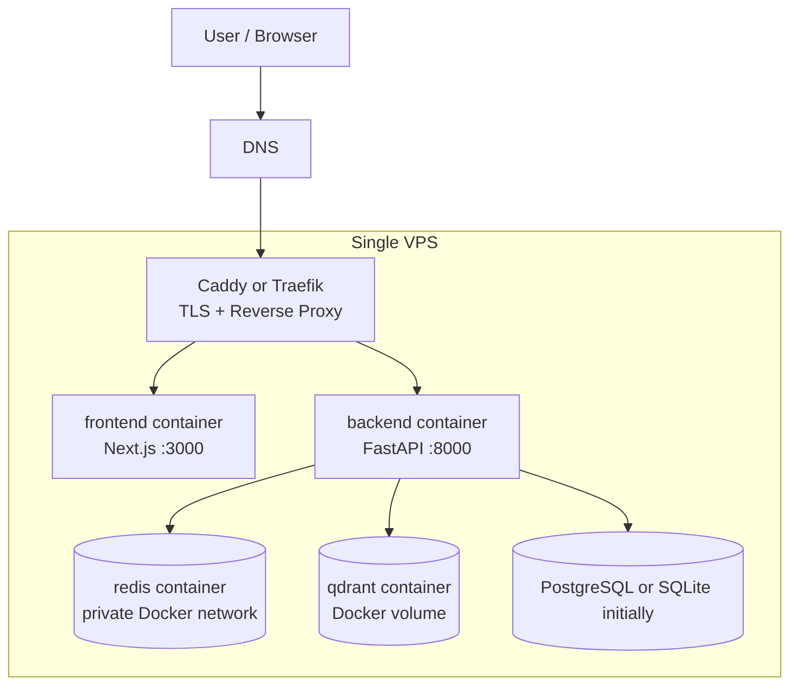

# Cheaper Alternatives to AWS ECS Deployment

## Document Metadata
* **Document ID:** DEPLOY-COST-001
* **Title:** Cheaper Hosting Options Compared to AWS ECS
* **Status:** Draft
* **Version:** 1.0.0
* **Reviewed On:** 2026-07-05
* **Related Plan:** `epic/deployment_plan_aws_ecs.md`

---

## 1. Executive Recommendation

For the Enterprise LLM Gateway, the cheapest practical path is:

1. **Development / demo / early staging:** single VPS with Docker Compose.
2. **Low-cost production-lite:** DigitalOcean App Platform or DigitalOcean Droplet + managed database.
3. **Cleaner managed PaaS:** Render, if paying a little more is acceptable for simpler ops.
4. **Keep AWS ECS:** only when enterprise AWS controls, VPC integration, IAM, compliance, or scale requirements justify the higher operational and service cost.

Recommended starting choice:

> Use **DigitalOcean Droplet + Docker Compose** for the first low-cost deployment, then move the database to managed PostgreSQL when persistence and reliability become important.

This matches the current repo because `docker-compose.yml` already defines the runtime topology: `backend`, `frontend`, `redis`, and `qdrant`.

---

## 2. Why AWS ECS Is Costlier for This Project

AWS ECS Fargate itself is usage-based, but a production ECS architecture usually adds several fixed or semi-fixed services:

* Application Load Balancer
* NAT Gateway, if tasks are in private subnets and need outbound internet
* RDS PostgreSQL
* ElastiCache Redis/Valkey
* CloudWatch logs and metrics
* ECR storage
* VPC networking and data transfer
* Optional EFS for Qdrant persistence

AWS remains the strongest option for enterprise governance, but for an early-stage deployment the supporting services can cost more than the app containers.

---

## 3. Workload Assumptions

Current containers:

| Component | Requirement |
|:--|:--|
| Backend | FastAPI container, port `8000`, Python dependencies, Redis, DB, optional LLM provider |
| Frontend | Next.js container, port `3000`, public app URL and backend URL |
| Redis | Cache and workflow trace storage |
| Qdrant | Vector database storage |
| Database | Currently SQLite by default; production should move to PostgreSQL |

Cost-sensitive assumption:

* 1-2 developers/admin users
* low to moderate traffic
* no strict HA requirement on day one
* acceptable manual operations for first deployment

---

## 4. Option Comparison

| Option | Approx Monthly Cost | Fit | Pros | Cons |
|:--|:--|:--|:--|:--|
| Single VPS + Docker Compose | Low, often under `$20-$40` before backups/domain | Best cheapest path | Uses existing compose, simplest migration, predictable bill | You manage patching, backups, security, monitoring |
| DigitalOcean Droplet + managed DB later | Low to moderate | Best cost/control balance | Cheap compute, can add managed PostgreSQL gradually | Still more ops than PaaS |
| DigitalOcean App Platform | Low to moderate | Best cheap managed app platform | Container support, HTTPS, scaling, simple deploys | Stateful Redis/Qdrant still need design; can get expensive with multiple containers |
| Railway | Low startup cost | Great for prototypes | Very fast deploys, Dockerfile support, built-in volumes/databases | Less ideal for regulated production; usage-based bill needs guardrails |
| Render | Moderate | Best managed PaaS simplicity | Docker support, private services, managed Postgres, Redis-compatible KV | Workspace plan + compute can be more than DO/Railway |
| Fly.io | Low to moderate | Good for edge/global apps | Machines, private networking, volumes | More platform-specific operations; managed data story needs planning |
| AWS ECS | Moderate to high | Best enterprise architecture | IAM, VPC, auditability, service ecosystem | Higher baseline complexity and cost |

---

## 5. Recommended Low-Cost Architecture

### Initial Deployment Shape

* One VPS with 2-4 vCPU and 4-8 GB RAM.
* Docker Compose runs all services.
* Caddy or Traefik terminates HTTPS.
* Redis and Qdrant are not publicly exposed.
* Backend and frontend are exposed only through reverse proxy.
* Backups go to S3-compatible object storage.

### Upgrade Path

1. Move SQLite to PostgreSQL on the same VPS.
2. Move PostgreSQL to managed database.
3. Move Redis to managed Redis/KeyDB/Valkey if trace volume grows.
4. Move Qdrant to Qdrant Cloud or a separate VPS with backups.
5. Move to AWS ECS only when HA, compliance, or enterprise controls are required.

---

## 6. Provider-Specific Evaluation

### 6.1 DigitalOcean Droplet

Best for the cheapest practical deployment.

DigitalOcean Droplets have simple fixed pricing. The official pricing page lists basic droplets starting at low monthly prices, including `512 MiB / 1 vCPU` and `1 GiB / 1 vCPU` tiers. For this app, a more realistic starting point is a larger droplet because backend dependencies, Next.js, Redis, and Qdrant will be memory hungry.

Recommended shape:

* 1 Droplet: 2 vCPU / 4 GB RAM or larger
* Docker Compose
* Caddy or Traefik
* Docker volumes for Redis/Qdrant
* Nightly volume/database backup

Use this when:

* You want the lowest bill.
* One-region deployment is acceptable.
* Manual operations are acceptable.

Avoid this when:

* You need high availability.
* You need managed backups and point-in-time recovery from day one.
* You do not want to maintain the server OS.

### 6.2 DigitalOcean App Platform

Best for low-cost managed app hosting.

DigitalOcean App Platform supports container deployment and starts paid container instances at low monthly prices. It also provides HTTPS, scaling, metrics, log forwarding, and rollbacks.

Suggested shape:

* Frontend container service
* Backend container service
* Managed database or external PostgreSQL
* External Redis-compatible cache
* Qdrant Cloud or separate Qdrant host

Tradeoff:

* Easier than VPS.
* More expensive than a single VPS once every component becomes its own service.
* Better operational experience than raw Docker Compose.

### 6.3 Railway

Best for fastest prototype deployment.

Railway has a low minimum usage model and Dockerfile support. It is attractive for quick demos because it can host several services with minimal setup.

Use this when:

* You need something working quickly.
* You are okay with usage-based billing.
* This is not yet a strict production environment.

Avoid this when:

* You need mature network isolation and compliance controls.
* You need highly predictable production operations.

### 6.4 Render

Best for managed simplicity.

Render supports Docker services, private services, managed PostgreSQL, and Redis-compatible key-value storage. It is a clean fit for teams that want fewer infrastructure decisions.

Use this when:

* You prefer PaaS over managing a VPS.
* You want managed Postgres and Redis-like services in the same platform.
* You can accept a higher baseline monthly cost than VPS.

Avoid this when:

* Absolute minimum cost is the primary goal.
* You want full control over networking and runtime.

### 6.5 Fly.io

Best for global/edge container deployment.

Fly.io is attractive when latency across regions matters. It can run Dockerized apps and offers private networking and volumes.

Use this when:

* You expect users across regions.
* You want lightweight VM-style container deployment.

Avoid this when:

* You want the simplest managed database/cache story.
* You prefer fewer platform-specific deployment concepts.

---

## 7. Estimated Cost Bands

These are planning bands, not quotes.

| Deployment Shape | Expected Monthly Band | Notes |
|:--|:--|:--|
| Single VPS, all containers | `$20-$50` | Cheapest usable path. Add backup storage separately. |
| VPS + managed PostgreSQL | `$40-$90` | Better persistence with still-low cost. |
| DigitalOcean App Platform | `$40-$120+` | Depends on container sizes and managed dependencies. |
| Railway prototype | `$10-$80+` | Usage-based; set spend limits. |
| Render managed PaaS | `$80-$200+` | Higher but simpler production operations. |
| AWS ECS production | `$150-$400+` | Can exceed this with NAT, RDS, ElastiCache, logs, egress, HA. |

---

## 8. Cost-Optimized Migration Plan

### Phase 1: Cheapest Working Deployment

1. Provision a VPS.
2. Install Docker and Docker Compose.
3. Add Caddy or Traefik reverse proxy.
4. Deploy existing `docker-compose.yml` with production env files.
5. Restrict public ports to `80` and `443`.
6. Add daily backups for:
   * app database
   * Redis dump if traces must persist
   * Qdrant storage
7. Add uptime monitoring.

### Phase 2: Production-Lite Hardening

1. Move from SQLite to PostgreSQL.
2. Add DB migrations.
3. Add managed PostgreSQL or backup-tested self-hosted PostgreSQL.
4. Add explicit CORS origins.
5. Move secrets out of plain `.env` files where possible.
6. Add log rotation and disk alerts.

### Phase 3: Managed Services

1. Move Redis to managed Redis/Valkey if reliability matters.
2. Move Qdrant to Qdrant Cloud or a dedicated server.
3. Add blue/green deploy scripts.
4. Add restore drills.

### Phase 4: AWS Reconsideration

Move to AWS ECS when one of these becomes true:

* enterprise customer requires AWS hosting
* strict IAM, VPC, audit, or compliance requirements appear
* multi-AZ high availability is required
* traffic justifies managed autoscaling
* the team wants infrastructure-as-code and platform governance over lowest cost

---

## 9. Required App Changes for Any Cheaper Option

These are also useful for AWS:

1. Add `/health` endpoint to backend.
2. Fix frontend Dockerfile health check by installing `curl` or using a Node health check.
3. Add production `.dockerignore` files.
4. Replace wildcard CORS with environment-specific origins.
5. Move production DB from SQLite to PostgreSQL.
6. Add backup/restore scripts.
7. Ensure Redis/Qdrant are private-only and not exposed to the internet.

---

## 10. Final Recommendation

Choose **single VPS + Docker Compose** now if the main goal is cheaper than AWS.

Recommended starting layout:

* Provider: DigitalOcean, Hetzner, Akamai/Linode, or similar VPS provider
* Size: 2 vCPU / 4 GB RAM minimum; 4 vCPU / 8 GB RAM preferred if Qdrant is active
* Runtime: Docker Compose
* Proxy: Caddy or Traefik
* Database: PostgreSQL preferred; SQLite acceptable only for demos
* Cache: Redis container initially
* Vector DB: Qdrant container with persistent volume initially
* Backups: nightly encrypted backups to object storage

This gives the lowest monthly cost while preserving a clean migration path to DigitalOcean App Platform, Render, or AWS ECS later.

---

## 11. Pricing Sources Reviewed

* AWS Fargate pricing: https://aws.amazon.com/fargate/pricing/
* AWS ElastiCache pricing: https://aws.amazon.com/elasticache/pricing/
* DigitalOcean App Platform pricing: https://www.digitalocean.com/pricing/app-platform
* DigitalOcean Droplet pricing: https://www.digitalocean.com/pricing/droplets
* Render pricing: https://render.com/pricing
* Railway pricing: https://railway.com/pricing
* Fly.io pricing: https://fly.io/pricing
* Hetzner Cloud overview: https://www.hetzner.com/cloud/

