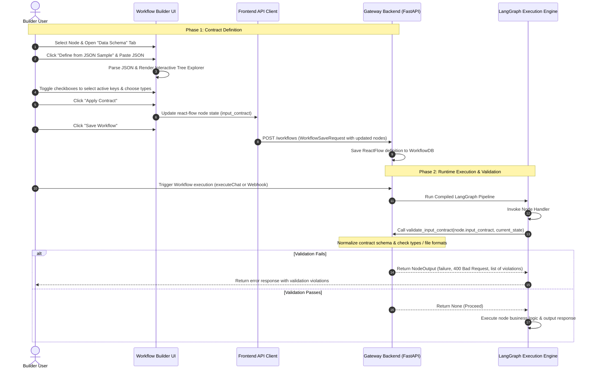

# Epic: Review of Input and Output Contract Definition with Interactive JSON Selector

**Status:** In Progress

---

## 1. Description & Goal

In the Enterprise LLM Gateway, nodes process diverse data payloads. To ensure workflow reliability and prevent runtime crashes, every node requires explicit validation of its incoming data. In the current implementation, input and output contracts are read-only JSON blocks that are hard for developers to construct manually.

This Epic introduces:
1. **Interactive JSON Payload Selector (Frontend):** A visual editor where developers can paste a sample JSON payload (e.g. webhook payloads, LLM outputs, or custom datasets), view it as a hierarchical tree, and toggle checkboxes/types to visually generate the node's input contract.
2. **Support for Simple & Complex Types (Backend & Frontend):** Full schema validation support for simple types (`email`, `phone`, `ip_address`, `url`, `uuid`, `datetime`) and complex binary documents (`pdf`, `doc`, `docx`, `image`, `file`).
3. **Strict Validation Pipeline:** Pre-execution schema checks that automatically halt workflow runs if constraints are violated, aligning our execution reliability with industry leaders like **n8n** and **Zapier**.

---

## 2. User Stories

*   **As a workflow developer,** I want to paste a sample JSON output from a previous node and select which fields are expected in the next step, so that I don't have to manually write JSON schemas.
*   **As a workflow developer,** I want to define specific rules for input fields, such as expecting a valid email, phone number, IP address, or specific file type (e.g., a PDF document), so that bad data is caught early.
*   **As a system administrator,** I want the workflow execution engine to validate incoming data payloads and return clear violation messages if the input contract is violated, preventing downstream node failures.

---

## 3. Key Requirements & Scope

### In-Scope
1. **Visual Schema Generator Modal (Frontend):** Add a modal to the "Data Schema" tab of the node properties panel allowing user-pasted JSON to be parsed, shown in a tree view, and converted to a schema.
2. **Hierarchical Tree Interaction (Frontend):** Support nesting, collapsible folders/objects, type selectors, and required field switches.
3. **Complex Binary Type Validation (Backend):** Update backend contract validation to check `file` type objects (matching both strings and metadata dicts) for extensions and mime-types (`pdf`, `doc`/`docx`, `image`).
4. **Enhanced Data Type Registry:** Register new simple formats (`ip_address`) and complex media formats (`pdf`, `doc`, `image`, `file`) across the schema builder.

### Out-of-Scope (Deferred to Future Roadmap)
*   **Auto-Correction of Mapped Payloads:** Automatically converting types (e.g. converting a string `"100"` to integer `100` if the contract specifies an integer).
*   **Visual XML Schema Generator:** Visual builders for SOAP/XML data inputs.

---

## 4. Sequence Diagram (Data Flow & Validation)

The sequence diagram below visualizes the schema definition and validation lifecycle:

---

## 5. Verification Criteria (Definition of Done)

*   **Interactive Modal:** The visual JSON selector modal successfully parses valid JSON, renders collapsible trees, and generates standard contracts.
*   **Type Coverage:** The schema creator supports simple types (`email`, `phone`, `ip_address`) and complex types (`pdf`, `doc`, `image`, `file`).
*   **Run-Time Validation:** The backend halts execution and returns a `400` status with clear error messages if input fields violate type constraints or file rules.
*   **Unit Tests:** Automate test cases verify email format, IP address matches, and valid/invalid file uploads.
