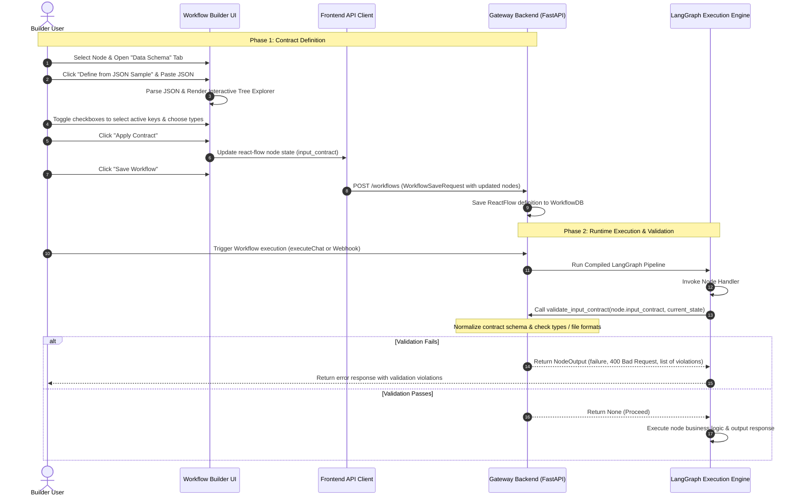

# Technical and Visual Design: Input/Output Contract Definition

This document details the complete technical design, visual UI/UX layout, and runtime execution flow for defining and validating simple and complex types, inspired by **n8n** and **Zapier**.

---

## 1. Data Type Representation (n8n & Zapier Alignment)

In modern workflow builders, data payloads contain both simple primitives and complex file objects. We map these to standard formats under the hood while maintaining a user-friendly field-selection interface.

### Simple Types

Simple types map to standard JSON Schema types with specific semantic formats for validation:

- **String formats**: `email`, `phone`, `ip_address`, `url`, `uuid`, `date`, `datetime`.
- **Numeric primitives**: `integer`, `number` (with min/max boundaries).
- **Boolean & raw JSON**: `boolean`, `json` (generic parsed object).

### Complex Types (Files & Binary Data)

To handle files (like `pdf`, `doc`, `image`), we introduce a custom type alias `file`.
A `file` in the gateway can be passed in two ways:

1. **URI/Path String**: A path to local storage, a remote URL, or a `data:image/png;base64,...` data URI.
2. **Metadata Dictionary**: A structured object containing file info:
   ```json
   {
     "file_path": "path/to/file.pdf",
     "file_name": "report.pdf",
     "mime_type": "application/pdf",
     "size": 10245
   }
   ```
   Both formats are natively resolved and validated against the format specified (e.g. `pdf` checks if the extension is `.pdf` or mime-type is `application/pdf`).

---

## 2. Sequence Diagram (Runtime Flow)

The diagram below represents how contracts are defined in the builder and validated during runtime workflow execution:



---

## 3. Visual UI Design (Wireframe & Layout)

Below is the visual layout design for the interactive **JSON Payload Selector Modal** that will be built using modern, premium aesthetics (dark header, glassmorphism, clean typography, dynamic badge colors).

```
+--------------------------------------------------------------------------------------------------+
|  [Icon] Define Schema from JSON Sample                                                       [X] |
+--------------------------------------------------------------------------------------------------+
| Paste a sample JSON payload below to automatically infer fields, toggle active data elements,   |
| and configure verification types.                                                                |
+--------------------------------------------------------------------------------------------------+
|  RAW JSON SOURCE TEXTAREA                        |  INTERACTIVE SCHEMA GENERATOR & TREE EXPLORER |
|  +--------------------------------------------+  |  +-----------------------------------------+ |
|  | {                                          |  |  | [x] data                   (object)     | |
|  |   "data": {                                |  |  |   |-[x] chunks             (array)      | |
|  |     "chunks": ["hello"],                   |  |  |   |-[x] chunk_count        (integer)    | |
|  |     "chunk_count": 1,                      |  |  |   |-[x] strategy           (string)     | |
|  |     "strategy": "recursive",               |  |  |   |-[x] chunk_size         (integer)    | |
|  |     "chunk_size": 1000,                    |  |  |   \-[x] chunk_overlap      (integer)    | |
|  |     "chunk_overlap": 200                   |  |  | [x] auth_token             (string)     | |
|  |   },                                       |  |  | [x] source_system          (string)     | |
|  |   "auth_token": "token",                   |  |  +-----------------------------------------+ |
|  |   "source_system": "localhost"             |  |  SELECTED FIELD SETTINGS                   | |
|  | }                                          |  |  +-----------------------------------------+ |
|  +--------------------------------------------+  |  | Field Path: data.chunks                 | |
|  | [Icon] Valid JSON Detected                 |  |  | Target Type: [ Array (string)  v ]      | |
|  +--------------------------------------------+  |  | [ ] Required / Mandatory Field          | |
|                                                  |  +-----------------------------------------+ |
+--------------------------------------------------------------------------------------------------+
|                                                           [ Cancel ] [ Generate & Apply Schema ] |
+--------------------------------------------------------------------------------------------------+
```

### Aesthetic Specifications:

1. **Interactive Tree**: Collapsible nested layers with visual guide lines (`|-`, `\-`) and colors matching our categories (indigo/emerald text, soft gray borders).
2. **Dynamic Selection**: Checking a parent object automatically select/deselects children (with manual overrides allowed).
3. **Type Badges**: Pill-shaped badges with custom tailwind gradients (e.g. `bg-purple-50 text-purple-600` for objects/arrays, `bg-blue-50 text-blue-600` for simple strings, and `bg-emerald-50 text-emerald-600` for file types).
4. **Validation Preview**: A live JSON preview pane that updates in real-time as checkboxes are clicked, displaying the actual JSON schema output.

---

## 4. Inferred Contract Schema Output

When the user pastes the example JSON and applies the schema, it generates the following normalized **JSON Schema Contract** that is saved on the node instance:

```json
{
  "type": "object",
  "properties": {
    "data": {
      "type": "object",
      "properties": {
        "chunks": {
          "type": "array",
          "items": { "type": "string" }
        },
        "chunk_count": { "type": "integer" },
        "strategy": { "type": "string" },
        "chunk_size": { "type": "integer" },
        "chunk_overlap": { "type": "integer" }
      },
      "required": ["chunks", "chunk_count"]
    },
    "auth_token": { "type": "string" },
    "source_system": { "type": "string" }
  },
  "required": ["data", "auth_token"]
}
```

---

## 5. Input-to-Output Mapping Protocol (Zapier & n8n Model)

To connect adjacent nodes in the workflow, the output contract from a predecessor node must be mapped to the input contract of the successor node.

### A. The Mapping Interface (Frontend)

When the user maps outputs to inputs:

1. They open the **Field Mapper Modal** (`FieldMapperModal`).
2. The modal displays:
   - **Target Fields (Input)**: Inferred/defined by the successor's `input_contract` (e.g. `data.chunks`, `auth_token`).
   - **Source Fields Popover (Output)**: A dropdown populated by the predecessor's `output_contract` structure.
3. The user selects a source field (e.g. `chunks`), which automatically inserts a Jinja2 template mapping expression:
   - For direct predecessor data: `{{ input_data.data.chunks }}`
   - For cross-node reference: `{{ nodes.node_id.output_key }}`

### B. Mapping Resolution Engine (Backend Runtime)

During execution of a node:

1. The backend loads the node's properties, including `mapping_template` (a JSON dictionary/string defining the mapping).
2. The backend constructs a `render_context` dictionary:
   ```python
   render_context = {
       "data": previous_node_output,
       "input_data": previous_node_output,
       "nodes": all_preceding_node_outputs_dict,
       "context": global_workflow_context,
       "metadata": workflow_metadata
   }
   ```
3. The backend resolves the templates for each mapped property:
   - It iterates through the `mapping_template` dictionary recursively.
   - For each string value containing `{{ ... }}`, it compiles and renders it using `Jinja2` within the `render_context`.
4. The resolved dictionary becomes the node's payload (`inp.data`), which is then validated against B's `input_contract` before execution.
