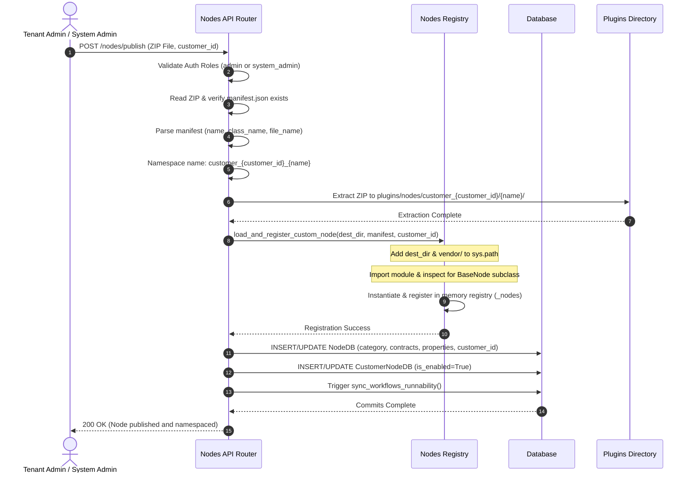
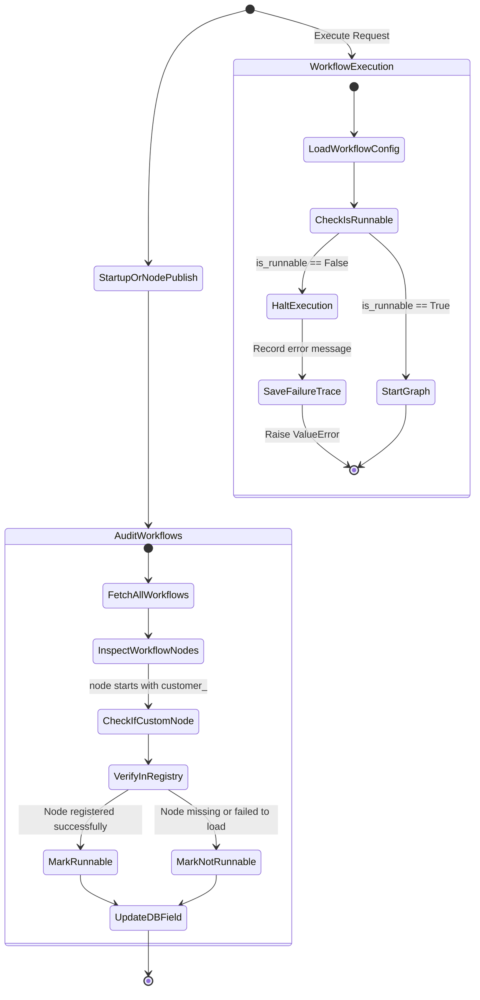

# Epic: Independent Custom Node Publishing & Execution Robustness (Phase 2)

## 1. System Design Goals
This epic outlines the architecture, database schema, security boundaries, and execution robustness policies for Phase 2, allowing customer tenant administrators and system administrators to build, package, upload, and run their own independent, self-contained custom nodes, and unifying this modular plugin model for heavy built-in nodes.

Key Objectives:
- **ZIP-based Node Submissions**: Allow developers to package a custom node inheriting from `BaseNode` along with all its external package dependencies (e.g. within a `vendor` folder inside the archive) in a single ZIP file.
- **Unified Modular Plugin Architecture**: Extend the self-contained directory structure to complex built-in nodes (beginning with `presidio-ner-guard-agent`, which depends on `spacy`). Built-in modules are dynamically loaded from their own isolated subdirectories, shipping with their own requirements and local dependencies to prevent global dependency bloat.
- **Dynamic Loading & Isolation**: Automatically extract, load, and register published nodes dynamically at runtime without restarting the application.
- **Tenant Namespacing**: Isolate custom nodes per customer tenant (using namespaced names such as `customer_{customer_id}_{node_name}`) to prevent namespace collisions and unauthorized execution across tenants.
- **Phase 0 - Absolute Loading Robustness & Safety**: Guarantee that any syntax, import, or runtime errors when loading *any* node (built-in or custom, e.g. spaCy model load issues or missing dependencies) do not crash the backend server on boot or runtime. Instead, the registry registers the load failure, and any workflow referencing the broken node is flagged as `is_runnable = False` in the database, preventing it from executing and generating audit/failure traces.
- **Role-based Publishing Permissions**: Restrict node publishing endpoints to either the specific customer's Tenant Admin (`admin` role) or System Administrators (`system_admin` role).

---

## 2. System Architecture & Diagrams

### A. Sequence Diagram: Publishing a Custom Node
This sequence diagram shows the upload, validation, extraction, dynamic imports registration, and enabling flow of a custom node.



### B. State Diagram: Workflow Runnability Audit and Execution Block
This state diagram details how workflows are audited for missing or broken custom nodes, and how the executor handles execution blocks.



---

## 3. Component Design & Workflow

### A. ZIP Packaging Format & Convention
A custom node must be submitted as a ZIP archive with the following layout:
```
my_custom_node.zip
├── manifest.json
├── main_node.py
└── vendor/
    └── some_dependency_library/
```

#### Manifest Schema (`manifest.json`)
The manifest dictates how the class loader locates and registers the node:
- **`name`**: The base name of the node (alphanumeric and underscores, e.g. `slack_notifier`).
- **`label`**: UI label display name (e.g. `Slack Notifier`).
- **`description`**: Brief details on what the node does.
- **`file_name`**: The python entrypoint file relative to zip root (e.g. `main_node.py`).
- **`class_name`**: The class inside the entrypoint inheriting from `BaseNode` (e.g. `SlackNotifierNode`).
- **`category`**: UI categorization (e.g. `Custom`, `Transform`, `Guardrails`).
- **`icon`**: Tabler/Lucide icon key.
- **`color`**: Hex color string for UI branding.

---

### B. Dynamic Class Loader & Dependency Resolution
When a custom node is published or loaded on startup, the class loader performs the following steps:
1. Adds the directory containing the node file to python's `sys.path`.
2. Inspects if a `vendor/` or `libs/` folder exists under the node's directory and inserts it at position `0` of `sys.path` (giving packaged dependencies precedence over system-wide ones).
3. Dynamically loads the module using standard python import mechanics:
   ```python
   import importlib.util
   import sys
   
   spec = importlib.util.spec_from_file_location(module_name, str(py_file_path))
   module = importlib.util.module_from_spec(spec)
   sys.modules[module_name] = module
   spec.loader.exec_module(module)
   ```
4. Scans the module classes to find the class matching `class_name` that subclasses `BaseNode`.
5. Instantiates the class and overrides its `name` attribute with the namespaced node name.
6. Catches all exceptions (like syntax, import, or instantiation errors) and logs them without crashing the host server.

> [!NOTE]
> **Dependency Resolution Policy**:
> We support two methods for resolving custom node dependencies, keeping the execution runtime isolated and self-contained:
> 
> 1. **Automatic Server-Side Installation (Recommended)**:
>    If the uploaded ZIP file contains a `requirements.txt` or `pyproject.toml` at its root, the server will automatically detect it during the publish phase and install the listed dependencies into the node's local `vendor/` directory using:
>    ```bash
>    pip install -r requirements.txt --target plugins/nodes/customer_{customer_id}/{name}/vendor
>    ```
>    This automates dependency setup upon upload, meaning the developer only needs to upload their source code and definition files.
> 
> 2. **Pre-Vendorized Packages**:
>    The developer can manually package pre-compiled dependencies inside the `vendor/` folder of the ZIP prior to submission. This requires zero network access on the backend server.
> 
> Once installed/present, the class loader injects the `<node_dir>/vendor` path at position `0` of the system path during registration, ensuring node isolation.

---

### C. Database Migration & Schema Alterations
To support multi-tenancy and status tracking, two new columns are introduced:
1. **`customer_id`** (`nodes` table): A nullable integer referencing the customer tenant who owns the node. System-wide nodes will have this set to `NULL`.
2. **`is_runnable`** (`workflows` table): A boolean flag, defaulting to `True`.

On application startup, database initialization runs table inspection and executes `ALTER TABLE` commands if columns are missing.

---

### D. Workflow Runnability Auditor (`sync_workflows_runnability`)
A background synchronization runner performs audits to prevent runtime execution of broken workflows:
1. Queries the manifests under `plugins/nodes/` to build a list of all *intended* custom node names.
2. Retrieves all workflows from the database.
3. For each workflow, inspects its ReactFlow definition's nodes structure.
4. If a workflow references a custom node (starts with `customer_` or exists in the list of intended custom nodes) that is not registered in the active `NodesRegistry._nodes`, the workflow is marked `is_runnable = False` in the database.
5. If all referenced nodes are valid and registered, it is marked `is_runnable = True`.
6. This auditor runs:
   - On application startup (after node auto-discovery completes).
   - On custom node publish success (which might fix a previously broken workflow).

---

### E. Runtime Guard & Trace Logging
During workflow trigger or manual execution:
1. The `WorkflowExecutor` checks `is_runnable` from the workflow config dictionary.
2. If `is_runnable` is `False`, execution immediately halts before the LangGraph compiler compiles the graph.
3. A failure trace is logged in the trace store (`status = "failure"`, `error_message = "Workflow execution halted: Workflow is marked as not runnable due to node loading errors."`), so developers can inspect issues via logs.
4. A `ValueError` is raised, terminating execution cleanly.

---

### F. Built-in Node Modularization (Case Study: `presidio-ner-guard-agent`)
To decouple heavy dependencies from the core application package, built-in nodes that rely on specialized libraries (such as the `presidio-ner-guard-agent` which requires `spacy` and `presidio-analyzer` / `presidio-anonymizer`) are migrated into a matching self-contained plugin subdirectory structure:
- **Directory Layout**:
  ```
  plugins/nodes/built_in/presidio_ner_guard/
  ├── manifest.json
  ├── presidio_ner_guard_agent.py
  └── requirements.txt
  ```
- **Requirements & Local Dependencies Setup**:
  On startup or deployment, if the built-in plugin folder does not contain its dependencies inside `vendor/`, the server executes the same server-side installer:
  ```bash
  pip install -r requirements.txt --target plugins/nodes/built_in/presidio_ner_guard/vendor
  ```
  This installs heavy packages like `spacy` locally to that built-in plugin directory.
- **Phase 0 Startup Robustness**:
  If a heavy library fails to load or import (for example, if the spaCy `en_core_web_sm` model is not downloaded or cannot load), the registry catches this exception and logs a warning. The application boots successfully. Workflows referencing `presidio-ner-guard-agent` are automatically flagged `is_runnable = False` during the startup runnability audit.

---

## 4. API Design & Endpoint Contracts

### A. Publish Custom Node (`POST /nodes/publish`)
Allows Tenant Admins and System Admins to submit ZIP packages.

- **URL**: `/nodes/publish`
- **Method**: `POST`
- **Headers**:
  - `Authorization: Bearer <JWT_TOKEN>`
- **Request Body (Multipart Form)**:
  - `file`: Binary ZIP file content.
  - `customer_id` (Optional, Form Field): Target customer ID (system admin only).
- **Responses**:
  - **`200 OK`**: Custom node registered.
    ```json
    {
      "message": "Custom node published successfully",
      "node_name": "customer_1_slack_notifier"
    }
    ```
  - **`400 Bad Request`**: ZIP structure or manifest validation failed.
    ```json
    {
      "detail": "manifest.json not found in ZIP archive."
    }
    ```
  - **`403 Forbidden`**: Insufficient permissions.

---

### B. List Nodes (`GET /nodes`)
Filters nodes visibility based on the requesting user's customer scope.
- **Rules**:
  - **Standard Users / Tenant Admins**: Can only see global system nodes (`customer_id == NULL`) and their own custom nodes (`customer_id == user.customer_id`).
  - **System Admins**: Can see all registered nodes.

---

### C. Remove Custom Node (`DELETE /nodes/{node_name}`)
Allows Tenant Admins (for their own namespaced nodes) or System Admins to delete custom nodes from the gateway.

- **URL**: `/nodes/{node_name}`
- **Method**: `DELETE`
- **Headers**:
  - `Authorization: Bearer <JWT_TOKEN>`
- **Workflow / Side Effects**:
  1. Verify authorization (System Admin can delete any custom node, Tenant Admin can only delete nodes where `customer_id == user.customer_id`).
  2. Query `NodeDB` and `CustomerNodeDB` to remove database records.
  3. Evict the instance from `NodesRegistry._nodes` memory map.
  4. Delete the corresponding node directory from `plugins/nodes/customer_{customer_id}/{name}/` (or `plugins/nodes/global/{name}/`).
  5. Run `sync_workflows_runnability(db)` to mark all workflows utilizing this deleted node as `is_runnable = False`.
- **Responses**:
  - **`200 OK`**: Custom node deleted.
    ```json
    {
      "message": "Custom node 'customer_1_slack_notifier' has been successfully removed."
    }
    ```
  - **`403 Forbidden`**: User lacks permission or is attempting to delete a node belonging to another tenant.
  - **`404 Not Found`**: Node name is not found or not custom.

---

### D. Get Node Workflow Usage (`GET /nodes/{node_name}/usage`)
Returns the list of all workflows currently dependent on the specified node.

- **URL**: `/nodes/{node_name}/usage`
- **Method**: `GET`
- **Headers**:
  - `Authorization: Bearer <JWT_TOKEN>`
- **Workflow / Database Query**:
  Queries the `workflow_nodes` table joining `workflows` to retrieve all matching records:
  ```sql
  SELECT w.id, w.name, w.is_enabled, w.is_runnable, w.user_id 
  FROM workflows w
  JOIN workflow_nodes wn ON wn.workflow_id = w.id
  WHERE wn.agent_name = :node_name
  ```
- **Responses**:
  - **`200 OK`**: Lists dependent workflows.
    ```json
    {
      "node_name": "customer_1_slack_notifier",
      "usages": [
        {
          "workflow_id": "wf_abc_123",
          "name": "Alert Notification Flow",
          "is_enabled": true,
          "is_runnable": true,
          "owner_id": "user_99"
        }
      ]
    }
    ```
  - **`403 Forbidden`**: Tenant scope validation failed.
  - **`404 Not Found`**: Node name is not found.

---

## 5. Frontend & UI Visual Indicators

To ensure clear visual distinction between system-wide built-in nodes and tenant-uploaded custom nodes, the frontend builder UI will implement the following changes:

### A. Workflow Canvas Node Customizations (`BaseNode.tsx`)
When a node's data indicates it is a custom node (i.e. `name` starts with `customer_` or `customer_id` is present):
1. **Dashed Border Styling**: The node card wrapper will render a `border-dashed` style instead of the standard solid border to indicate custom/customized extension.
2. **"Tenant Custom" Pill/Badge**: An extra indicator badge reading `"Custom"` (with a subtle custom color background) will display next to or inside the header badge.
3. **Corner Avatar Indicator**: A tiny builder/user icon (using Lucide `User` or `Hammer`) will overlay in the upper-right corner of the node card.

### B. Accordion & Node Library Sidebar (`AgentSidebar.tsx`)
1. **Sub-Categorization**: Custom nodes will be grouped in a dedicated accordion section named **"Custom Nodes"** (or dynamically prefixed with "Tenant-specific").
2. **List Badge**: Each item in the search list will have a small badge/icon designating it as a custom-designed node.


