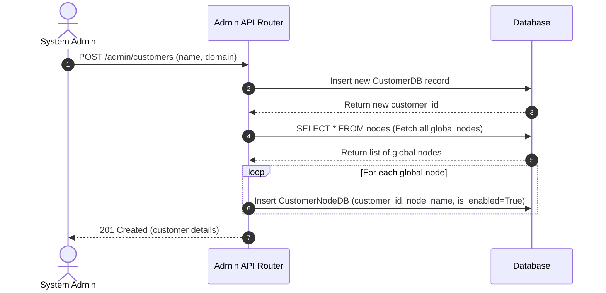
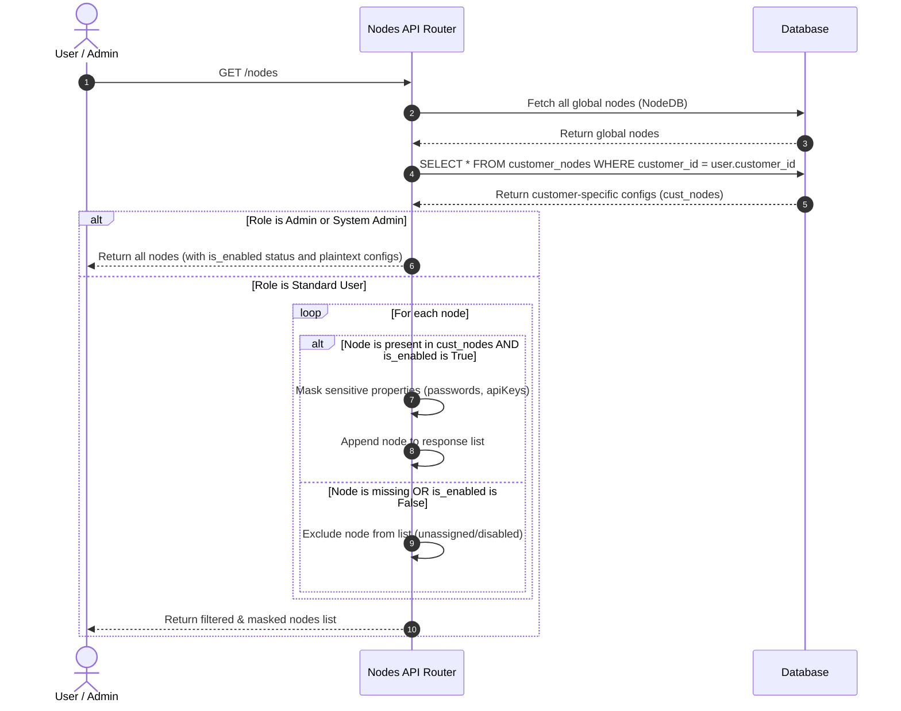
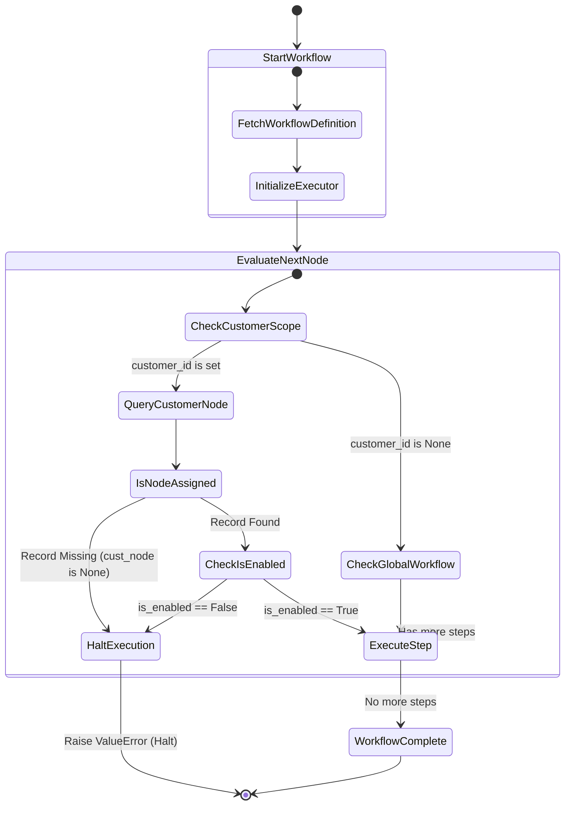
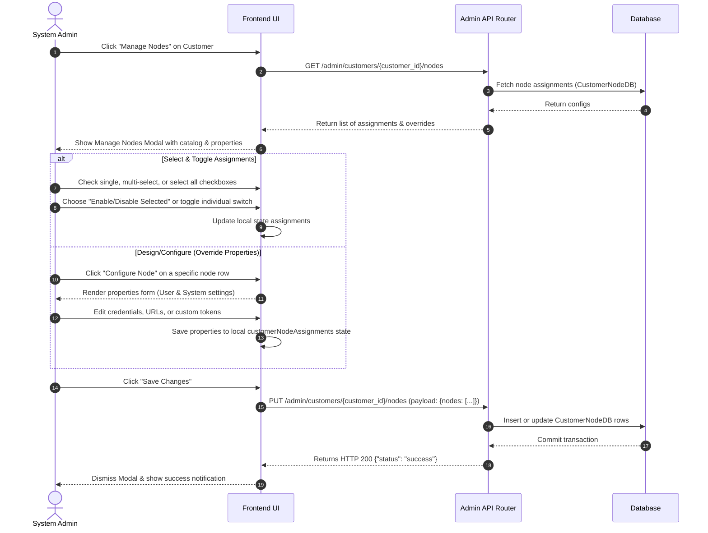

# Epic: Simple Customer Node Assignment & Onboarding Scoping

**Status**: Under Review  
**Target File**: `epic/epic_customer_nodes.md`  

---

## 1. System Design Goals

This document outlines a simplified multi-tenant node management design to address the issue where onboarded users do not see their tenant's assigned nodes. 

Instead of dynamically merging default/fallback configurations at query time, we implement an **explicit assignment model** driven by a simple join table (`customer_nodes`).

A node is considered assigned/enabled for a customer only if there is a corresponding row in the `customer_nodes` table with `is_enabled = True`. If a row is missing, the node is considered **not assigned/disabled** for that customer tenant.

---

## 2. System Architecture Diagrams

### A. Sequence Diagram: Customer Onboarding & Node Copy
This diagram shows the sequence when a new customer tenant is onboarded, registering all current global nodes for them.



### B. Sequence Diagram: Querying Nodes (Admin vs. Standard User)
This diagram shows how nodes are resolved and filtered when queried by different roles under the tenant.



### C. State Diagram: Workflow Executor Runtime Verification
This state diagram details how the Workflow Executor evaluates node enablement states during runtime execution.



---

## 3. Component Design & Workflow

### A. Database Table Design
We utilize the `customer_nodes` table to track the active nodes assigned to each customer tenant:
- **`customer_id`**: Foreign key pointing to `customers.id`.
- **`node_name`**: String key identifying the global node definition (e.g. `generic_llm_agent`, `api_webhook_agent`).
- **`is_enabled`**: Boolean flag indicating if this customer tenant has access to use and configure this node.
- **`properties`**: JSON payload for overrides (credentials, specific endpoints).

### B. Customer Onboarding & Copy Trigger
1. **At Customer Onboarding** (`POST /admin/customers`):
   - When a new customer tenant (e.g. Acme Corp) is onboarded, the system fetches all available global nodes from the `nodes` catalog.
   - For every registered node, a row is inserted into `customer_nodes` for the new `customer_id` with `is_enabled = True` (enabled by default) and an empty properties override dict `{}`.
   - This ensures a complete list of nodes is assigned to the customer immediately on customer onboarding.
2. **At Global Node Registration** (`POST /nodes` or startup sync):
   - **Crucial Rule**: When a new node is added globally, it only gets created in the main `nodes` table. It is **NOT** automatically propagated/inserted into `customer_nodes`.
   - The System Admin can later assign/enable this new node to specific customers through the administration console.

### C. Admin Node Assignment & Design Page
A dedicated administration interface is provided inside the super-admin console (`/admin`, "Customers" tab) to let system administrators selectively configure node eligibility and customize default settings for each tenant.

#### 1. Core UX Elements
*   **Manage Nodes Action**: Each customer row in the Customers table displays a prominent **"Manage Nodes"** action button.
*   **Customer Nodes Modal**: Clicking the button opens a modal overlay specifically branded for that customer tenant (e.g. `Acme Corp Node Control`).
*   **Metrics / Status Bar**: High-level counters display total nodes, total active/enabled nodes, and how many nodes are checked for bulk operations.
*   **Search & Filters**: A real-time filter input allows quick filtering of nodes by name, key, or category.
*   **Grid of Nodes**:
    *   **Bulk Checkboxes**: Checkboxes next to each node allow single, multi-select, or checking the master box ("Select All") at the header.
    *   **Quick Toggle**: A switch button next to each node toggles `is_enabled` on/off immediately.
    *   **Configure Node / "Design" Button**: A gear icon button that opens a secondary panel (within the modal or overlay) to input customer-specific environment variables/properties (e.g. Acme-specific OpenAI API keys or custom Slack webhook URLs).
*   **Bulk Selection Toolbar**:
    *   *Select All* / *Deselect All* checkboxes.
    *   *Enable Selected* / *Disable Selected* buttons, which update states for all checked rows.
    *   *Enable All* / *Disable All* buttons, which update states for every node in the tenant catalog.
*   **Confirmation & Save**: Clicking **"Save Changes"** makes a batch PUT request to update the entire list of nodes and custom configurations.

#### 2. Sequence Diagram: Admin Assign & Design Node Configuration



---

## 4. Evaluation of Disabling a Node on Existing Workflows

If an administrator disables a node (sets `is_enabled = False` in the `customer_nodes` table) that is already used in one or more active workflows, the system behaves as follows:

### A. Impact on Workflow Canvas (Design-Time UI)
- The workflow canvas loads the workflow definition containing the disabled node.
- The node element on the canvas is visually flagged with a **warning state** (e.g. dashed red border and a label "Disabled by Admin").
- The user is blocked from executing manual tests/runs of that specific node from the builder panel.
- Adding *new* instances of this node from the library is disabled.

### B. Impact on Production Execution (Runtime Runner)
- When a workflow is triggered, the `WorkflowExecutor` builds the execution graph.
- Before executing any node's step, the executor queries the `customer_nodes` table.
- If the node is disabled or missing (`is_enabled == False` or `cust_node is None`), the executor **halts execution immediately** and logs a step failure.
- This guarantees that disabled features cannot be bypassed by existing background triggers or scheduled tasks.

---

## 5. Implementation Checklist

- `[ ]` **Database Seed/Trigger**: Write database creation code in `create_customer` (in `backend/app/api/admin/router.py`) to copy all registered nodes to `customer_nodes` upon customer creation.
- `[ ]` **Backend API Scoping**: Ensure `/nodes` router endpoints return nodes based on an explicit `is_enabled == True` check against `customer_nodes`. (Also verify category routers correctly filter based on `cust_node and cust_node.is_enabled` and support `system_admin`).
- `[ ]` **Execution Enforcement**: Update `WorkflowExecutor` to load and check `customer_nodes.is_enabled` before executing any node, raising a runtime error if disabled or missing.
- `[ ]` **Automated Tests**: Write tests in `test_saas.py` verifying that:
  - New customer onboarding automatically populates all nodes as enabled.
  - Disabling a node hides it from standard users.
  - Executing a workflow with a disabled node halts with an error.

---

## 6. Tenant-wide Node Input/Output Contract Customization & Inheritance

To support advanced customization (e.g. custom schemas, custom fields in a vector database query, or specialized request structures), tenants need to configure customer-specific input and output contracts that override global system defaults.

### A. Inheritance Sequence & Merging Order

When a workflow is built, loaded, or executed, the system resolves its nodes' contract schemas in the following order:

```
[System Registry Node (NodeDB)]
            │
            ▼ (Overridden by)
[Tenant Custom Node Configuration (CustomerNodeDB)]
```

1. **System Default Contract**: The system-level base schema stored in the `nodes` catalog (`NodeDB`).
2. **Tenant-wide Override**: If a tenant admin has configured custom input/output contracts (saved in `CustomerNodeDB`), these contracts override the system defaults for all workflows within that tenant.
3. **Workflow-Level Hydration**: The workflow storage engine (`backend/app/workflows/store.py`) merges the tenant-level overrides into the workflow definition at load time, ensuring standard users see the correct tenant-wide contracts on the canvas and in properties mapping dialogs.

### B. Access Control & Hybrid Editing Permissions

To prevent schema drift, secure infrastructure credentials, and protect workflow execution integrity, editing capabilities are scoped by user role:

| Action / Capability | System Admin | Tenant Admin | Standard User |
| :--- | :--- | :--- | :--- |
| Edit Global Node Registry Contracts | **Yes** | No | No |
| Edit Tenant-wide Override Contracts | **Yes** (on behalf of tenant) | **Yes** | No |
| Override core schema structure in workflow | No | No | No |
| Configure `system_properties` (e.g. credentials, endpoints) | **Yes** | No (Read-Only) | No (Read-Only) |
| Configure `user_properties` (e.g. queries, table names) | **Yes** | **Yes** | **Yes** |

#### Property Precedence & Resolution Hierarchy
When resolving the value of any node property at runtime or design-time, the system respects the following precedence order:
```
[Workflow Node Instance Overrides (workflow_node_properties.properties)] (Highest Precedence)
            │
            ▼ (Falls back to)
[Tenant-wide Node Overrides (customer_nodes.properties)]
            │
            ▼ (Falls back to)
[Global Catalog Default Properties (nodes.user_properties / nodes.system_properties)] (Lowest Precedence)
```

- **`system_properties` (Read-only for Admins & Users)**: System-level properties (such as ports, hosts, workers, and database credentials) represent tenant infrastructure settings. They are read-only for customer/tenant administrators and standard users. Only a System Administrator can edit them.
- **`user_properties` (Editable by Admins & Users)**: User-level properties (such as database query types, table names, custom prompt templates, or mapping schemas) can be configured freely by both tenant admins and standard users.
- **Standard User Restrictions**: Standard users are not allowed to change core input or output schemas (contracts) for node instances. Consequently, the `workflow_node_properties` table does NOT contain columns for `input_contract` and `output_contract`. Instead, standard users build workflows adhering strictly to the tenant-wide contracts. If field mapping is required (e.g., matching a dynamic database output to an input), the mapper saves the mappings inside the local instance `properties` (e.g. under `mapping_template`), leaving the contract schema intact.
- **Tenant Admin Capabilities**: Tenant Admins can override the default contract schema for any node allocated to their tenant using the administration panel, which saves the custom JSON schemas directly to `CustomerNodeDB.input_contract` and `CustomerNodeDB.output_contract`. They can also define tenant-wide default values for `user_properties`.

