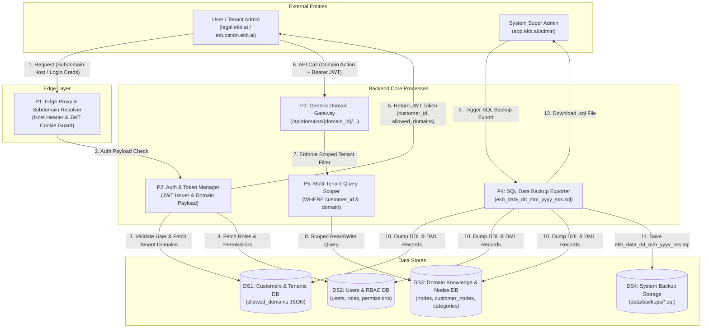

# EPIC: 100% DB-Driven Multi-Domain Multi-Tenanted Platform Architecture

## Core Directive: ZERO HARDCODING
- **No hardcoded domain, route, or tenant logic in frontend or backend code.**
- All domain metadata, UI navigation, search filters, form schemas, workflows, and route bindings must reside in the **Database / Config Tables**.
- System Admin can onboard a new domain (e.g., `legal`, `education`, `healthcare`, `finance`, `retail`) or tenant via Admin Console / DB inserts **with zero code changes or redeployments**.

---

## Architecture Specification

### 1. Database Schema for Dynamic Domains (`domains` Table)
- `DomainDB`:
  - `id`: Unique domain key (e.g. `legal`, `education`, `healthcare`)
  - `name`: Display name (e.g. "Legal AI Platform", "EduLearn AI")
  - `slug`: URL slug / Subdomain key (e.g. `legal`, `education`)
  - `description`: Domain summary
  - `icon`: Icon identifier (e.g. `Briefcase`, `GraduationCap`, `HeartPulse`)
  - `theme_color`: Primary palette token (e.g. `#6366f1`, `#0ea5e9`)
  - `navigation`: Dynamic JSON defining workspace tabs per role (Admin vs User)
  - `capabilities`: JSON defining workflow graph IDs, supported file types, and feature flags
  - `search_schema`: JSON defining search filters, dynamic inputs, and facet options
  - `status`: `active` | `disabled`

### 2. Tenant Mapping (`customers` Table)
- `allowed_domains`: List of enabled domain IDs (e.g. `["legal", "education"]`).
- `settings`: Tenant-specific overrides for domain capabilities, branding, and plan limits.

### 3. Generic Backend Domain Endpoints (Decoupled & Parameterized)
- `GET /api/domains` -> Lists all active domains available to user/tenant.
- `GET /api/domains/{domain_id}/config` -> Returns complete domain manifest (UI navigation, theme, search schemas, enabled actions).
- `POST /api/domains/{domain_id}/search` -> Executes domain-specific search pipeline resolved dynamically from DB capabilities.
- `POST /api/domains/{domain_id}/upload` -> Handles tenant-scoped ingestion based on domain file contracts.
- `POST /api/domains/{domain_id}/action/{action_name}` -> Polymorphic execution of any domain-specific task (e.g., generate brief, evaluate quiz, audit ledger).
- `POST /api/admin/domains` (CRUD) -> System Admin API to onboard/edit domains on the fly.

### 4. Generic Frontend Dynamic Engine (`app/[domain]/page.tsx`)
- Zero domain-specific pages (`/legal`, `/education` all powered by `[domain]`).
- On load, reads `params.domain`, calls `api.getDomainConfig(domain)`.
- Dynamically renders sidebar, role switcher, navigation tabs, file upload dropzones, and search filters driven entirely by the database JSON payload.
- Unified API client (`api.executeDomainAction(domain, action, payload)`).


---

## Impact Analysis
- **Database**: Zero destructive schema changes. `CustomerDB.allowed_domains` JSON column is leveraged for domain routing.
- **Security & Authorization**: Scope permissions and tenant filtering strictly via JWT `customer_id` and RBAC checks.
- **Backwards Compatibility**: Existing `/admin` and `/legal-research` routes remain operational as defaults for system admins and standard users.

---

## Data Flow Diagram (DFD Level 0 & Level 1)



### Process Descriptions

1. **P1 (Edge Proxy & Subdomain Resolver)**: Inspects `Host` header (e.g. `legal.ekb.ai` -> `legal`) and decodes JWT cookies to enforce route level permissions before hitting backend.
2. **P2 (Auth & Token Manager)**: Authenticates credentials against `DS2`, reads allowed domains and subscription tier from `DS1`, and embeds `customer_id`, `allowed_domains`, and `plan_tier` into signed JWT payload.
3. **P3 (Generic Domain Gateway & Strategy Dispatcher)**: Unified backend router (`/api/domains/{domain_id}/...`) that resolves polymorphic execution flow based on `(domain, customer_id, plan_tier)`.
4. **P4 (SQL Data Backup Exporter)**: System Admin triggered process dumping `DROP TABLE`, `CREATE TABLE` (with PKs/FKs), and `INSERT INTO` records into `ekb_data_dd_mm_yyyy_sss.sql`.
5. **P5 (Multi-Tenant Query Scoper)**: Intercepts queries to enforce `WHERE customer_id = :cid AND domain = :domain` isolation across data stores.

---

## Polymorphic Domain & Customer Plan Architecture

### 1. Backend: Strategy & Dynamic Pipeline Resolution
```
                        +------------------------------------+
                        | Incoming Request                   |
                        | (Domain: legal, Tenant: AZB,       |
                        |  Plan: Enterprise)                 |
                        +-----------------+------------------+
                                          |
                                          v
                        +------------------------------------+
                        | Domain Strategy Dispatcher         |
                        +-----------------+------------------+
                                          |
        +---------------------------------+---------------------------------+
        |                                 |                                 |
        v                                 v                                 v
+---------------+                 +---------------+                 +---------------+
| Legal Domain  |                 | Edu Domain    |                 | Finance Domain|
| Pipeline      |                 | Pipeline      |                 | Pipeline      |
+-------+-------+                 +-------+-------+                 +-------+-------+
        |                                 |                                 |
        v                                 v                                 v
[Plan Resolver]                   [Plan Resolver]                   [Plan Resolver]
- Standard -> Vector Search       - Standard -> Basic RAG           - Standard -> Doc Search
- Enterprise -> GraphRAG +        - Enterprise -> Syllabus chunker  - Enterprise -> XBRL
  Precedent Citations + OCR         + Quiz engine + LMS webhook       parsing + Audit table
```

### 2. Frontend: Modular Domain Registry & Dynamic Layouts
- **Frontend Domain Registry** (`frontend/lib/config/domains.ts`): Maps each domain (`legal`, `education`, `finance`) to its dedicated layout components, view widgets, and color tokens.
- **Dynamic Manifest Negotiation** (`GET /api/domains/{domain_id}/manifest`): Backend informs frontend which tabs, actions, and features are unlocked based on tenant customer plan (e.g. OCR enabled, Advanced Analytics enabled).
- **Zero Frontend Hardcoding**: Adding a new domain (e.g. `healthcare`) requires only adding a domain component pack and registering its backend strategy. Zero existing code breaks.


