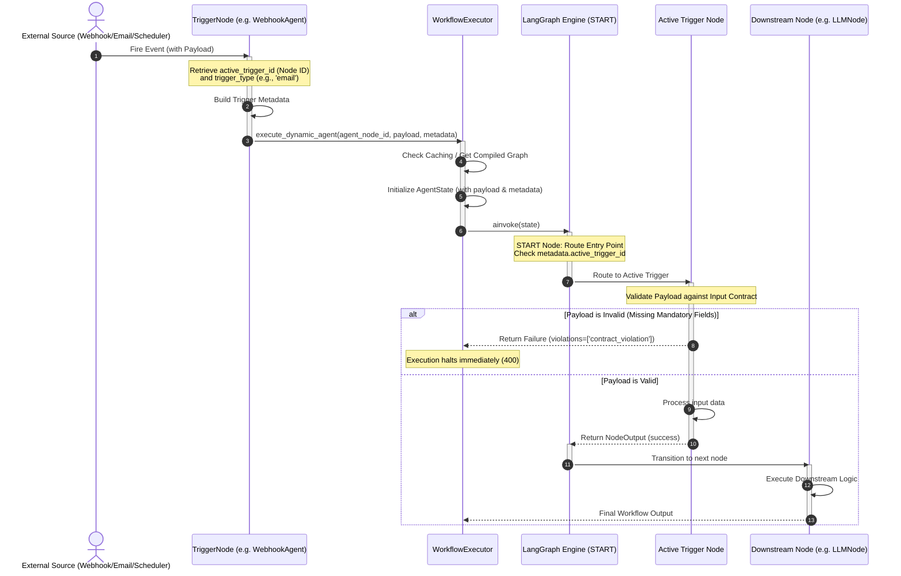

# Epic: Support for Multiple Entry Points (Triggers) per Workflow

**Status:** Parked / Backlog

---

## 1. Description & Goal

In the current version of the Enterprise LLM Gateway, a workflow definition is strictly constrained to a single entry point (a single Trigger or Start node). When developers want to run the same downstream LLM processing, guardrails, and integrations using different event sources (e.g. executing via a webhook callback, on an email ingestion event, or on a scheduled timer), they are forced to duplicate the entire workflow graph. This violates the DRY (Don't Repeat Yourself) principle and leads to high maintenance overhead.

This Epic details the support for **Multiple Entry Points (Triggers)** on a single workflow canvas, enabling execution to start dynamically at whichever trigger fires while sharing the downstream processing nodes.

---

## 2. User Stories

*   **As a workflow developer,** I want to drag multiple triggers (e.g. Webhook, Email, Scheduler) onto the same canvas and connect them to the same downstream processing steps, so that I don't have to duplicate the workflow logic.
*   **As a system administrator,** I want to know exactly which trigger event (and trigger type) initiated a specific execution run, so that I can audit and troubleshoot runs effectively.
*   **As a workflow consumer,** I want the execution to fail immediately with a validation error if the triggering payload is missing mandatory fields specified in the workflow's input contract.

---

## 3. Key Requirements & Scope

### In-Scope
1.  **Canvas Validation Relaxation (Frontend):** Allow multiple nodes of category `Trigger` or `Start` on the workflow builder canvas. Remove the restriction where saving is blocked if `startNodes.length > 1`.
2.  **Multi-source Reachability (Frontend):** Update the canvas validator to verify that all nodes on the canvas are connected downstream of *at least one* of the trigger nodes (no disjoint graph fragments).
3.  **Dynamic Graph Routing (Backend):** Compile the dynamic LangGraph with a conditional edge originating from `START` to each defined trigger node. Transition to the active trigger node based on the runtime `active_trigger_id` metadata.
4.  **Unified Input Validation (Backend):** Validate the incoming execution payload against the active trigger's `input_contract`. Immediately fail with a `400` validation error if any mandatory fields are missing.
5.  **Trigger Source Tracking (Backend):** Inject `active_trigger_id`, `trigger_type` (e.g., webhook, email), and `trigger_time` into the execution trace metadata for auditing.

### Out-of-Scope (Deferred to Future Roadmap)
*   **Heterogeneous Payload Mapping:** Defining dynamic schema translation mapper rules per trigger. (Instead, all triggers will validate against the unified input contract, failing if mandatory fields are missing).
*   **Sub-workflows:** Supporting nested / callable child workflows from within parent workflows.

---

## 4. Sequence Diagram (Runtime Routing)

The sequence diagram below visualizes how the proposed runtime conditional routing executes:

---

## 5. Verification Criteria (Definition of Done)

*   **UI Capability:** Workflows with multiple triggers can be designed, validated, and saved successfully on the workflow builder canvas.
*   **Isolation of Starts:** When a specific trigger fires, the backend executes the graph starting *only* at that trigger's node ID.
*   **Metadata Logging:** Execution logs and traces store the active trigger details.
*   **Contract Enforcement:** Missing fields on invoke lead to immediate validation failure.
*   **Test Suite:** Unit and integration tests verify the execution paths.
