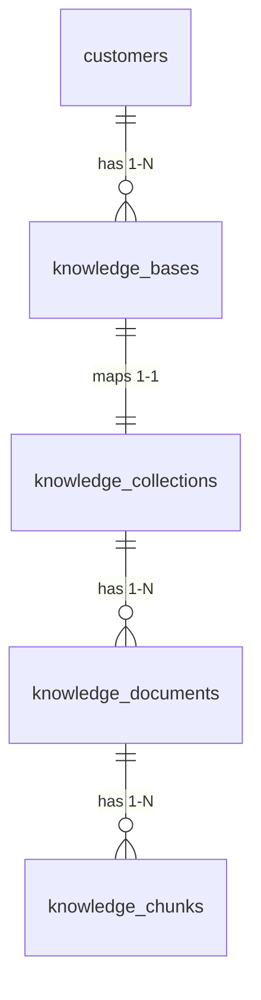
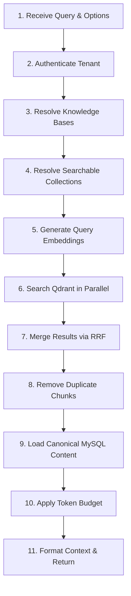
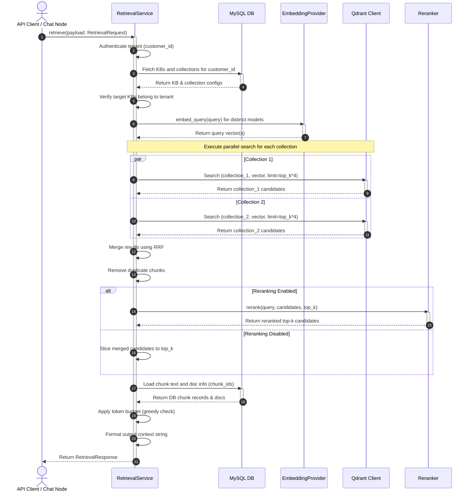

# Epic: Tenant-Scoped Multi-Collection Knowledge Retrieval Service

**Status:** Draft / Under Review
**Authors:** AdI Jain (Business Analyst) & AdiTech (Lead Architect)

---

## 1. Description & Goal

In the current system, knowledge retrieval is designed around a single shared Qdrant collection where tenant-isolation is enforced via payload filtering. However, as the platform scales, different tenants (customers) and knowledge bases require diverse embedding models, partition isolation, and granular search parameters.

This Epic introduces the **Tenant-Scoped Multi-Collection Knowledge Retrieval Service**. The system will partition Qdrant collections at a **1-to-1 mapping with Knowledge Bases**, mapping documents to collections in a **1-to-N** hierarchy. A retrieval request will target a single tenant but can search across multiple selected Knowledge Bases. The service must resolve the corresponding collections, generate embeddings, perform parallel Qdrant searches, merge results using RRF, apply token budgets, deduplicate chunks, and format a clean context payload for LLM consumption.

---

## 2. User Stories

### Persona: End User / API Client
* **As a chat system consumer,** I want to ask questions and retrieve relevant context from specific KBs (e.g. "product documentation" and "customer support manuals") so that the response is highly contextual and bounded to my workspace.
* **As an API client,** I want to supply a list of `knowledge_base_ids` and query parameters to retrieve matching chunks with precise citations, ranking scores, and source metadata.

### Persona: System Administrator / Tenant Admin
* **As a tenant administrator,** I want my knowledge bases to be isolated from other tenants in Qdrant collections to ensure security compliance and clean vector namespace division.
* **As a tenant administrator,** I want to configure different embedding models (e.g., OpenAI text-embedding-3-small, Ollama nomic-embed-text) for different knowledge bases.

---

## 2.1 Workflow Node Integration

* **Knowledge Retrieval Node (`knowledge_retrieval`):** A custom canvas node that retrieves context from a configured list of Knowledge Bases.
  * **User Properties:** The node exposes a `knowledge_base_ids` user property (an array of integers) that defines which Knowledge Bases to query.
  * **Execution Flow:** At runtime, the workflow engine triggers this node, which extracts the configured `knowledge_base_ids` and passes them along with the runtime query (from the preceding chat/message state) to the `RetrievalService`.

---


## 3. Data Model Design (MySQL)

We will introduce a `knowledge_collections` table in MySQL to establish the 1-to-1 relationship with `knowledge_bases`, and adjust `knowledge_documents` to reference this collection.



### 3.1 Schema Definition

#### `knowledge_collections` (New Table)
Maintains the mapping of a Knowledge Base to a physical Qdrant collection and the associated embedding metadata.
```sql
CREATE TABLE knowledge_collections (
    id INTEGER NOT NULL AUTO_INCREMENT,
    name VARCHAR(255) NOT NULL,
    knowledge_base_id INTEGER NOT NULL,
    customer_id INTEGER NOT NULL,
    embedding_model VARCHAR(255) NULL,
    vector_dimension INTEGER NULL,
    distance_metric VARCHAR(50) DEFAULT 'COSINE',
    status VARCHAR(50) DEFAULT 'active',
    created_at VARCHAR(50) NOT NULL,
    updated_at VARCHAR(50) NOT NULL,
    PRIMARY KEY (id),
    UNIQUE KEY uq_kb_id (knowledge_base_id),
    UNIQUE KEY uq_collection_name (name),
    FOREIGN KEY (knowledge_base_id) REFERENCES knowledge_bases(id) ON DELETE CASCADE,
    FOREIGN KEY (customer_id) REFERENCES customers(id) ON DELETE CASCADE
);
```

#### `knowledge_documents` (Modified Table)
Documents belong to collections. We drop/deprecate `collection_name` direct column and associate documents with `collection_id`.
```sql
ALTER TABLE knowledge_documents ADD COLUMN collection_id INTEGER NULL;
ALTER TABLE knowledge_documents ADD CONSTRAINT fk_doc_collection FOREIGN KEY (collection_id) REFERENCES knowledge_collections(id) ON DELETE CASCADE;
```
*(Migration plan will backfill `collection_id` for existing documents based on their KB's collection).*

---

## 4. Retrieval Pipeline Architecture

The retrieval pipeline consists of 11 sequential, well-defined phases:



### Step-by-Step Logic

1. **Receive Query:** Receive `RetrievalRequest` payload containing the query string, tenant context, target `knowledge_base_ids`, `top_k`, and metadata constraints.
2. **Authenticate Tenant:** Verify that the request session belongs to an active tenant. Ensure `customer_id` is present and verified.
3. **Resolve Knowledge Bases:** Query MySQL to ensure all requested `knowledge_base_ids` exist, are active, and belong to the verified `customer_id`. Throw `403 Forbidden` on breach.
4. **Resolve Searchable Collections:** Retrieve the `knowledge_collections` mapped to the validated KBs. Group search targets by their respective Qdrant collection names and resolve metadata (embedding model, etc.).
5. **Generate Query Embedding:** For each distinct embedding model resolved across target collections, generate query vector embeddings. Cache embeddings for duplicate models to minimize API latency.
6. **Search Qdrant:** Execute concurrent vector searches (`asyncio.gather`) across all resolved collections. Retrieve `limit = top_k * 4` candidates per collection to provide RRF and Rerank margin.
7. **Merge Results:** Combine raw candidate outputs. If multi-collection search was performed, merge candidates using Reciprocal Rank Fusion (RRF). If a reranker is configured, re-score candidates.
8. **Remove Duplicate Chunks:** Deduplicate chunks by ID or source hash to prevent feeding redundant context to the LLM.
9. **Load Canonical Content:** Retrieve full chunk contents and document metadata from MySQL using a single batched query on the selected candidate IDs.
10. **Apply Token Budget:** Parse chunk texts, estimate tokens (via tiktoken or character count fallback), and greedily select highest-ranking chunks under the `max_context_tokens` limit.
11. **Generate Context & Return:** Format the context string with clear document boundaries and return the structured `RetrievalResponse`.

---

## 5. Sequence Diagram



---

## 6. Interface Contracts (API & Service)

### 6.1 API Retrieval Request Payload
```json
{
  "query": "How do I configure SSO authentication?",
  "knowledge_base_ids": [10, 12],
  "top_k": 5,
  "min_score": 0.65,
  "max_context_tokens": 4000
}
```

### 6.2 API Retrieval Response Payload
```json
{
  "context": {
    "chunks": [
      {
        "chunk_id": 1405,
        "document_id": 42,
        "knowledge_base_id": 10,
        "score": 0.89,
        "chunk_index": 2,
        "content": "SSO configuration requires Okta or Azure AD...",
        "metadata": {
          "department": "IT Operations"
        }
      }
    ],
    "context": "[Source: SSO Setup Guide]\nSSO configuration requires Okta or Azure AD...",
    "total_chunks": 1,
    "total_tokens": 78
  },
  "documents": [42],
  "knowledge_bases": [10]
}
```

### 6.3 Admin KB Creation & Collection Provisioning
* **Endpoint:** `POST /api/knowledge/bases`
* **Access:** Admin/System Admin
* **Request Payload:**
```json
{
  "name": "Product Documentation",
  "description": "Technical specs and user manuals",
  "settings": {
    "embedding_model": "text-embedding-3-small",
    "vector_dimension": 1536,
    "distance_metric": "COSINE"
  }
}
```
* **Processing logic:**
  1. Inserts record into `knowledge_bases`.
  2. Inserts mapping record into `knowledge_collections` with generated `name` (e.g. `kb_collection_{kb_id}`).
  3. Proactively creates/provisions the corresponding physical collection in Qdrant with the specified dimension and metric.

### 6.4 Document Upload & Ingestion to KB
* **Endpoint:** `POST /api/knowledge/bases/{kb_id}/documents`
* **Access:** Admin/System Admin
* **Request:** `multipart/form-data` with file upload.
* **Processing logic:**
  1. Authenticates admin and verifies `kb_id` belongs to tenant.
  2. Resolves collection metadata from `knowledge_collections` for the `kb_id`.
  3. Stores file, extracts text, generates chunks.
  4. Generates embeddings using the collection's configured model.
  5. Inserts metadata into `knowledge_documents` and chunks into `knowledge_chunks`.
  6. Upserts vector points to the Qdrant collection named `kb_collection_{kb_id}`.

---


## 7. Verification Criteria & Definition of Done

* **Tenant Isolation:** Under no circumstances should a retrieval request return chunks belonging to another `customer_id`.
* **Multi-Collection Search:** A query spanning multiple `knowledge_base_ids` successfully retrieves and merges results from distinct Qdrant collections.
* **Token Budget Enforcement:** The formatted context string must not exceed the requested `max_context_tokens` limit.
* **Error Resilience:** If Qdrant or embedding generation fails for one collection, the request fails gracefully with appropriate error logging, or recovers candidates from other collections.
* **Unit & Integration Tests:** Automated tests covering:
  1. Multi-KB search.
  2. RRF candidate merging logic.
  3. Token budget enforcement.
  4. Tenant cross-contamination attempt prevention.
