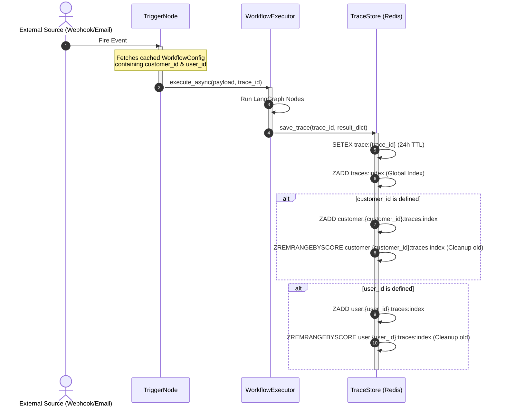
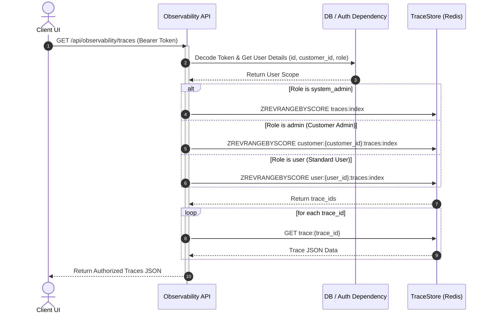

# Epic: Tenant & Owner Scoped Observability Logging

**Status:** Under Review

---

## 1. Description & Goal

In the current version of the Enterprise LLM Gateway, execution logs and traces are stored in a single flat Redis key-value store and a global sorted set index (`traces:index`). The observability API route (`/api/observability/traces`) returns all execution traces to any requester without authentication or tenant boundary check, creating a critical data leakage vulnerability in a multi-tenant setup.

This Epic outlines the implementation of a secure, partitioned, and role-authorized logging system that isolates execution traces based on the following access rules:

1. **Regular Users** can only see traces of workflows they created or own (`user_id` matches user ID).
2. **Customer Admins** can see execution traces of all workflows belonging to users in their customer tenant (`customer_id` matches customer tenant ID).
3. **System Admins** retain global visibility across all customer tenants and users.

---

## 2. Infrastructure Dependencies & Redis Setup

The multi-tenant logging system depends on an active **Redis** service for hosting the `TraceStore` and time-based index structures. Below are the steps required to configure and run Redis for this gateway.

### A. Run Redis using Docker (Recommended)

1. Add a Redis container to your `docker-compose.yml`:
   ```yaml
   redis:
     image: redis:8.8.0-alpine
     container_name: gateway-redis
     ports:
       - "6379:6379"
     volumes:
       - redis_data:/data
     restart: unless-stopped
   ```
2. Set the `REDIS_HOST` environment variable to `redis` in the backend service configuration:
   ```yaml
   backend:
     # ...
     environment:
       - REDIS_HOST=redis
   ```
3. Start the services:
   ```bash
   docker compose up -d
   ```

### B. Run Redis locally on macOS (Without Docker)

1. Install Redis via Homebrew:
   ```bash
   brew install redis
   ```
2. Start the Redis server as a background service:
   ```bash
   brew services start redis
   ```
3. Verify connection:
   ```bash
   redis-cli ping
   # Expected response: PONG
   ```

---

## 3. User Stories

- **As a Workflow Developer (Standard User),** I want to view execution logs only for the workflows I created/own, so that my proprietary payloads, model inputs, and results are hidden from other standard users.
- **As a Customer Administrator (Customer Admin),** I want to see execution logs and traces for all workflows within my tenant, so that I can troubleshoot user workflow runs and monitor total token usage without needing platform-level System Admin rights.
- **As a Platform Administrator (System Admin),** I want to view system-wide logs across all tenants to diagnose platform-level infrastructure and gateway connectivity issues.

---

## 4. Key Requirements & Scope

### In-Scope

1. **Backend Database Metadata Correction:**
   - Modify `_build_workflow_definition_from_db` in `backend/app/workflows/store.py` to ensure that `customer_id` is populated in the returned `WorkflowDefinition` object.
2. **Scoped Trace Indexing (Redis):**
   - Update `TraceStore` to read `customer_id` and `user_id` metadata from the executing workflow definition.
   - Store `customer_id` and `user_id` inside each saved trace JSON payload.
   - Maintain the following indexes in Redis:
     - Global Index (for System Admins): `traces:index` (sorted set of `trace_id` by timestamp).
     - Customer/Tenant Index (for Customer Admins): `customer:{customer_id}:traces:index` (sorted set of `trace_id` by timestamp).
     - User Index (for Regular Users): `user:{user_id}:traces:index` (sorted set of `trace_id` by timestamp).
   - Implement TTL trimming logic during trace creation to ensure that tenant-scoped and user-scoped indexes are pruned of items older than 24 hours (matching the trace key TTL).
3. **Authorized API Routing:**
   - Secure the `/api/observability/traces` endpoint by adding `current_user: User = Depends(get_current_user)`.
   - Implement role-based index selection:
     - `system_admin`: Fetches from `traces:index`.
     - `admin` (Customer Admin): Fetches from `customer:{current_user.customer_id}:traces:index`.
     - `user` (Standard User): Fetches from `user:{current_user.id}:traces:index`.
   - **Workflow Filtering Support:** Add an optional `workflow_id` query parameter to the traces endpoint to filter trace results to only those matching the requested workflow.
4. **Frontend Integration:**
   - Update the Observability Hub (`frontend/app/metrics/page.tsx`) query to use custom headers with the JWT bearer token.
   - Integrate the "System Activity Logs" page in `frontend/app/admin/page.tsx` to pull and render logs securely based on the Customer Admin's scope.
   - **Dropdown Selector UI:** Add a dropdown selector in the dashboard headers allowing users/admins to filter the list of log runs by individual workflow IDs.
   - **System Log Viewer Redesign**: Redesign the logs viewer table in the Admin panel to:
     - Move the `customer_id` and `user_id` fields to the main table row as first-class columns.
     - Redesign the expanded trace row to occupy the full width of the table.
     - Render trace data (Raw JSON) with a toggle option allowing users to view the payload as either an interactive, collapsible **JSON Tree** or a raw pre-formatted text box.

### Out-of-Scope (Deferred to Future Roadmap)

- **Custom Retention Windows per Tenant:** Standardizing the TTL of all logs to 24 hours. Custom retention settings will be part of a future billing/tiering epic.
- **Hot-to-Cold Log Archiving:** Moving logs older than 24 hours to S3 or a persistent database like SQLite for long-term audit trail storage.

---

## 5. Architectural Decisions & Tool Choices

### A. Role of Prometheus vs. Redis

To clarify the division of labor in the observability system (MELT stack):

| Capabilities / Storage | Prometheus                              | Redis (TraceStore)                               |
| :--------------------- | :-------------------------------------- | :----------------------------------------------- |
| **Purpose**            | High-level metrics tracking (M in MELT) | Granular execution logs & traces (L & E in MELT) |
| **Data Structure**     | Time-series counters & histograms       | JSON payloads & Sorted Set indexes               |
| **Cardinality**        | Low cardinality (aggregates only)       | High cardinality (unique per trace run)          |
| **Retention**          | Long-term trends                        | Short-term (24-hour transient TTL)               |

- **Why we use Prometheus:** We use Prometheus to track aggregate metrics (e.g., total requests, token counts by model, API error rates) for system health dash-boarding.
- **Why we do NOT use Prometheus for logs:** Storing raw log strings, trace IDs, and step-by-step inputs/outputs in Prometheus is impossible due to **label cardinality explosion**, which would crash the scraper and degrade metric queries.
- **Why Redis is necessary for log traces:**
  1. **High Write Throughput:** Workflows execute concurrent steps, creating high-concurrency write pressure. Writing logs directly to SQLite on every step creates database locking overhead. Redis processes in-memory writes instantly.
  2. **Automatic Expiration (TTL):** Traces are transient. Redis natively handles automatic key eviction using a 24-hour TTL, saving disk space.
  3. **Fast Time-Based Indexing:** Sorted sets allow fast pagination and time-window queries (e.g. "latest runs in the last 10 minutes") using `ZREVRANGEBYSCORE`.

### B. Redis Data Structure Definitions (TraceStore)

For storing and routing traces securely by Tenant (`customer_id`) and Creator/Owner (`user_id`), the Redis key space is partitioned using three index layers:

#### 1. Trace Payload Store (Raw Data)

- **Key Format:** `trace:{trace_id}`
- **Type:** String (Serialized JSON Object)
- **TTL:** 24 Hours (`86400` seconds)
- **Schema Additions:**
  ```json
  {
    "trace_id": "...",
    "workflow_id": "...",
    "customer_id": 1,
    "user_id": "12",
    "status": "...",
    "latency_ms": 120.5,
    "timestamp": 1719436800.0,
    "content": "...",
    "violations": []
  }
  ```
- **Command:** `SETEX trace:{trace_id} 86400 <json_payload>`

#### 2. Global Trace Index (System Admin Access)

- **Key Format:** `traces:index`
- **Type:** Sorted Set (ZSET)
- **Member:** `trace_id` (string value representing the run ID)
- **Score:** Unix Epoch Timestamp (float value representing execution time)
- **Commands:**
  - **Save:** `ZADD traces:index <timestamp> <trace_id>`
  - **Query:** `ZREVRANGEBYSCORE traces:index +inf <start_time> LIMIT 0 <limit>`
  - **Prune (TTL):** `ZREMRANGEBYSCORE traces:index 0 <timestamp - 86400>`

#### 3. Tenant-Scoped Trace Index (Customer Admin Access)

- **Key Format:** `customer:{customer_id}:traces:index`
- **Type:** Sorted Set (ZSET)
- **Member:** `trace_id`
- **Score:** Unix Epoch Timestamp
- **Commands:**
  - **Save:** `ZADD customer:{customer_id}:traces:index <timestamp> <trace_id>`
  - **Query:** `ZREVRANGEBYSCORE customer:{customer_id}:traces:index +inf <start_time> LIMIT 0 <limit>`
  - **Prune (TTL):** `ZREMRANGEBYSCORE customer:{customer_id}:traces:index 0 <timestamp - 86400>`

#### 4. Owner-Scoped Trace Index (Standard User Access)

- **Key Format:** `user:{user_id}:traces:index`
- **Type:** Sorted Set (ZSET)
- **Member:** `trace_id`
- **Score:** Unix Epoch Timestamp
- **Commands:**
  - **Save:** `ZADD user:{user_id}:traces:index <timestamp> <trace_id>`
  - **Query:** `ZREVRANGEBYSCORE user:{user_id}:traces:index +inf <start_time> LIMIT 0 <limit>`
  - **Prune (TTL):** `ZREMRANGEBYSCORE user:{user_id}:traces:index 0 <timestamp - 86400>`

---

## 6. Visual Design Mockup

The user interface for the System Activity Logs features a clean, unified dashboard for viewing, filtering, and drilling into workflow executions:
* **Workflow Filtering:** A dropdown selector in the header lets users filter log executions by specific workflows.
* **Time Range Selector:** A time-window selector (e.g., Last 24 Hours, Last 1 Hour).
* **Execution Details Drawer:** Clicking any run trace item opens a side drawer displaying step-by-step node outputs, statuses, and error reports in a vertical timeline.


---

## 7. Sequence Diagrams

### A. Workflow Execution & Scoped Indexing

This diagram outlines how a trigger node initiates execution, passing tenant/owner info down to the trace storage pipeline:



### B. Authorized Log Retrieval Flow

This diagram details the sequence when a user requests logs via the observability API:



---

## 8. Verification Criteria

- **Data Isolation Test:**
  - Verify that a standard user from Customer A cannot retrieve any traces belonging to Customer B, nor any traces belonging to other users in Customer A.
  - Verify that a Customer Admin from Customer A can retrieve all traces of Customer A's users, but zero traces from Customer B.
  - Verify that a System Admin can retrieve all traces globally.
- **Security & Auth Checking:**
  - Confirm that calling `/api/observability/traces` without a valid Bearer Token results in a `401 Unauthorized` response.
- **Redis Index Trimming:**
  - Verify that old trace IDs (older than 24 hours) are successfully cleared from `customer:{customer_id}:traces:index` and `user:{user_id}:traces:index` sorted sets on subsequent executions.
- **Frontend Compatibility:**
  - Verify that the Observability Hub loads data matching the user's role without layout breaks.
  - Verify that the System Logs tab in the Customer Admin page lists all executions for the tenant.
  - Verify that the System Logs table includes "Customer ID" and "User ID" columns, and that expanding a log shows the interactive JSON Tree view spanning the full width of the table with toggle options.

---

## 9. Visual Design Mockup


