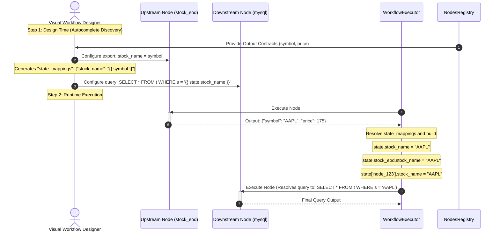

# Epic: Workflow-Level State Management and Variable Sharing

**Status:** Backlog / Proposal

---

## 1. Description & Goal

Currently, the Enterprise LLM Gateway workflows only pass output payloads sequentially or require complex references (e.g. `{{ nodes.node_id.data.output_data.field }}`) to access outputs from previous nodes. This tightly couples nodes to specific IDs and sequence structures, creating a fragile environment when rearranging nodes or building parallel paths.

This Epic introduces a global, workflow-level key-value store (`state`) that allows nodes to save their output variables to a shared context during execution. Downstream nodes can easily access these variables dynamically (e.g. `{{ state.stock_name }}`). To prevent naming conflicts between parallel paths, the state is structured both flat at the root level and namespaced by node type and node instance ID.

---

## 2. User Stories

*   **As a workflow designer (UI),** I want to declare that specific node outputs should be exported to workflow-level state variables by checking a "Stateable" checkbox directly next to output contract fields under the Data Contracts tab, so that downstream nodes can reference them without knowing internal node IDs.
*   **As a workflow designer (UI),** I want autocomplete suggestions (e.g., dropdowns or draggable pills) displaying all available upstream state variables when writing node configurations (like database queries or LLM prompts), so that I don't have to guess variable names.
*   **As a workflow designer (UI),** I want a visual badge indicator on nodes that write to the state, and a hover tooltip listing what variables they expose, so that I can understand the state landscape directly on the canvas at a glance.
*   **As a downstream node (like MySQL/Database),** I want to retrieve state variables dynamically using simple Jinja2 syntax (e.g., `SELECT * FROM stocks WHERE name = '{{ state.stock_name }}'`), so that node configs remain clean and readable.
*   **As a workflow consumer,** I want execution traces to log and persist the history of the workflow state, so that I can inspect the values of shared variables at any step of execution for auditing and debugging.

---

## 3. Key Requirements & Scope

### In-Scope
1.  **Schema-Driven Variable Discovery & Indicators (Frontend UX):** Traverse the workflow graph backwards from the active node to display all reachable upstream output contract fields and custom declared variables as autocomplete recommendations. Display a small key/tag icon badge with variable count on nodes writing to state, showing exposed keys on hover.
2.  **Explicit State Exporters & Mutation (Frontend & Backend):** Support a "Stateable" checkbox next to output contract fields in the Output Structure mapping list. Provide an optional inline text input to define a custom global variable name (defaults to the field name). Mappings can use runtime dynamic expressions (e.g., inline Jinja logic) for dynamic mutation.
3.  **Conflict-Free Namespaced State (Backend):** Store updates under three scopes:
    - Global flat scope: `state.variable_name` (last-writer-wins convenience)
    - Node name scope: `state.node_class_name.variable_name` (e.g., `state.stock_eod.stock_name`)
    - Node ID scope: `state.node_id.variable_name` (e.g., `state['node-123'].stock_name`)
4.  **Deep Merging Reducer (Backend):** Implement a deep-merging reducer in the LangGraph runner to prevent parallel execution branches from overwriting each other's state keys or node histories.
5.  **State Volatility & Audit Trails (Backend):** The state variables are volatile, held in-memory during workflow graph execution (`state.context["state"]`) rather than saved as permanent database records or persistent Redis caches. Optionally log them in in-flight run trace details for runtime execution debugging.
6.  **Runtime State Initialization (Backend):** Allow starting workflow execution with a client-supplied initial key-value dictionary (e.g., from triggering query params, SSO token context, or direct API invoke payloads) injected directly into `state.context["state"]` at launch.
7.  **Namespace Reservation (Frontend & Backend):** Enforce visual and backend schema validation rules that reject any node named `state` or with ID `state` to prevent naming collisions.

### Out-of-Scope
*   **Mutable/Writable State Nodes:** Dedicated nodes whose sole job is to edit/mutate workflow variables at runtime (e.g., variable setters or math operators). This epic focuses on outputs mapped at the edge of existing nodes.
*   **Cross-Workflow State Sharing:** Sharing state variables between separate workflow run executions.

---

## 4. Sequence Diagram (Design-to-Run Flow)

The sequence diagram below visualizes the lifecycle of the workflow-level state from designer definition to runtime execution:

---

## 5. UI Level Designs

The mockup below illustrates the design for the workflow properties panel and the template variable selector:

1. **Export to Workflow State (Properties Panel)**: An interactive table allows mapping output contract fields (e.g., `symbol`) to custom global variables (e.g., `stock_name`).
2. **Autocomplete Suggestions (Code Editor)**: Downstream nodes (like SQL query editor or prompt templates) provide dynamic autocompletion. Typing `{{ state.` displays selectable pills for both explicitly mapped variables and default node-scoped fallbacks.

---

## 6. Verification Criteria (Definition of Done)

*   **Designer UI:** Property panels show export mapping sections, and downstream properties/mapping panes successfully autocomplete `state.` values.
*   **Scope Isolation:** Parallel branches merge their state variables successfully without data loss.
*   **Jinja Rendering:** Nodes like DB and LLM resolve all variables using global, node type, and node ID state structures.
*   **Trace Visibility:** Saved trace execution logs include the full `context.state` object.
*   **Test Suite:** Passing tests for basic variable sharing, namespaced lookup, and parallel branch safety.
