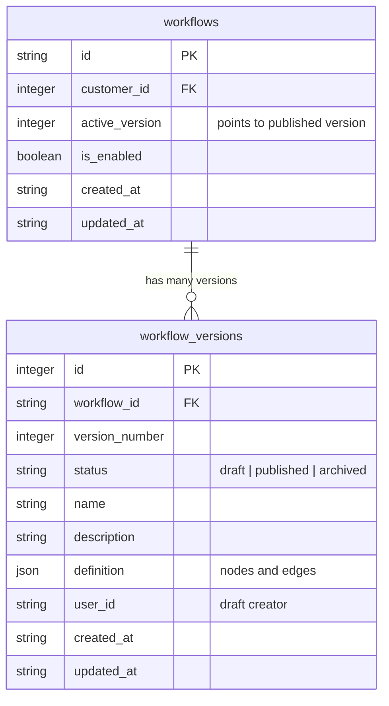
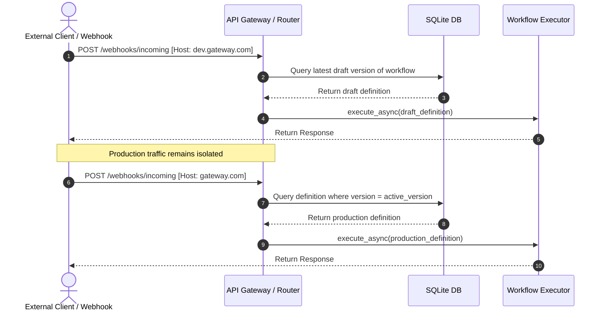

# Epic: Workflow Observability, Run Control, and Multi-Version Commits

**Status:** Draft / Active  
**Product Requirements Document (PRD - Part 1):** [prd_workflow_observability.md](file:///Users/vivekjain/projects/enterprise-llm-gateway/epic/prd_workflow_observability.md)

---

## 1. Requirements

### 1.1 Business Objective
Provide enterprise administrators and workflow designers with complete visibility, operational control, and safe deployment lifecycles for their LLM orchestration workflows. This minimizes downtime, simplifies debugging, and prevents unverified changes from impacting production systems.

### 1.2 User Personas
-   **System Admin (Platform Operator)**: Manages global gateway infrastructure, customer tenant boundaries, global node catalogs, and cross-tenant execution logs.
-   **Tenant Admin (Company Administrator)**: Directs company-specific workflows, user accesses, local node overrides, and reviews auditing metrics/traces within their tenant.
-   **Workflow Designer (Workflow Author)**: Constructs and tests LLM pipelines, resolves validation errors, monitors draft node executions, and deploys workflows to production.
-   **DevOps Engineer**: Manages the deployment and monitoring of the gateway infrastructure.

---

## Part 1: Full Observability of Running Workflows in a Production Environment

This part covers the logging, tracking, visual representation, and operational controls (stopping and restarting) of active workflow executions.

### 2.1 Use Cases by Persona

#### UC-1.1: Live Run Progress Monitoring (Real-time Node Status)
*   **Persona**: Workflow Designer, Tenant Admin, System Admin
*   **Description**: Watch a workflow execution run in real-time on a graphical layout.
*   **Flow**:
    1. User opens a running execution trace log in the UI dashboard.
    2. The UI renders the ReactFlow canvas for that workflow.
    3. As the backend executes the graph, the nodes transition visual states dynamically:
        *   `Start Node`: Green border + check icon (Success).
        *   `PII Guard`: Pulsing blue border + spinner icon (Running).
        *   `LLM Node`: Gray border (Pending).
    4. Upon completion of each node, the state resolves to Success (green) or Failure (red).

#### UC-1.2: Node-level Payload Auditing
*   **Persona**: Workflow Designer, Tenant Admin
*   **Description**: Inspect exact input parameters, output parameters, and latency per node.
*   **Flow**:
    1. User clicks on the `PII Guard` node in a completed run graph.
    2. A drawer panel slides open from the right.
    3. The panel displays:
        *   **Inputs**: The raw text or JSON object passed into the node.
        *   **Outputs**: The sanitized, redacted text returned by the node.
        *   **Properties**: The configuration properties (e.g., confidence threshold) used during execution.
        *   **Timing**: Latency (`182ms`) and timestamp.

#### UC-1.3: Active Task Interruption (Stop Execution)
*   **Persona**: Tenant Admin, System Admin
*   **Description**: Cancel a workflow execution that is stuck in an infinite loop or taking too long.
*   **Flow**:
    1. User views the live runs list and spots a trace with status `Running` that has exceeded its timeout.
    2. User clicks the **Stop** button next to the run.
    3. The backend identifies the active asyncio task running the LangGraph loop and sends a cancel signal.
    4. The executor catches the interruption, stops downstream nodes, updates the trace status in Redis to `Stopped`, and terminates.

#### UC-1.4: Failed Task Replay (Restart Run)
*   **Persona**: Workflow Designer, Tenant Admin
*   **Description**: Re-trigger a failed execution with the exact same input to test if a database or connection issue is fixed.
*   **Flow**:
    1. User views a run in the dashboard with status `Failed`.
    2. User clicks **Restart**.
    3. The backend retrieves the original input payload and context from the Redis trace log.
    4. The backend spawns a new execution run with its own `trace_id`, linking it to the parent run for auditing history.

#### UC-1.5: Tenant-isolated Trace View
*   **Persona**: Tenant Admin
*   **Description**: Review execution logs restricted exclusively to workflows of their own organization.
*   **Flow**:
    1. Tenant Admin (Company A) opens the dashboard.
    2. The API retrieves and restricts all runs where `customer_id` matches the admin's organization ID. Traces of other tenants are completely hidden.

#### UC-1.6: Fleet-wide Observability
*   **Persona**: System Admin, DevOps Engineer
*   **Description**: View runs and latency profiles globally across all tenants.
*   **Flow**:
    1. System Admin opens the dashboard.
    2. The UI renders a customer selector dropdown.
    3. System Admin filters logs by specific customer names or views them globally.

---

### 2.2 User Journeys

#### Admin Diagnostic and Recovery Journey
```
[Admin spots Failed Run in logs]
               │
               ▼
[Clicks Run ID to open Graph Visualizer]
               │
               ▼
[Clicks Failed Red Node -> Reads SQL Timeout error in Drawer]
               │
               ▼
[Fixes MySQL connection configuration]
               │
               ▼
[Clicks "Restart" -> Monitor new running execution turn Green]
```

---

### 2.3 Visual Designs & Wireframes

#### Observability Runs Dashboard:
```
+---------------------------------------------------------------------------------------------------+
| RUN HISTORY                                                      [Filter: Running  |▼] [Filter Customer |▼] |
+---------------------------------------------------------------------------------------------------+
| Run ID      | Status     | Workflow       | Customer    | User ID  | Latency  | Actions               |
|-------------|------------|----------------|-------------|----------|----------|-----------------------|
| tr_91b2c3d4 | [Running]  | Email Router   | ACME Corp   | user123  | 820ms    | [Stop] [Logs] [Graph] |
| tr_02a8b9c1 | [Failed]   | PII Anonymizer | Initech     | user999  | 1450ms   | [Restart] [Logs] [Graph]|
| tr_7f3a9e1b | [Completed]| Lead Scraper   | ACME Corp   | user123  | 2100ms   | [Logs] [Graph]        |
+---------------------------------------------------------------------------------------------------+
```

#### Run Visualizer Canvas Modal:
```
+---------------------------------------------------------------------------------------------------+
| Run: tr_91b2c3d4   Status: RUNNING                            [Stop Execution] [Close]            |
+---------------------------------------------------------------------------------------------------+
|                                                                                                   |
|   +---------------+            +------------------+            +-----------------+                |
|   |  Start Node   |===========>|   Presidio NER   |===========>|    Main LLM     |                |
|   |   (Success)   |            |    (Running)     |            |    (Pending)    |                |
|   +---------------+            +------------------+            +-----------------+                |
|                                                                                                   |
+---------------------------------------------------------------------------------------------------+
```

---

### 2.4 Phased Implementation Plan (Part 1)

*   **Phase 1: In-Memory Task Registry & Stop/Cancel APIs (Ease: Medium | Changes: Moderate)**
    *   Implement task registry dict `active_tasks` mapping `trace_id` to `asyncio.Task` inside the backend.
    *   Expose `/api/observability/traces/{trace_id}/stop` endpoint.
    *   Handle `asyncio.CancelledError` in `executor.py` to write `Stopped` status in Redis.
*   **Phase 2: Redis State Tracking Hooks & Restart API (Ease: Hard | Changes: Moderate)**
    *   Update node run wrappers to write step-by-step trace updates into Redis.
    *   Expose `/api/observability/traces/{trace_id}/restart` endpoint.
*   **Phase 3: Observability Dashboard & Canvas Overlay UI (Ease: Hard | Changes: High)**
    *   Build Next.js runs dashboard table.
    *   Build `RunVisualizerModal` overlay leveraging ReactFlow to render dynamic node state.

---
---

## Part 2: Creating, Editing, and Publishing Workflows (Two-Level Commit)

This part covers multi-versioning, user-specific draft isolation, domain-isolated testing, and concurrent conflict resolution.

### 3.1 Use Cases by Persona

#### UC-2.1: Save Canvas Draft
*   **Persona**: Workflow Designer
*   **Description**: Modify node layouts on the canvas and save them as a private draft.
*   **Flow**:
    1. Designer adds a new database node to the workflow.
    2. Designer clicks "Save Draft".
    3. The application writes the nodes/edges definitions to `workflow_versions` with `status = "draft"` and `user_id = current_user.id`.
    4. The production pipeline is unaffected.

#### UC-2.2: Parallel Draft Workspaces
*   **Persona**: Workflow Designers (User A and User B)
*   **Description**: Edit the same workflow simultaneously without overwriting work.
*   **Flow**:
    1. User A opens the canvas and makes changes. Saves draft (v3-draft-UserA).
    2. User B opens the canvas and makes changes. Saves draft (v3-draft-UserB).
    3. Both developers maintain separate drafts in the `workflow_versions` table.

#### UC-2.3: Subdomain-isolated Sandbox Testing
*   **Persona**: Workflow Designer
*   **Description**: Test a draft layout with live requests without altering production traffic.
*   **Flow**:
    1. Designer configures an external webhook to call `dev.gateway.com/webhooks/incoming/lead-enrichment`.
    2. The router reads the hostname `dev.gateway.com` and resolves the designer's latest draft version.
    3. Sandbox execution logs are written with tag `mode="test"`.
    4. Live traffic hitting `gateway.com` continues executing the production version definition uninterrupted.

#### UC-2.4: Publish Draft Promotion
*   **Persona**: Workflow Designer
*   **Description**: Deploy the tested draft configuration to live production triggers.
*   **Flow**:
    1. Designer clicks "Publish".
    2. The backend validates parent references, sets draft status to `"published"`, increments version number, and updates `WorkflowDB.active_version`.
    3. Webhook listener registers the new version immediately.

#### UC-2.5: Publish Conflict Detection
*   **Persona**: Workflow Designer (User B)
*   **Description**: Prevent overwriting someone else's changes who published first.
*   **Flow**:
    1. User B click "Publish" on a draft based on v2.
    2. The backend detects that active production version is now v3 (published by User A).
    3. The publish action is blocked, and the UI displays a conflict merge/resolution dialog.

#### UC-2.6: Historical Version Rollback
*   **Persona**: Tenant Admin, Workflow Designer
*   **Description**: Revert live production triggers to run a stable older version.
*   **Flow**:
    1. User reviews version logs, selects v1, and clicks "Rollback".
    2. `WorkflowDB.active_version` points back to `v1`. Live listeners reload.

---

### 3.2 User Journeys

#### Collaborative Edit and Publish Journey
```
[User A & User B open same Canvas]
               │
               ▼
[User A Saves Draft A] ──► [User B Saves Draft B]
               │                         │
               ▼                         ▼
[User A Publishes Live v3]    [User B clicks Publish]
                                         │
                                         ▼
                            [System Flags 409 Conflict]
                                         │
                                         ▼
                            [User B Merges A's changes & Publishes v4]
```

---

### 3.3 Visual Designs & Wireframes

#### Version Conflict Warning Dialog:
```
+------------------------------------------------------------------------+
| ⚠️ Conflict Detected                                                    |
+------------------------------------------------------------------------+
| The active version in production was updated to v3 by UserA.            |
| Your draft is based on v2. Please select an option below:              |
|                                                                        |
|  [ ] Pull & Merge (Rebase your changes onto v3)                         |
|  [ ] Force Publish (Archive v3 and push your draft as v4)              |
|  [ ] Clone as Copy (Save your draft as a new workflow)                  |
|                                                                        |
|                                                     [Cancel] [Confirm] |
+------------------------------------------------------------------------+
```

---

### 3.4 Phased Implementation Plan (Part 2)

*   **Phase 1: Normalization & Draft Saves (Ease: Medium | Changes: Moderate)**
    *   Create `workflow_versions` schema in SQLite and migrate current workflows.
    *   Modify `/workflows` save API to target draft entries in the new table.
*   **Phase 2: Subdomain Sandbox Routing (Ease: Hard | Changes: Moderate)**
    *   Introduce host-detection middleware to FastAPI and Next.js layers.
    *   Route traffic to draft/published graphs based on `dev.gateway.com` vs `gateway.com`.
*   **Phase 3: Publish, Conflict Check, & UI Indicators (Ease: Hard | Changes: High)**
    *   Implement `/publish` endpoint with concurrency checks.
    *   Build "Save Draft", "Publish" controls, and conflict merge prompt inside the canvas UI.

---
---

## 8. Architectural Considerations

### 8.1 Database Schema (Multi-Version & Multi-Draft)



### 8.2 Subdomain Sandbox Routing Sequence



---

## 9. Impact Analysis (Codebase & Data Model)

### 9.1 Codebase Impact
- **Routing Infrastructure**: Request routers inside the FastAPI/Next.js layers need host header context mapping to resolve the target environment subdomain (`dev` vs production).
- **Trigger Lifecycle Listener**: `workflow_auto_discover` must run dual-trigger setups if webhook listeners need to register for drafts under dev domains.

### 9.2 Datamodel Impact
- **Database Schema Normalization**: Split current `workflows` columns (`definition`, `edges`, `nodes_structure`) into `workflow_versions` table. This creates a 1-to-many relationship supporting historical records and multi-developer drafts.
- **Run Tracking**: Trace schema adds execution status fields (`Running`, `Completed`, `Failed`, `Stopped`) and node progress states inside Redis.

---

## 10. Proposed Technical Implementation Plan

This section contains the implementation level details to carry out Phase 1 and Phase 2.

### 10.1 User Review Required Design Choices

> [!IMPORTANT]
> **Subdomain Host Isolation**:
> Webhook triggers and agent execution endpoints will intercept the incoming host header:
> *   Requests to **`dev.gateway.com`** will dynamically resolve and run the latest draft version for the matching workflow.
> *   Requests to **`gateway.com`** will resolve and run the `active_version` published definition.
> 
> *Note:* In local development, this will map to:
> *   `http://dev.localhost:8000/...` (Development Sandbox)
> *   `http://localhost:8000/...` (Production Environment)

> [!IMPORTANT]
> **Optimistic Publish Locks (Git-Style conflict warning)**:
> When a user clicks "Publish" on draft version, the backend validates if the draft's `parent_version` matches the workflow's current `active_version` in the database.
> If another user has published in the meantime, the publisher receives a `409 Conflict` error and must review/pull the latest version.

### 10.2 Detailed Proposed Code Changes

#### 10.2.1 Database Models
- **Modify** [db_models.py](file:///Users/vivekjain/projects/enterprise-llm-gateway/backend/app/models/db_models.py):
  - **Table `workflows`**: Remove columns: `edges`, `nodes_structure`, `definition`, `version`. Add column: `active_version = Column(Integer, nullable=True)`.
  - **Table `workflow_versions` [NEW]**:
    - `id = Column(Integer, primary_key=True, index=True)`
    - `workflow_id = Column(String, ForeignKey("workflows.id"), nullable=False, index=True)`
    - `version_number = Column(Integer, nullable=False)`
    - `parent_version = Column(Integer, nullable=True)`
    - `status = Column(String, default="draft")` (Values: `"draft"`, `"published"`, `"archived"`)
    - `name = Column(String)`
    - `description = Column(String, nullable=True)`
    - `definition = Column(JSON)`
    - `user_id = Column(String, nullable=False)`
    - `created_at = Column(String, default=utcnow)`
    - `updated_at = Column(String, default=utcnow)`

#### 10.2.2 Backend Stores & Services
- **Modify** [store.py](file:///Users/vivekjain/projects/enterprise-llm-gateway/backend/app/workflows/store.py):
  - Update loaders to join versions.
  - Implement user-scoped draft updates inside `workflow_versions`.
  - Implement promotion function: checks optimistic lock parent version, updates active production version, archives old version, invalidates compiler cache.
- **Modify** [service.py](file:///Users/vivekjain/projects/enterprise-llm-gateway/backend/app/workflows/service.py):
  - Refactor `workflow_auto_discover` and webhook interfaces to parse incoming host header. Execute the user's latest draft on `dev.gateway.com` / `dev.localhost`, and execute active version on production domains.

#### 10.2.3 Async Monitoring & Routing APIs
- **Modify** [executor.py](file:///Users/vivekjain/projects/enterprise-llm-gateway/backend/app/workflows/executor.py):
  - Track active tasks in a global registry dictionary.
  - Update progress trace states to Redis during runtime node-execution transitions.
- **Modify** [router.py](file:///Users/vivekjain/projects/enterprise-llm-gateway/backend/app/api/workflows/router.py):
  - Add endpoints:
    - `POST /api/workflows/{workflow_id}/versions/{version_id}/publish`
    - `POST /api/observability/traces/{trace_id}/stop`
    - `POST /api/observability/traces/{trace_id}/restart`

#### 10.2.4 Frontend Interfaces
- **Modify** [WorkflowHeader.tsx](file:///Users/vivekjain/projects/enterprise-llm-gateway/frontend/app/workflow-builder/components/WorkflowHeader.tsx):
  - Include Save Draft and Publish buttons, displaying optimistic concurrency conflict errors if raised.
- **Modify** [page.tsx](file:///Users/vivekjain/projects/enterprise-llm-gateway/frontend/app/admin/page.tsx):
  - Render execution states (`Running`, `Completed`, `Failed`, `Stopped`). Include trigger controls (Stop and Restart). Add customer filters for system admins.
- **New File** `RunVisualizerModal.tsx`:
  - Provide visual overlay mapping ReactFlow to execution node status markers from Redis logs.

### 10.3 Verification Plan
- **Unit Tests**: Validate draft saving, version promotion checks, parent version match assertions, and task registry cancellations.
- **Manual Steps**: Verify subdomain trigger routing locally using `dev.localhost:8000` vs `localhost:8000`. Test workflow execution interruption and failed task replay.
