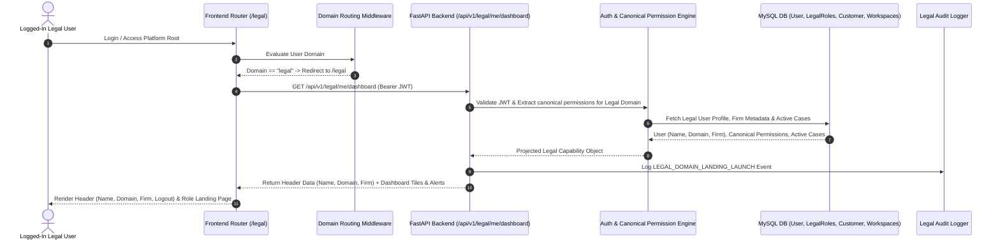

# [STORY-00] Role-Based Landing Page & Persona Workspace Hub

**Epic Reference**: `User Onboarding & Dashboard Foundation`  
**Target Release**: MVP Wave 1  
**GitHub Track ID**: `#LEGAL-STORY-00`

---

## 1. User Story & Personas

### 1.1 Personas Involved
- **Individual Advocate / Solo Practitioner**: Self-registered single lawyer accessing freemium/pro legal research.
- **Law Firm Advocate (Org Member)**: Member of a multi-lawyer firm with shared case workspaces.
- **Paralegal / Researcher**: Conducts bulk research, prepares case compilations, and imports DOCX files.
- **In-House Corporate Counsel**: Reviews external advocate drafts and monitors corporate litigation risk.
- **External Guest (View/Comment Only)**: Authenticated external reviewer with restricted read/comment access.
- **Law Firm Administrator**: Configures team seats, permissions, ethical walls, and firm settings.

### 1.2 Story Statement
> **As a** logged-in user (Organization Member or Individual Practitioner),  
> **I want** a personalized, role-aware Landing Page and Workspace Hub immediately upon login,  
> **So that** I am shown a clear glimpse of my authorized capabilities, active case workspaces, pending review notifications, and quick-action tools without interface clutter.

---

## 2. Acceptance Criteria (AC)

- **AC-1 (Domain Detection & `/legal` Redirection)**: Middleware checks user domain (`domain == "legal"`). All users belonging to the legal domain are automatically redirected to the `/legal` root endpoint upon authentication.
- **AC-2 (Canonical Legal Permissions & Role Mapping)**: The platform enforces canonical permissions defined for the legal domain (`legal:case:create`, `legal:case:read`, `legal:research:query`, `legal:docx:import`, `legal:binder:export`, `legal:ethical_wall:manage`, `legal:transcript:record`, `legal:audit:view`). Roles (`para_legal`, `advocate_associate`, `advocate_partner`, `external_guest`, `firm_admin`) are assigned these canonical permissions.
- **AC-3 (Role-Based Landing Page Render)**: When `/legal` is accessed, the frontend reads assigned canonical permissions and dynamically renders the landing page tiles tailored to the user's role.
- **AC-4 (Global Legal Header)**: The header on `/legal` prominently displays:
  - **User Name** (e.g. `Adv. Rajesh Kumar` / `Bella Sharma`)
  - **Domain Tag** (e.g. `Domain: Legal Practice`)
  - **Company / Law Firm Name** (e.g. `LexJuris Advocates`)
  - **Logout Button** (`[Logout]`)
  - **Active Role Badge** (e.g. `Role: Senior Associate`)
  - **Global Command Search Bar** (`Cmd + K`)
- **AC-5 (Session & Security Audit)**: Logs user login event, domain redirection to `/legal`, assigned canonical permissions, and tenant context in `LegalAuditLogDB`.

---

## 3. Data Flow Diagram (DFD)



---

## 4. UI Wireframes & Layout Architecture

### 4.1 Layout Structural Allocation: Header vs Left Navigation Panel

- **Top Global Header Bar**:
  - App Branding: `⚖️ LEGAL PLATFORM (/legal)`
  - Identity Context: **User Name**, **Domain Tag** (`Legal`), **Firm / Company Name**, **Role Badge** (`Paralegal` / `Senior Associate`)
  - Global Tools: **Command Search** (`Cmd + K`), **Notifications Bell**, **Logout Button** (`[Logout]`)
- **Left Collapsible Navigation Panel**:
  - `🔍 Research Hub` (Default Active)
  - `📁 Case Workspaces`
  - `📄 Word (.docx) Import`
  - `📜 Citation Converter`
  - `⚖️ IPC ↔ BNS Cross-Map`
  - `📤 Court PDF Binders`
  - `🎙️ Audio Transcripts & Intake`
  - `🛡️ Ethical Wall Admin` *(Firm Admin only)*

---

### 4.2 Bella (Paralegal / Researcher) Clean Search-Centric Landing Page (`/legal`)

*Minimalist design inspired by foundation LLM interfaces (ChatGPT/Claude/Gemini) featuring a central search box with an integrated filter drawer icon.*

```
+---------------------------------------------------------------------------------------------------------+
| ⚖️ LEGAL PLATFORM (/legal) | [🔍 Cmd + K] | 👤 Name: Bella Sharma | 🌐 Domain: Legal | 🏢 LexJuris | 🔒 Logout |
+-------------------------------+-------------------------------------------------------------------------+
| LEFT PANEL (COLLAPSIBLE)      | MAIN CANVAS                                                             |
|                               |                                                                         |
| 🔍 Research Hub (Active)      |                 ⚖️ Legal AI Precedent & Ratio Research Engine             |
| 📁 Case Workspaces (12)       |       "What legal proposition or precedent ratio are you researching?"  |
| 📄 Import Word (.docx)        |                                                                         |
| 📜 Citation Converter         | +---------------------------------------------------------------------+ |
| ⚖️ IPC ↔ BNS Cross-Map        | | 🔍 Search SC/HC judgments, acts, ratio decidendi...    [🎛️ Filters] | |
| 📤 PDF Court Binders          | +---------------------------------------------------------------------+ |
| 🎙️ Client Transcripts         |                                                                         |
|                               | Mode Toggle:  (x) 🔍 Search Judgments   ( ) 🤖 Ask AI Assistant
| *(Grounding & zero-hallucination citation verification hard-baked in system background)*
| ----------------------------- |                                                                         |
| 📌 QUICK RECENT CASES         | [ Expanded Filter Drawer (When 🎛️ Filters clicked) ]                   |
| • C-2026-089 (Ram Sharma)     | +---------------------------------------------------------------------+ |
| • C-2026-104 (IT Appeal)      | | Courts: [ Supreme Court v ] [ High Court of Delhi v ]                 | |
|                               | | Year Range: [ 2022 to 2026 v ]  Bench: [ Division Bench v ]        | |
|                               | | Outcome Tag: [ [Bail Granted] x ] [ [Notice Quashed] x ]            | |
|                               | | Act/Section: [ Income Tax Act 148A(b) ]                             | |
|                               | +---------------------------------------------------------------------+ |
|                               |                                                                         |
|                               | Pinned Case Shortcuts:                                                  |
|                               | [📁 Case C-2026-089 (Bail)] [📁 Case C-2026-104 (IT Appeal)]            |
+-------------------------------+-------------------------------------------------------------------------+
```

---

### 4.3 Advocate / Senior Partner Landing Page Wireframe (`/legal`)

```
+---------------------------------------------------------------------------------------------------------+
| ⚖️ LEGAL PLATFORM (/legal) | [🔍 Cmd + K] | 👤 Name: Adv. Rajesh Kumar | 🌐 Legal | 🏢 LexJuris | 🔒 Logout |
+-------------------------------+-------------------------------------------------------------------------+
| LEFT PANEL (COLLAPSIBLE)      | MAIN CANVAS                                                             |
|                               |                                                                         |
| 🔍 Research Hub               | WELCOME BACK, ADV. RAJESH KUMAR                                         |
| 📁 Case Workspaces (12)       | Here is your workspace summary for today (07 August 2026):              |
| 📄 Import Word (.docx)        |                                                                         |
| 📜 Citation Converter         | 🚀 QUICK ACTION TILES (CANONICAL PERMISSIONS ENABLED)                   |
| ⚖️ IPC ↔ BNS Cross-Map        | +-----------------------+ +-----------------------+ +-----------------+ |
| 📤 PDF Court Binders          | | 🔍 Legal Research     | | 📁 Case Workspaces    | | 📄 Import DOCX  | |
| 🎙️ Client Transcripts         | +-----------------------+ +-----------------------+ +-----------------+ |
| 🛡️ Ethical Walls (Admin)      |                                                                         |
|                               | 📁 RECENT ACTIVE CASES            | 💬 PENDING REVIEW COMMENTS          |
|                               | • C-2026-089: State v. Ram Sharma | 🔴 @Bella tagged you in C-2026-089 |
|                               | • C-2026-042: Apex Corp v. Union  | 🟡 Citation in Draft v1.3 distinguished|
+-------------------------------+-------------------------------------------------------------------------+
```

---

### 4.4 External Guest Landing Page Wireframe (`/legal` - Read/Comment Only)

```
+---------------------------------------------------------------------------------------------------------+
| ⚖️ LEGAL PLATFORM (/legal) | 👤 Guest: Adv. Vikram (Senior) | 🌐 Legal | 🏢 Corporate Counsel | 🔒 Logout  |
+---------------------------------------------------------------------------------------------------------+
| SHARED WORKSPACES & REVIEW BRIEF (READ & COMMENT ONLY)                                                  |
|                                                                                                         |
| 📁 C-2026-089: State v. Ram Sharma (Bail Application)                                                   |
| Shared by: LexJuris Advocates | Access Expires in: 5 Days                                               |
| Available Actions: [ View Brief (Read Only) ]  [ Add Review Comment ]                                   |
| Note: Editing document text is disabled for external guests.                                             |
+---------------------------------------------------------------------------------------------------------+
```

---

## 5. Impact Analysis & Database Schema Changes

### 5.1 Updates to Existing Database Models (`backend/app/models/db_models.py`)
Ensure `UserDB` and `CustomerDB` include organization classification and landing preference defaults:

```python
# UserDB existing table enhancement check:
# UserDB.customer_id distinguishes Organization User (not null) vs Solo Individual (null)
# RoleDB.role_type defines capability projection (system_admin, tenant_admin, para_legal, legal_analyst, guest)
```

### 5.2 API Routes (`backend/app/api/dashboard/router.py`)
- `GET /api/v1/user/me/dashboard` — Returns personalized dashboard tiles, recent cases, pending alerts, and role capabilities.
- `GET /api/v1/user/me/capabilities` — Returns boolean map of authorized features for frontend menu rendering.
