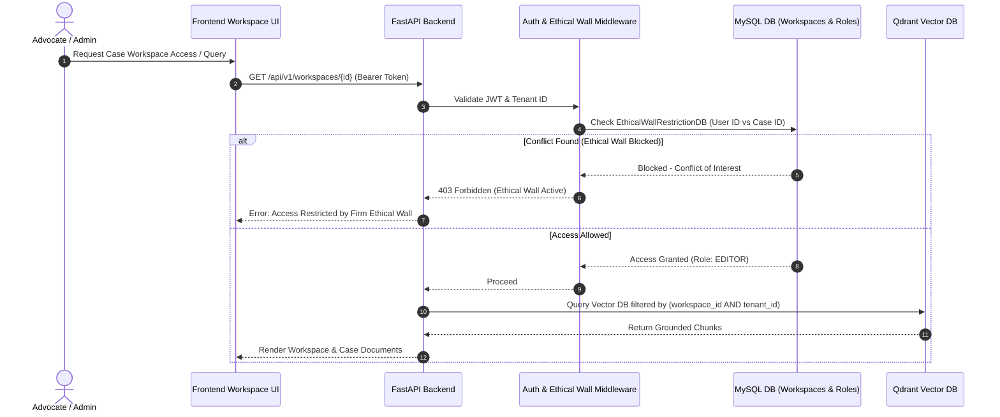

# [STORY-01] Case Workspace Sharing, Granular Access Control & Ethical Wall Isolation

**Epic Reference**: `C-14 Team Sharing & Permissions`  
**Target Release**: MVP Wave 1  
**GitHub Track ID**: `#LEGAL-STORY-01`

---

## 1. User Story & Personas

### 1.1 Personas Involved
- **Lawyer / Advocate**: Creates case-specific folders, invites junior associates, and shares research briefs within their practice group.
- **Law Firm Administrator**: Sets up practice groups, configures ethical walls for conflicting client cases, and manages firm user permissions.
- **System Admin**: Monitors multi-tenant isolation, data encryption keys, and system-wide security logs.

### 1.2 Story Statement
> **As a** Law Firm Advocate and Firm Administrator,  
> **I want to** create case-centric workspaces with granular role-based access controls and system-enforced ethical walls,  
> **So that** team members can collaborate seamlessly while strictly preventing conflict-of-interest document leakage between opposing legal teams in the same firm.

---

## 2. Acceptance Criteria (AC)

- **AC-1 (Workspace Creation)**: Users can create case workspaces tagged with `Client Case ID`, `Practice Area` (e.g. Criminal, Constitutional), and `Description`.
- **AC-2 (Granular Role Assignment)**: Internal team members can be granted one of four permissions: `OWNER`, `EDITOR`, `COMMENTER`, `VIEWER`.
- **AC-3 (Ethical Wall Conflict Rules)**: Firm Admins can define Ethical Wall rules blocking specific users/groups from seeing, searching, or receiving alerts for specified Case Workspaces.
- **AC-4 (Search & Retrieval Isolation)**: Hybrid search and RAG queries automatically inject `workspace_id` and `ethical_wall_group_id` parameters. Blocked cases must never appear in vector or sparse search results.
- **AC-5 (Audit Trail)**: Every workspace creation, role change, and access attempt (including blocked attempts) is logged to `LegalAuditLogDB`.

---

## 3. Data Flow Diagram (DFD)



---

## 4. UI Wireframes

### 4.1 Case Workspace & Sharing Modal Wireframe

```
+---------------------------------------------------------------------------------------------------------+
| [Case Workspace: C-2026-BNS-89] State v. Ram Sharma (Bail Petition)                  [Settings]       |
| Practice Area: Criminal Law | Owner: Adv. Rajesh Kumar | Ethical Wall: ACTIVE                      |
+---------------------------------------------------------------------------------------------------------+
| WORKSPACE DOCUMENTS                                | TEAM MEMBERS & PERMISSIONS                         |
|                                                    |                                                    |
| 📁 01_Pleadings / Draft_Bail_v1.docx               | 👤 Adv. Rajesh Kumar (Owner)         [Manage]      |
| 📁 02_Judgments / SC_Bail_Precedents.pdf           | 👤 Adv. Priya Sharma (Editor)        [ Can Edit v] |
| 📁 03_Research_Notes / Ratio_Analysis.md          | 👤 Law Clerk Amit (Commenter)        [ Can Comment v]|
|                                                    | -------------------------------------------------- |
| [+ Upload Document]  [+ Add Research Note]         | 🛡️ ETHICAL WALL CONFLICT BLOCKS                    |
|                                                    | ⛔ Adv. Vikram (Blocked - Represents Co-accused)   |
|                                                    | [+ Add Ethical Wall Exclusion Rule]                |
+----------------------------------------------------+----------------------------------------------------+
| [Save Permissions]  [Cancel]                                                                           |
+---------------------------------------------------------------------------------------------------------+
```

---

## 5. Impact Analysis & Database Schema Changes

### 5.1 New Database Models (`backend/app/models/db_models.py`)

```python
class CaseWorkspaceDB(Base):
    __tablename__ = "case_workspaces"

    id = Column(String(36), primary_key=True, default=generate_uuid, index=True)
    customer_id = Column(String(36), ForeignKey("customers.id", ondelete="CASCADE"), nullable=False, index=True)
    case_code = Column(String(100), nullable=False, index=True) # e.g. C-2026-089
    title = Column(String(255), nullable=False)
    description = Column(Text, nullable=True)
    practice_area = Column(String(100), default="General", index=True)
    owner_id = Column(String(36), ForeignKey("users.id"), nullable=False, index=True)
    created_at = Column(DateTime(timezone=True), server_default=func.now(), nullable=False)
    updated_at = Column(DateTime(timezone=True), server_default=func.now(), onupdate=func.now())


class WorkspaceMemberDB(Base):
    __tablename__ = "workspace_members"

    id = Column(String(36), primary_key=True, default=generate_uuid, index=True)
    workspace_id = Column(String(36), ForeignKey("case_workspaces.id", ondelete="CASCADE"), nullable=False, index=True)
    user_id = Column(String(36), ForeignKey("users.id", ondelete="CASCADE"), nullable=False, index=True)
    role = Column(String(32), nullable=False, default="VIEWER") # OWNER, EDITOR, COMMENTER, VIEWER
    granted_by = Column(String(36), nullable=False)
    created_at = Column(DateTime(timezone=True), server_default=func.now(), nullable=False)


class EthicalWallRuleDB(Base):
    __tablename__ = "ethical_wall_rules"

    id = Column(String(36), primary_key=True, default=generate_uuid, index=True)
    customer_id = Column(String(36), ForeignKey("customers.id", ondelete="CASCADE"), nullable=False, index=True)
    workspace_id = Column(String(36), ForeignKey("case_workspaces.id", ondelete="CASCADE"), nullable=False, index=True)
    blocked_user_id = Column(String(36), ForeignKey("users.id", ondelete="CASCADE"), nullable=False, index=True)
    reason = Column(Text, nullable=False) # e.g. "Conflict of interest - Represents opposing party"
    created_by = Column(String(36), nullable=False)
    created_at = Column(DateTime(timezone=True), server_default=func.now(), nullable=False)
```

### 5.2 API Routes to be Created (`backend/app/api/workspaces/router.py`)
- `POST /api/v1/workspaces` — Create Case Workspace.
- `GET /api/v1/workspaces` — List workspaces accessible to user (filtering out ethical wall blocked items).
- `POST /api/v1/workspaces/{id}/members` — Add/Update workspace member roles.
- `POST /api/v1/admin/ethical-walls` — Create Ethical Wall block rule (Firm Admin only).

### 5.3 Affected Systems
- **Qdrant Vector DB**: Vector metadata filter payload must include `workspace_id`.
- **RAG Pipeline**: Hybrid retrieval filters by user's active case workspace context.
