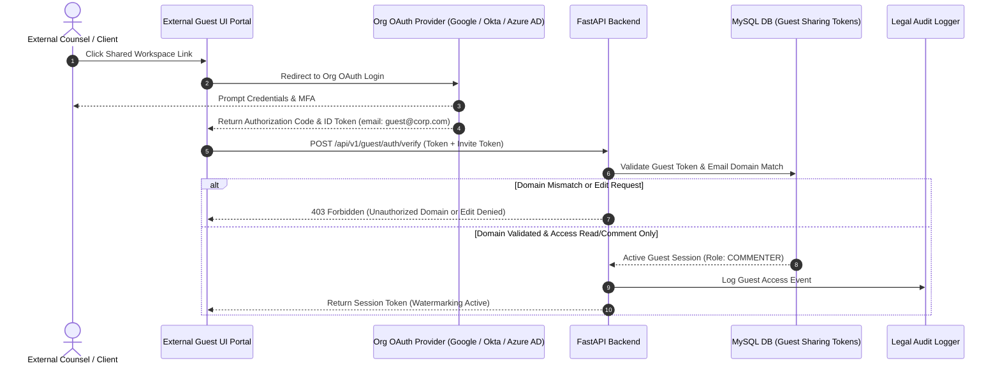

# [STORY-02] OAuth-Guarded Guest Collaboration (View/Comment Only Access)

**Epic Reference**: `C-14.2 External Guest Collaboration`  
**Target Release**: MVP Wave 1  
**GitHub Track ID**: `#LEGAL-STORY-02`

---

## 1. User Story & Personas

### 1.1 Personas Involved
- **Senior Advocate / External Legal Counsel**: Invited guest accessing shared draft briefs for review.
- **Client In-House Counsel**: External corporate legal team reviewing matter progress.
- **Law Firm Administrator**: Sets expiration dates and domain restrictions on external sharing links.

### 1.2 Story Statement
> **As a** Law Firm Advocate and External Guest (Senior Counsel / In-house Counsel),  
> **I want to** authenticate securely via OAuth against my organization email domain and access shared matter workspaces,  
> **So that** I can review documents and leave inline comments while strictly preventing any unauthorized edit access to firm documents.

---

## 2. Acceptance Criteria (AC)

- **AC-1 (Read/Comment Only Enforcement)**: External guests are strictly assigned `VIEWER` or `COMMENTER` role. Edit actions (`PUT /documents`, `DELETE /documents`, draft text modifications) return `403 Forbidden`.
- **AC-2 (OAuth Domain Validation)**: Guest access requires OAuth 2.0 / OIDC login validating that the guest's email domain matches the approved organization domain (e.g. `@corporatelaw.com`).
- **AC-3 (Time-Bound Sharing Tokens)**: Guest links automatically expire after a configurable duration (default: 7 days, max: 30 days).
- **AC-4 (Passcode & Watermarking)**: Shared documents accessed by guests render with dynamic security watermarking (Guest Email + IP Timestamp).
- **AC-5 (Access Logging)**: Every external guest login, view, and comment action is recorded in `LegalAuditLogDB`.

---

## 3. Data Flow Diagram (DFD)



---

## 4. UI Wireframes

### 4.1 External Guest Access & Watermarked View Wireframe

```
+---------------------------------------------------------------------------------------------------------+
| [WATERMARK: CONFIDENTIAL - READ ONLY - ADV. SHARMA - 07 AUG 2026]                                       |
| Shared Document: Written Submissions - Bail Petition (BNS 103)        Guest Role: [COMMENTER ONLY]       |
+---------------------------------------------------------------------------------------------------------+
| DOCUMENT VIEWER (READ-ONLY)                        | GUEST REVIEW COMMENTS                              |
|                                                    |                                                    |
| 1. The Applicant submits that the alleged       | 💬 Comment by Senior Counsel Adv. Sharma            |
|    offence under Section 103 of BNS [IPC 302]    | "The parity argument needs citation to the 2025    |
|    does not attract custodial interrogation...   |  Bombay High Court precedent."                     |
|                                                  |   [+ Add Reply]                                    |
| 2. Reliance is placed on State of UP v. Singh    | -------------------------------------------------- |
|    (2018) 4 SCC 120...                           | 🔒 EDITING DISABLED FOR EXTERNAL GUESTS            |
|                                                  | (OAuth Domain Verified: corporate-counsel.com)     |
+--------------------------------------------------+------------------------------------------------------+
| [Leave Comment]  [Download Watermarked PDF]  [Log Out]                                                  |
+---------------------------------------------------------------------------------------------------------+
```

---

## 5. Impact Analysis & Database Schema Changes

### 5.1 New Database Models (`backend/app/models/db_models.py`)

```python
class GuestShareTokenDB(Base):
    __tablename__ = "guest_share_tokens"

    id = Column(String(36), primary_key=True, default=generate_uuid, index=True)
    workspace_id = Column(String(36), ForeignKey("matter_workspaces.id", ondelete="CASCADE"), nullable=False, index=True)
    created_by = Column(String(36), ForeignKey("users.id"), nullable=False)
    allowed_email_domain = Column(String(255), nullable=False) # e.g. "corporatelaw.com"
    allowed_role = Column(String(32), default="COMMENTER") # STRICTLY COMMENTER or VIEWER
    passcode_hash = Column(String(255), nullable=True)
    expires_at = Column(DateTime(timezone=True), nullable=False)
    is_active = Column(Boolean, default=True)
    created_at = Column(DateTime(timezone=True), server_default=func.now(), nullable=False)
```

### 5.2 API Routes (`backend/app/api/guest/router.py`)
- `POST /api/v1/workspaces/{id}/share-link` — Create guest share token (Internal Advocate/Admin only).
- `POST /api/v1/guest/auth/verify` — OAuth validation callback for external guests.
- `GET /api/v1/guest/documents/{id}` — Stream watermarked document view for authenticated guests.
