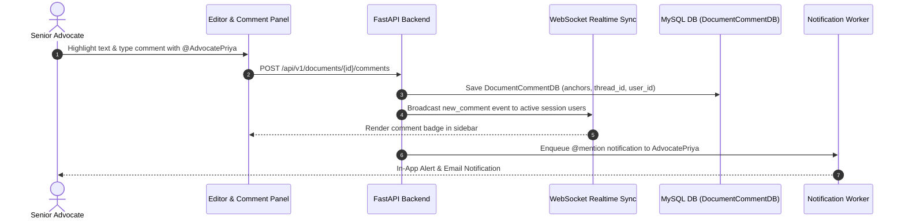

# [STORY-03] In-Context Multi-Threaded Legal Review Comments & Resolution Workflows

**Epic Reference**: `C-15 In-Context Legal Review Comments`  
**Target Release**: MVP Wave 1  
**GitHub Track ID**: `#LEGAL-STORY-03`

---

## 1. User Story & Personas

### 1.1 Personas Involved
- **Senior Advocate / Lead Counsel**: Highlights legal text in draft petitions, leaves precise review comments, and `@mentions` junior advocates.
- **Junior Advocate / Paralegal**: Resolves review comments, updates draft text, and submits updated revisions.
- **External Guest (View/Comment Only)**: Leaves feedback on shared briefs.

### 1.2 Story Statement
> **As an** Advocate reviewing a legal brief,  
> **I want to** select text ranges, attach multi-threaded review comments with team `@mentions`, and track comment resolution,  
> **So that** team feedback is context-anchored to exact paragraphs without cluttering the core document text.

---

## 2. Acceptance Criteria (AC)

- **AC-1 (Paragraph & Highlight Anchoring)**: Comments must be anchored to exact character ranges (`start_offset`, `end_offset`) and paragraph IDs within a document.
- **AC-2 (Multi-Threaded Replies & Mentions)**: Users can reply to comments in nested threads and `@mention` team members (triggering email/in-app notifications).
- **AC-3 (Resolution Workflow)**: Comments can be marked as `RESOLVED` or `REOPENED`. Resolved comments are hidden by default but remain in comment history.
- **AC-4 (One-Click Suggestion Accept)**: Text change suggestions in comments can be accepted with one click, updating draft text and logging the edit.
- **AC-5 (Role-Based Commenting)**: Internal `OWNER`, `EDITOR`, `COMMENTER` users and external guests with `COMMENTER` access can post comments. `VIEWER` users can only read comments.

---

## 3. Data Flow Diagram (DFD)



---

## 4. UI Wireframes

### 4.1 In-Context Inline Commenting Wireframe

```
+---------------------------------------------------------------------------------------------------------+
| Draft Written Submission - Supreme Court SLP (Criminal)                                 [Save v1.2]     |
+--------------------------------------------------+------------------------------------------------------+
| DOCUMENT TEXT                                    | REVIEW COMMENT THREADS                               |
|                                                  |                                                      |
| 1. The Petitioner submits that the High Court   | 💬 Comment by Adv. Rajesh (Senior) - 2 hours ago     |
|    erred in refusing anticipatory bail...        | [Anchored to: "refusing anticipatory bail"]          |
|    |=== Highlighted Text Range ===|              | "Mention the recent 2025 Constitution Bench judgment |
|                                                  |  on liberty under Article 21. @Priya"                |
| 2. Section 480 of BNSS [CrPC 438] confers       |   └─ 💬 Reply by Adv. Priya - 1 hour ago             |
|    unfettered power on the High Court...         |      "Added citation to Section 2. Resolution requested."|
|                                                  |   [Accept Suggestion]  [Mark Resolved]               |
+--------------------------------------------------+------------------------------------------------------+
| [Add Comment to Highlighted Text]                                                                       |
+---------------------------------------------------------------------------------------------------------+
```

---

## 5. Impact Analysis & Database Schema Changes

### 5.1 New Database Models (`backend/app/models/db_models.py`)

```python
class DocumentCommentDB(Base):
    __tablename__ = "document_comments"

    id = Column(String(36), primary_key=True, default=generate_uuid, index=True)
    document_id = Column(String(36), ForeignKey("ekp_documents.id", ondelete="CASCADE"), nullable=False, index=True)
    parent_comment_id = Column(String(36), ForeignKey("document_comments.id", ondelete="CASCADE"), nullable=True, index=True)
    paragraph_id = Column(String(64), nullable=True, index=True)
    start_offset = Column(Integer, nullable=True)
    end_offset = Column(Integer, nullable=True)
    highlighted_text = Column(Text, nullable=True)
    user_id = Column(String(36), ForeignKey("users.id"), nullable=False, index=True)
    comment_text = Column(Text, nullable=False)
    status = Column(String(32), default="OPEN") # OPEN, RESOLVED, REOPENED
    created_at = Column(DateTime(timezone=True), server_default=func.now(), nullable=False)
    updated_at = Column(DateTime(timezone=True), server_default=func.now(), onupdate=func.now())
```

### 5.2 API Routes (`backend/app/api/comments/router.py`)
- `POST /api/v1/documents/{id}/comments` — Add comment or reply.
- `GET /api/v1/documents/{id}/comments` — Fetch comment threads for document.
- `PATCH /api/v1/comments/{comment_id}/status` — Mark resolved / reopened.
