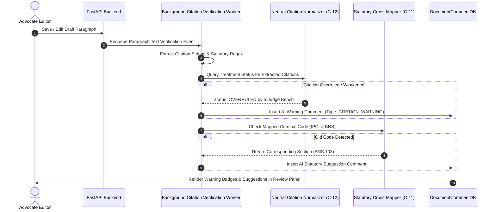

# [STORY-04] AI Citation Verification & Statutory Update Annotations

**Epic Reference**: `C-15.2 & C-15.3 AI-Assisted Annotations`  
**Target Release**: MVP Wave 1 / Wave 2  
**GitHub Track ID**: `#LEGAL-STORY-04`

---

## 1. User Story & Personas

### 1.1 Personas Involved
- **Lawyer / Advocate**: Drafting petitions or reviewing briefs, receiving real-time AI warnings on citation health.
- **Paralegal / Researcher**: Verifying precedent validity across historical drafts.
- **Judicial Officer**: Checking citation treatment (followed, distinguished, overruled).

### 1.2 Story Statement
> **As an** Advocate writing or reviewing a legal document,  
> **I want** the AI engine to automatically scan draft paragraphs and comments for legal citations and statutory codes,  
> **So that** I am immediately alerted if a cited precedent has been overruled or if an old criminal code (IPC/CrPC) needs updating to current statutory provisions (BNS/BNSS).

---

## 2. Acceptance Criteria (AC)

- **AC-1 (Real-time Citation Extraction)**: Background worker extracts case citations (e.g. `(2018) 4 SCC 120`, `2023 INSC 412`) from draft text and comment threads.
- **AC-2 (Precedent Health Check)**: Citation Normalization Engine (`C-12`) checks extracted citations against precedent treatment store. If precedent is `OVERRULED` or `DISTINGUISHED`, an AI warning comment is automatically attached.
- **AC-3 (BNS Statutory Annotation)**: Detects historical criminal code citations (e.g. `IPC 302`, `CrPC 438`, `IEA 27`) and inserts inline suggestions linking to corresponding new provisions (`BNS 103`, `BNSS 480`, `BSA 23`).
- **AC-4 (Non-Destructive Alert)**: AI warnings appear in the Review Panel as auto-generated annotations; document text is never automatically mutated without user approval.

---

## 3. Data Flow Diagram (DFD)



---

## 4. UI Wireframes

### 4.1 AI Citation & BNS Warning Panel Wireframe

```
+---------------------------------------------------------------------------------------------------------+
| Draft Written Submission - Criminal Appeal                                                              |
+--------------------------------------------------+------------------------------------------------------+
| DRAFT TEXT                                       | AI VERIFICATION & ANNOTATIONS                        |
|                                                  |                                                      |
| 2. Reliance is placed on State of UP v. Singh    | ⚠️ CITATION WARNING (Auto-generated by AI)           |
|    (2018) 4 SCC 120...                           | "State of UP v. Singh (2018) 4 SCC 120 was           |
|    └─ ⚠️ [AI Warning: Bad Law]                   |  OVERRULED by Constitution Bench in 2023 INSC 412." |
|                                                  |  [View Overruling Judgment] [Replace Citation]       |
| 3. Offence charged under Section 302 of IPC...   | ---------------------------------------------------- |
|    └─ 🔄 [AI Annotation: Statutory Mapping]      | 🔄 STATUTORY CODE UPDATE                             |
|                                                  | "IPC 302 corresponds to BNS 103 (Punishment for      |
|                                                  |  Murder). Update draft to reflect post-2024 law?"    |
|                                                  |  [Apply BNS 103 Update]  [Dismiss]                   |
+--------------------------------------------------+------------------------------------------------------+
```

---

## 5. Impact Analysis & Database Schema Changes

### 5.1 Model Updates (`backend/app/models/db_models.py`)

```python
class AICitationVerificationLogDB(Base):
    __tablename__ = "ai_citation_verifications"

    id = Column(String(36), primary_key=True, default=generate_uuid, index=True)
    document_id = Column(String(36), ForeignKey("ekp_documents.id", ondelete="CASCADE"), nullable=False, index=True)
    paragraph_id = Column(String(64), nullable=False)
    extracted_citation = Column(String(255), nullable=False)
    precedent_status = Column(String(64), nullable=False) # GOOD_LAW, OVERRULED, DISTINGUISHED
    overruling_case_id = Column(String(64), nullable=True)
    statutory_mapping_json = Column(JSON, nullable=True) # {"old": "IPC 302", "new": "BNS 103"}
    created_at = Column(DateTime(timezone=True), server_default=func.now(), nullable=False)
```

### 5.2 API Routes (`backend/app/api/verification/router.py`)
- `POST /api/v1/documents/{id}/verify-citations` — Trigger explicit AI citation verification check.
- `GET /api/v1/documents/{id}/citation-warnings` — Retrieve active AI warnings and statutory annotations.
