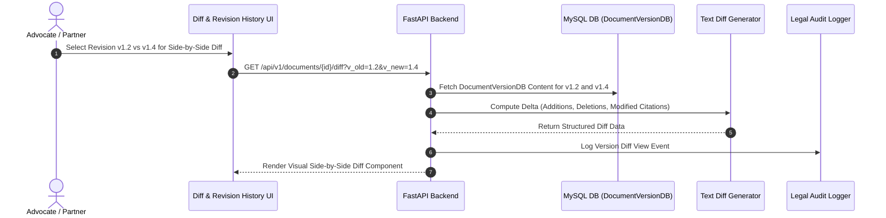

# [STORY-05] Legal Document Version History, Visual Side-by-Side Diff & Immutable Audit Trail

**Epic Reference**: `C-16 Legal Document History & Audit Trail`  
**Target Release**: MVP Wave 1 / Wave 2  
**GitHub Track ID**: `#LEGAL-STORY-05`

---

## 1. User Story & Personas

### 1.1 Personas Involved
- **Senior Advocate / Partner**: Compares draft versions side-by-side to review changes made by associates.
- **Junior Advocate**: Restores earlier revision snapshots if edits need reverting.
- **Law Firm Administrator / Auditor**: Inspects immutable audit logs for regulatory compliance and court submission tracking.

### 1.2 Story Statement
> **As a** Law Firm Advocate and Compliance Officer,  
> **I want to** view named document version snapshots, perform visual side-by-side diff comparisons, and inspect immutable audit logs,  
> **So that** all editing history is transparent, changes are audit-verifiable, and prior versions can be restored instantly without data loss.

---

## 2. Acceptance Criteria (AC)

- **AC-1 (Version Snapshots)**: Named version snapshots created automatically on major edits or manually saved (e.g. `v1.0 - Client Review`, `v2.0 - Senior Partner Edits`).
- **AC-2 (Visual Side-by-Side Diff)**: Users can select any two revisions and view a visual diff highlighting added text (green), deleted text (red), and modified citation anchors.
- **AC-3 (Version Restoration)**: Authorized users (`OWNER`, `EDITOR`) can restore any historical version as the current active draft.
- **AC-4 (Immutable Audit Log)**: Every document view, edit, comment, print, and export event is logged in `LegalAuditLogDB` with user ID, role, IP address, timestamp, and action parameters.
- **AC-5 (Statutory Alert on Old Drafts)**: Opening historical drafts older than 6 months triggers background check alerting if recent Supreme Court rulings impact referenced cases.

---

## 3. Data Flow Diagram (DFD)



---

## 4. UI Wireframes

### 4.1 Side-by-Side Visual Diff Wireframe

```
+---------------------------------------------------------------------------------------------------------+
| Document Diff: [Draft v1.2 (10 Aug 2026)] VS [Draft v1.4 (Current)]              [Restore v1.2]        |
+--------------------------------------------------+------------------------------------------------------+
| REVISION v1.2 (OLD)                              | REVISION v1.4 (CURRENT)                              |
|                                                  |                                                      |
| 1. The Applicant submits that offence under     | 1. The Applicant submits that offence under          |
|    -Section 302 of IPC- is not attracted.        |    +Section 103 of BNS [IPC 302]+ is not attracted. |
|                                                  |                                                      |
| 2. -Reliance is placed on State v. Ram (2010).-  | 2. +Reliance is placed on State v. Kumar (2024)      |
|                                                  |    INSC 105 [Bail Granted]+                          |
+--------------------------------------------------+------------------------------------------------------+
| Additions: +25 words | Deletions: -18 words | Citation Modifications: 2                             |
+---------------------------------------------------------------------------------------------------------+
```

---

## 5. Impact Analysis & Database Schema Changes

### 5.1 New Models (`backend/app/models/db_models.py`)

```python
class DocumentVersionDB(Base):
    __tablename__ = "document_versions"

    id = Column(String(36), primary_key=True, default=generate_uuid, index=True)
    document_id = Column(String(36), ForeignKey("ekp_documents.id", ondelete="CASCADE"), nullable=False, index=True)
    version_number = Column(Integer, nullable=False)
    version_label = Column(String(100), nullable=True) # e.g. "Draft v2.0 - Senior Counsel Review"
    content_text = Column(Text, nullable=False)
    created_by = Column(String(36), ForeignKey("users.id"), nullable=False)
    changes_summary_json = Column(JSON, nullable=True)
    created_at = Column(DateTime(timezone=True), server_default=func.now(), nullable=False)
```

### 5.2 API Routes (`backend/app/api/versions/router.py`)
- `GET /api/v1/documents/{id}/versions` — List version history timeline.
- `POST /api/v1/documents/{id}/versions` — Create manual named revision snapshot.
- `GET /api/v1/documents/{id}/diff` — Compute visual diff between two versions.
- `POST /api/v1/documents/{id}/versions/{version_id}/restore` — Restore historical revision.
