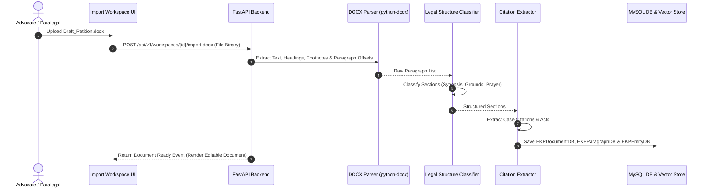

# [STORY-06] Word (.docx) Import with Legal Structure & Citation Auto-Extraction

**Epic Reference**: `C-17.1 High-Fidelity Word Import`  
**Target Release**: MVP Wave 1  
**GitHub Track ID**: `#LEGAL-STORY-06`

---

## 1. User Story & Personas

### 1.1 Personas Involved
- **Lawyer / Advocate**: Uploads external Word (`.docx`) petition drafts received from clients or opposing advocates.
- **Paralegal / Researcher**: Ingests case briefs into the workspace for AI citation check and analysis.

### 1.2 Story Statement
> **As an** Advocate or Paralegal,  
> **I want to** import Word (`.docx`) documents into a matter workspace,  
> **So that** document headings, legal structure, footnotes, and embedded citations are automatically extracted into a collaborative editable workspace with AI verification enabled.

---

## 2. Acceptance Criteria (AC)

- **AC-1 (High-Fidelity DOCX Parsing)**: Ingests `.docx` files using `python-docx`, preserving section headings, paragraph styles, numbered lists, and footnotes.
- **AC-2 (Legal Structure Auto-Classification)**: Automatically labels standard court submission sections (`Synopsis`, `List of Dates`, `Questions of Law`, `Grounds`, `Prayer`).
- **AC-3 (Automatic Citation Extraction)**: Scans imported text for case law citations (SCC, AIR, Neutral Citations) and statutory provisions, storing extracted entities in `EKPEntityDB`.
- **AC-4 (Parent-Child Paragraph Chunking)**: Split imported `.docx` text into searchable parent-child paragraphs for vector RAG indexing.
- **AC-5 (Async Import Job Tracking)**: Document imports over 20 pages run as asynchronous background jobs with live progress indicators (`Parsing` → `Structure Labeling` → `Citation Extraction` → `Ready`).

---

## 3. Data Flow Diagram (DFD)



---

## 4. UI Wireframes

### 4.1 Word (.docx) Import Modal & Processing Screen

```
+---------------------------------------------------------------------------------------------------------+
| Import Word (.docx) Document to Workspace [M-2026-089]                                                 |
+---------------------------------------------------------------------------------------------------------+
| Select File: [ Draft_Written_Submissions_SupremeCourt.docx ] (2.4 MB)                                  |
|                                                                                                         |
| IMPORT PROCESSING PIPELINE:                                                                             |
|  [✓] 1. Parsing File Structure & Headings ......................... DONE                               |
|  [✓] 2. Legal Section Classification (Synopsis / Grounds / Prayer) . DONE                               |
|  [🔄] 3. Extracting Case Citations & Statutory Codes ............... 78% (Found 12 Citations)            |
|  [ ] 4. Generating Parent-Child Vector Index ...................... PENDING                            |
|                                                                                                         |
| Preview Extracted Citations:                                                                            |
| • State of UP v. Singh (2018) 4 SCC 120 [Verified]                                                     |
| • Section 302 IPC [Mapped to BNS 103]                                                                   |
+---------------------------------------------------------------------------------------------------------+
| [Cancel]                                                           [Open Document in Editor]            |
+---------------------------------------------------------------------------------------------------------+
```

---

## 5. Impact Analysis & Database Schema Changes

### 5.1 New/Updated DB Models (`backend/app/models/db_models.py`)

```python
class DOCXImportJobDB(Base):
    __tablename__ = "docx_import_jobs"

    id = Column(String(36), primary_key=True, default=generate_uuid, index=True)
    workspace_id = Column(String(36), ForeignKey("matter_workspaces.id", ondelete="CASCADE"), nullable=False, index=True)
    filename = Column(String(255), nullable=False)
    file_size_bytes = Column(Integer, nullable=False)
    status = Column(String(32), default="PENDING") # PENDING, PROCESSING, COMPLETED, FAILED
    extracted_paragraphs_count = Column(Integer, default=0)
    extracted_citations_count = Column(Integer, default=0)
    created_by = Column(String(36), ForeignKey("users.id"), nullable=False)
    created_at = Column(DateTime(timezone=True), server_default=func.now(), nullable=False)
```

### 5.2 API Routes (`backend/app/api/import/router.py`)
- `POST /api/v1/workspaces/{id}/import-docx` — Upload and trigger async DOCX ingestion pipeline.
- `GET /api/v1/import-jobs/{job_id}` — Poll import job status and extracted citation summary.
