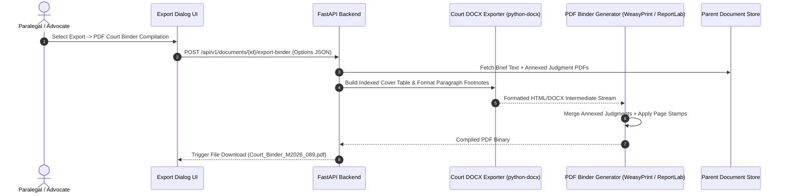

# [STORY-07] Court-Formatted Word (.docx) & Hyperlinked PDF Court Binder Exporter

**Epic Reference**: `C-17.2 & C-17.3 Export Engine`  
**Target Release**: MVP Wave 1  
**GitHub Track ID**: `#LEGAL-STORY-07`

---

## 1. User Story & Personas

### 1.1 Personas Involved
- **Paralegal / Law Clerk**: Prepares physical and digital court compilations for hearings.
- **Advocate**: Exports finalized petitions into court-standard Word (`.docx`) files matching High Court/Supreme Court filing rules.

### 1.2 Story Statement
> **As a** Paralegal or Advocate,  
> **I want to** export document briefs into court-standard Word (`.docx`) and hyperlinked PDF compilation binders,  
> **So that** court filings strictly adhere to Indian court margin/spacing rules and physical/digital binders include pagination-stamped index tables linking directly to annexed judgments.

---

## 2. Acceptance Criteria (AC)

- **AC-1 (Court-Standard DOCX Formatting)**: Exports `.docx` files configured to exact Indian High Court & Supreme Court filing rules (Legal/A4 paper size, 1.5 line spacing, 4cm left margin for binding, paragraph numbering).
- **AC-2 (Hyperlinked PDF Compilation Binder)**: Generates a single PDF combining the main brief, an automated Compilation Index Table, and full-text annexed judgments.
- **AC-3 (Bilingual Page Stamping)**: Applies continuous pagination stamping (e.g. `Page 1 of 145`) across the compiled PDF binder.
- **AC-4 (Footnote & Citation Resolution)**: Converts internal paragraph anchors into standard legal footnotes (e.g. SCC, AIR, Neutral Citations) during DOCX/PDF export.
- **AC-5 (DLP & Encryption Policy)**: Enforces firm DLP rules; sensitive client matters can be password-protected on PDF export.

---

## 3. Data Flow Diagram (DFD)



---

## 4. UI Wireframes

### 4.1 Export Court Binder Modal Wireframe

```
+---------------------------------------------------------------------------------------------------------+
| Export Court Filing Package [Matter: M-2026-089]                                                        |
+---------------------------------------------------------------------------------------------------------+
| Select Export Format:                                                                                   |
|  ( ) Court-Standard Word (.docx) — Double Spaced, 4cm Margin, Footnotes                                  |
|  (*) Hyperlinked PDF Court Binder Compilation (Brief + Index Table + Annexed Judgments)                  |
|                                                                                                         |
| Binder Compilation Options:                                                                             |
|  [✓] Include Automated Index Table of Authorities                                                       |
|  [✓] Annex full text of top 3 cited Supreme Court judgments                                              |
|  [✓] Apply continuous bottom-right pagination stamping                                                  |
|  [ ] Password protect PDF output                                                                        |
|                                                                                                         |
| Selected Annexures:                                                                                     |
|  1. State of UP v. Singh (2018) 4 SCC 120 (Annexure A-1, Pages 15-42)                                   |
|  2. Ramesh v. State (2024) INSC 412 (Annexure A-2, Pages 43-89)                                         |
+---------------------------------------------------------------------------------------------------------+
| [Cancel]                                                           [Generate & Download Binder PDF]     |
+---------------------------------------------------------------------------------------------------------+
```

---

## 5. Impact Analysis & Database Schema Changes

### 5.1 Model Updates (`backend/app/models/db_models.py`)

```python
class ExportLogDB(Base):
    __tablename__ = "export_logs"

    id = Column(String(36), primary_key=True, default=generate_uuid, index=True)
    workspace_id = Column(String(36), ForeignKey("matter_workspaces.id", ondelete="CASCADE"), nullable=False, index=True)
    document_id = Column(String(36), ForeignKey("ekp_documents.id"), nullable=False)
    export_format = Column(String(32), nullable=False) # DOCX_COURT, PDF_BINDER, JSON
    annexures_count = Column(Integer, default=0)
    page_count = Column(Integer, default=0)
    exported_by = Column(String(36), ForeignKey("users.id"), nullable=False)
    created_at = Column(DateTime(timezone=True), server_default=func.now(), nullable=False)
```

### 5.2 API Routes (`backend/app/api/export/router.py`)
- `POST /api/v1/documents/{id}/export-docx` — Generate court-formatted `.docx` file.
- `POST /api/v1/documents/{id}/export-binder` — Generate hyperlinked PDF compilation binder.
