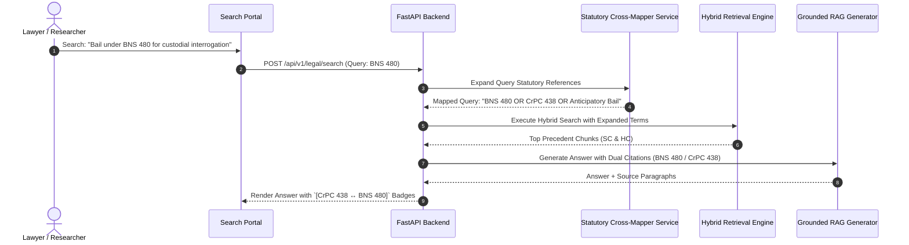

# [STORY-08] Criminal Law Statutory Cross-Mapping Engine (IPC/CrPC/IEA ↔ BNS/BNSS/BSA)

**Epic Reference**: `C-11 Statutory Cross-Mapping Engine`  
**Target Release**: MVP Wave 1  
**GitHub Track ID**: `#LEGAL-STORY-08`

---

## 1. User Story & Personas

### 1.1 Personas Involved
- **Lawyer / Advocate**: Researching criminal precedents or drafting filings post-July 2024 overhaul.
- **Paralegal / Law Clerk**: Converting historical case notes into new statutory terms.
- **B2C Legal Researcher**: Searching for criminal offences using layperson terms or old IPC section numbers.

### 1.2 Story Statement
> **As an** Advocate or Legal Researcher,  
> **I want** the search and query engine to automatically map and expand queries across old criminal codes (IPC, CrPC, Indian Evidence Act) and new criminal codes (BNS, BNSS, BSA),  
> **So that** historical precedents (e.g. IPC 302 cases) are seamlessly retrieved when searching under new sections (e.g. BNS 103) and vice-versa, with clear correspondence badges.

---

## 2. Acceptance Criteria (AC)

- **AC-1 (Bi-Directional Query Expansion)**: Queries containing `IPC 302` automatically expand to include `BNS 103`, and vice-versa, in vector and hybrid BM25 search queries.
- **AC-2 (Correspondence Badges)**: Search results and structured extracts display explicit correspondence badges (e.g. `[IPC 302 ↔ BNS 103 - Punishment for Murder]`).
- **AC-3 (Non 1:1 Mapping Handling)**: For split or merged provisions (e.g. IPC 420 split into BNS 318(4) & BNS 316), the system displays explanatory notes linking all related sections.
- **AC-4 (Mapping Versioning & Verification)**: Mappings are version-controlled; users can inspect the mapping source (Official Ministry of Home Affairs tables vs legal expert review).
- **AC-5 (Grounding in Generative Answers)**: Generative RAG responses citing criminal provisions cite both the historical precedent judgment and the corresponding current statutory code.

---

## 3. Data Flow Diagram (DFD)



---

## 4. UI Wireframes

### 4.1 Search Result with BNS Statutory Correspondence Badges Wireframe

```
+---------------------------------------------------------------------------------------------------------+
| 🔍 Search: "Pre-arrest bail under BNS 480"                             [Filter: Criminal Law v]          |
| ℹ️ Query Expansion Active: Searching BNS 480 + Corresponding CrPC 438 Precedents                       |
+---------------------------------------------------------------------------------------------------------+
| SEARCH RESULTS (34 Judgments Found)                                                                     |
|                                                                                                         |
| 1. Ramesh Kumar v. State of Maharashtra                                                                |
|    Supreme Court of India | 2025 INSC 114 | Bench: 3 Judges                                           |
|    🏷️ Statutory Mapping: [BNS 480 ↔ CrPC 438 (Anticipatory Bail)]                                      |
|    "Held that the principles governing anticipatory bail under Section 438 CrPC continue to apply       |
|     with full force to Section 480 of BNSS 2023..."                                                     |
|    [View Full Judgment]  [Extract Ratio]  [Save to Workspace]                                          |
|                                                                                                         |
| 2. ABC v. State (Delhi High Court - 2024)                                                               |
|    🏷️ Statutory Mapping: [BNS 103 ↔ IPC 302 (Murder)]                                                  |
+---------------------------------------------------------------------------------------------------------+
```

---

## 5. Impact Analysis & Database Schema Changes

### 5.1 New Models (`backend/app/models/db_models.py`)

```python
class StatutoryCrossMapDB(Base):
    __tablename__ = "statutory_cross_mappings"

    id = Column(String(36), primary_key=True, default=generate_uuid, index=True)
    old_act = Column(String(100), nullable=False, index=True) # IPC, CrPC, IEA
    old_section = Column(String(50), nullable=False, index=True)
    new_act = Column(String(100), nullable=False, index=True) # BNS, BNSS, BSA
    new_section = Column(String(50), nullable=False, index=True)
    mapping_type = Column(String(32), default="ONE_TO_ONE") # ONE_TO_ONE, SPLIT, MERGED
    description = Column(Text, nullable=True)
    source_reference = Column(String(255), default="MHA Official Comparative Table")
    is_verified = Column(Boolean, default=True)
    created_at = Column(DateTime(timezone=True), server_default=func.now(), nullable=False)
```

### 5.2 API Routes (`backend/app/api/statutes/router.py`)
- `GET /api/v1/statutes/cross-map` — Lookup corresponding section (e.g. `?act=IPC&section=302`).
- `POST /api/v1/statutes/expand-query` — Expand search query text with statutory cross-references.
