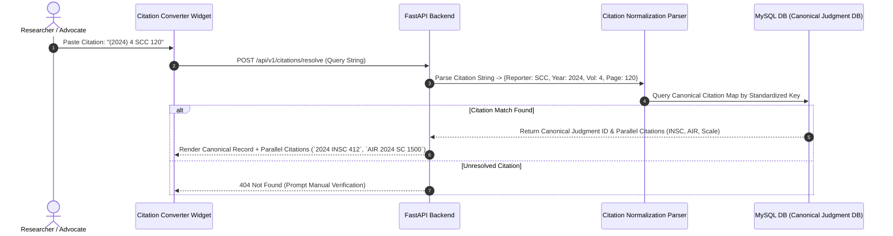

# [STORY-09] Neutral Citation Normalization & Deduplication Engine

**Epic Reference**: `C-12 Neutral Citation Normalization`  
**Target Release**: MVP Wave 1 / Wave 2  
**GitHub Track ID**: `#LEGAL-STORY-09`

---

## 1. User Story & Personas

### 1.1 Personas Involved
- **Paralegal / Researcher**: Typing or pasting messy citations (SCC, AIR, Scale, INSC) into search.
- **Lawyer / Advocate**: Verifying parallel citations across official neutral formats and commercial reporters.
- **System Admin**: Managing data quality and deduplication of judgment records.

### 1.2 Story Statement
> **As a** Legal Researcher or Advocate,  
> **I want** the system to resolve any citation style (SCC, AIR, Neutral INSC) to a canonical judgment record and link all parallel citations,  
> **So that** duplicate judgments are eliminated from search results and parallel citations are resolved automatically for court compilations.

---

## 2. Acceptance Criteria (AC)

- **AC-1 (Canonical Judgment Identity)**: Assigns a unique UUID canonical Judgment ID (`judgment_id`) to every ingested court judgment.
- **AC-2 (Citation Normalization Parser)**: Parses variant citation formats (e.g. `2024 INSC 412`, `(2024) 4 SCC 120`, `AIR 2024 SC 1500`) into a standardized structure (`reporter`, `year`, `volume`, `page`).
- **AC-3 (Parallel Citation Resolution)**: Given any one valid citation string, returns all known parallel citations for that judgment.
- **AC-4 (Metadata Deduplication)**: Prevents duplicate judgments from appearing in search results by matching court, date, party names, and bench strength.
- **AC-5 (Parallel Citation Converter UI)**: Provides a quick lookup widget where advocates can type any citation and receive ready-to-copy parallel citations for court index tables.

---

## 3. Data Flow Diagram (DFD)



---

## 4. UI Wireframes

### 4.1 Parallel Citation Converter Widget Wireframe

```
+---------------------------------------------------------------------------------------------------------+
| 🔍 Parallel Citation Converter & Verification Widget                                                     |
+---------------------------------------------------------------------------------------------------------+
| Enter Any Citation Format: [ (2024) 4 SCC 120                              ] [Resolve Parallel Citations]|
|                                                                                                         |
| CANONICAL JUDGMENT RESOLVED:                                                                            |
| 📜 Case Title: State of Maharashtra v. Ramesh Kumar & Ors.                                             |
| 🏛️ Court: Supreme Court of India | Date: 15 March 2024 | Bench: 3 Judges                                |
|                                                                                                         |
| KNOWN PARALLEL CITATIONS (Ready for Court Compilation):                                                |
|  [✓] Official Neutral Citation : 2024 INSC 412                    [Copy Citation]                      |
|  [✓] Supreme Court Cases       : (2024) 4 SCC 120                 [Copy Citation]                      |
|  [✓] All India Reporter        : AIR 2024 SC 1500                 [Copy Citation]                      |
|  [✓] SCALE Reporter            : 2024 (3) SCALE 88                [Copy Citation]                      |
+---------------------------------------------------------------------------------------------------------+
| [Copy All Parallel Citations to Clipboard]              [Generate Court Compilation Index Table]        |
+---------------------------------------------------------------------------------------------------------+
```

---

## 5. Impact Analysis & Database Schema Changes

### 5.1 New Models (`backend/app/models/db_models.py`)

```python
class CanonicalJudgmentDB(Base):
    __tablename__ = "canonical_judgments"

    id = Column(String(36), primary_key=True, default=generate_uuid, index=True)
    court_code = Column(String(50), nullable=False, index=True)
    case_number = Column(String(100), nullable=True, index=True)
    title = Column(String(500), nullable=False)
    judgment_date = Column(String(20), nullable=True, index=True)
    bench_strength = Column(Integer, default=1)
    neutral_citation = Column(String(150), unique=True, index=True, nullable=True) # e.g. 2024 INSC 412
    created_at = Column(DateTime(timezone=True), server_default=func.now(), nullable=False)


class ParallelCitationDB(Base):
    __tablename__ = "parallel_citations"

    id = Column(String(36), primary_key=True, default=generate_uuid, index=True)
    canonical_id = Column(String(36), ForeignKey("canonical_judgments.id", ondelete="CASCADE"), nullable=False, index=True)
    reporter_name = Column(String(50), nullable=False, index=True) # SCC, AIR, SCALE, INSC
    citation_string = Column(String(255), nullable=False, index=True)
    normalized_key = Column(String(255), unique=True, index=True) # e.g. "SCC_2024_4_120"
    created_at = Column(DateTime(timezone=True), server_default=func.now(), nullable=False)
```

### 5.2 API Routes (`backend/app/api/citations/router.py`)
- `POST /api/v1/citations/resolve` — Resolve input citation to canonical record and parallel citations.
- `GET /api/v1/citations/canonical/{id}` — Fetch canonical judgment details and parallel citation mapping.
