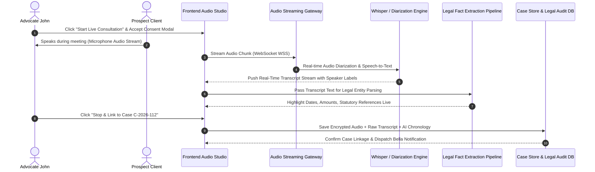

# [STORY-10] Live Client Meeting Audio Transcription & Case Intake Linkage

**Epic Reference**: `Team Collaboration, Review & Legal Workspace Engine`  
**Target Release**: MVP Wave 2  
**GitHub Track ID**: `#LEGAL-STORY-10`

---

## 1. User Story & Personas

### 1.1 Personas Involved
- **Lawyer / Advocate (John)**: Initiates live consultation recording with prospective or existing client; reviews diarized transcript, tags key facts, and saves meeting to case workspace.
- **Paralegal / Researcher (Bella)**: Processes saved client transcripts, verifies extracted facts/dates, converts dialogue into court-ready "Statement of Facts", and tracks assigned action items.
- **Client / Prospect (Meeting Guest)**: Participates in consultation call; provides mandatory recording & confidentiality consent.
- **Law Firm Administrator**: Audits privilege compliance metadata and enforces data retention & DLP policies on audio artifacts.

### 1.2 Story Statement
> **As an** Advocate or Paralegal,  
> **I want** to capture and transcribe live client consultations with real-time speaker diarization and automatic legal entity extraction,  
> **So that** I can instantly save meeting audio, transcripts, and auto-generated "Statement of Facts" directly into a new or existing Case Workspace under strict Attorney-Client Privilege safeguards without manual note-taking.

---

## 2. Acceptance Criteria (AC)

- **AC-1 (Consent & Privilege Guard Modal)**: Must present mandatory client consent verification modal before audio recording begins. Auto-applies `[ATTORNEY-CLIENT PRIVILEGED - CONFIDENTIAL]` header metadata and zero model retention flag.
- **AC-2 (Live Real-Time Transcription & Diarization)**: Streams audio via WebSockets/WebRTC, transcribing spoken dialogue in real-time with speaker labels (`Advocate John`, `Client Ramesh`, `Paralegal Bella`).
- **AC-3 (Legal Entity & Fact Extraction)**: Auto-detects dates, monetary amounts (INR), property identifiers, statutory sections (IPC, BNS, CrPC), and witness names, highlighting them inline in side panel.
- **AC-4 (Case Workspace Binding)**: Prompt user upon call completion to link recording & transcript to an existing Case Workspace (e.g. `C-2026-089`) or launch a **New Client Intake Case** (`C-2026-XXX`).
- **AC-5 (Automated Intake Synthesis)**: Automatically generates 3 case files upon saving:
  - `Raw_Audio_Transcript_Privileged.txt` (Encrypted AES-256).
  - `Client_Intake_Summary_and_Chronology.md` (Chronological Statement of Facts).
  - `Action_Items_and_Drafting_Tasks.md` (Assigned drafting tasks).
- **AC-6 (RBAC & Privilege Boundary)**: External guests are strictly barred from viewing or downloading raw audio transcripts unless granted explicit client access approval by Advocate Owner.

---

## 3. Data Flow Diagram (DFD)



---

## 4. UI Wireframe

```
+---------------------------------------------------------------------------------------------------------+
| ⚖️ LIVE CLIENT CONSULTATION | Prospect: Ramesh Gupta | Case: [ Select or Create New Intake ▼ ]           |
| 🟢 Live Audio Recording Active | Speaker: Advocate John | 🛡️ ATTORNEY-CLIENT PRIVILEGED                 |
+---------------------------------------------------------------------------------------------------------+
|                                                                                                         |
| 🎙️ LIVE DIARIZED TRANSCRIPT STREAM                   | 📊 EXTRACTED LEGAL FACTS & ENTITIES             |
|                                                      |                                                  |
| [00:04:12] Advocate John:                            | 📅 Dates Mentioned:                              |
| "What was the exact date of breach of contract?"     | • 14 January 2021 (Sale Deed Execution)          |
|                                                      | • 10 June 2025 (Notice Sent)                     |
| [00:04:18] Client Ramesh Gupta:                      |                                                  |
| "On 14th January 2021 when they refused payment      | 💰 Monetary Claims:                              |
| of ₹1.5 Crores at South Delhi Sub-Registrar office." | • ₹1,50,00,000 (1.5 Crore INR)                   |
|                                                      |                                                  |
| [00:04:30] Advocate John:                            | ⚖️ Statutory Codes Cited:                        |
| "Did you issue notice under Section 138 NI Act?"     | • IPC Sec 420 ➔ [BNS 318(4) Cheating]            |
|                                                      | • NI Act Sec 138 (Dishonour of Cheque)           |
|                                                      |                                                  |
| +--------------------------------------------------+ | 📌 PENDING ACTION ITEMS:                         |
| | [ 🛑 STOP & SAVE TO CASE ]    [ ⏸️ PAUSE ]       | | [x] Obtain certified copy of Sale Deed          |
| +--------------------------------------------------+ | [ ] Draft Legal Notice under BNS 318(4)          |
+---------------------------------------------------------------------------------------------------------+
```

---

## 5. Security & Legal Compliance Matrix

| Security Control | Implementation Standard | Compliance Rationale |
|------------------|-------------------------|----------------------|
| **Encryption at Rest** | AES-256 GCM encrypted audio storage | Bar Council client confidentiality compliance. |
| **Encryption in Transit** | TLS 1.3 / WSS (WebSockets Secure) | Protects live audio packets against interception. |
| **Data Retention Guard** | Zero LLM provider retention policy | Ensures client speech is never used for AI model training. |
| **Access Control** | RBAC restriction (Advocate & assigned Paralegal only) | Prevents cross-case legal privilege leaks. |
