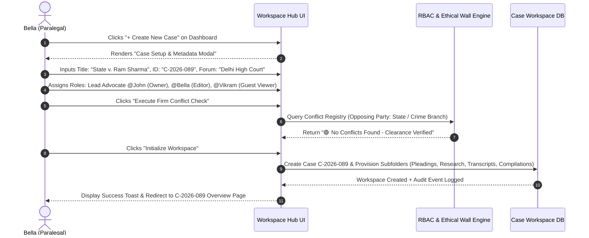
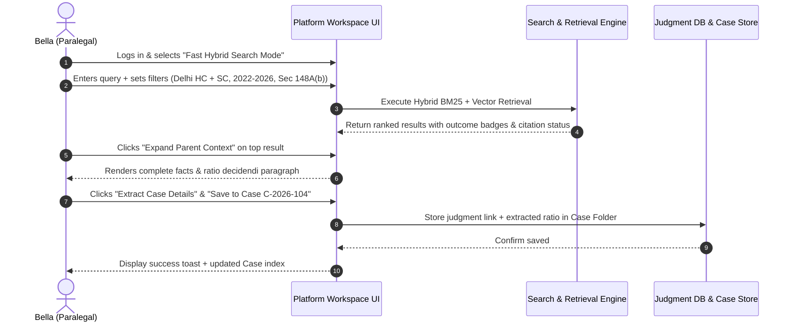
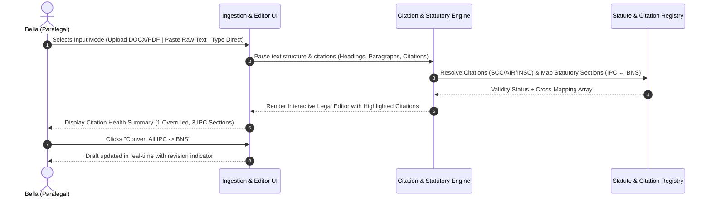
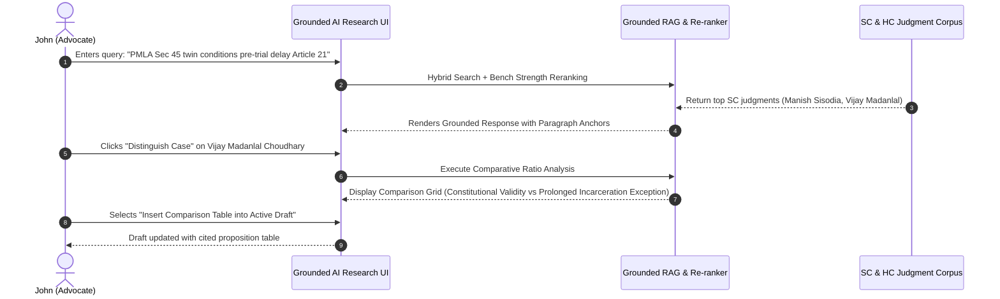
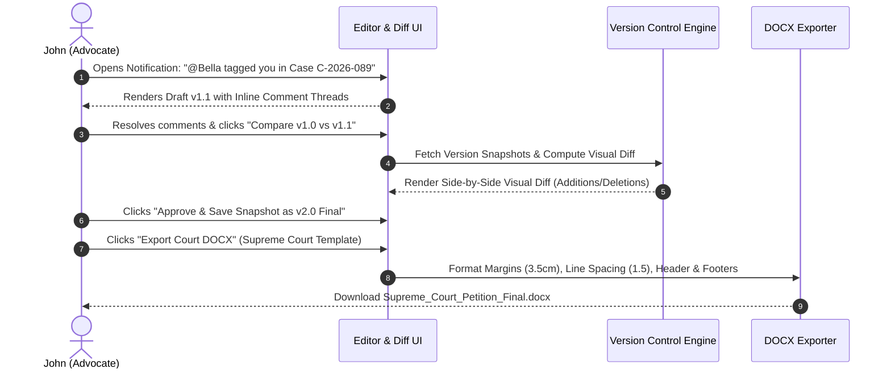

# Detailed User Journey Specifications: Bella (Paralegal) & John (Lawyer)

**Document Status:** Locked-In User Journeys (Pre-Implementation Baseline)  
**Date:** 07 August 2026  
**Target Platform:** Legal AI Research & Practice Support Platform (Indian Judiciary Focus)  
**Personas Covered:**  
- **Bella**: Paralegal / Legal Researcher / Law Clerk  
- **John**: Advocate / Senior Lawyer / Partner  

---

## 1. Executive Summary & Journey Principles

Before engineering design or code implementation begins, this document locks in the exact end-to-end user journeys for the primary legal platform personas. 

### Core Principles of User Journeys:
1. **Explicit Capabilities & Constraints**: Every persona has explicitly defined "Can Do" and "Cannot Do" capabilities.
2. **Step-by-Step Stepwise Execution**: Every workflow documents what the user sees, what action they take, how the platform responds, and how outcomes are achieved.
3. **No Implementation Leaks**: Focuses strictly on user behavior, choices, UI triggers, and business outcomes.
4. **Branching & Exception Handling**: Covers primary success paths, alternative choices, error messages, and security boundary enforcement (e.g., Ethical Walls, Guest permissions).

---

## 2. Persona 1: Bella (Paralegal / Legal Researcher)

### 2.1 Profile & Role Definition
Bella is a paralegal and legal researcher at a busy litigation firm (*LexJuris Advocates*). She handles heavy daily research tasks, reads long court judgments, extracts citations, prepares case compilations, and converts client Word documents into structured case files.

#### What Bella CAN Do:
- Perform hybrid/keyword and semantic searches across full Indian judgment database.
- Toggle between **B2C/Fast Search Mode (Non-LLM)** and **AI-Assisted Research Mode**.
- Filter search results by Court (SC, HC, District), Date Range, Judges, Act/Section, and Verdict Outcome tags (`[Bail Granted]`, `[Petition Dismissed]`).
- Expand child paragraph chunks into full parent sections (Facts, Issues, Reasoning, Order).
- Save search queries, judgments, and extracted ratio snippets into specific Case Workspaces.
- Import `.docx` legal briefs from lawyers/clients and trigger automated citation & statutory parsing.
- Review AI-extracted citations, verify parallel citations (SCC, AIR, Neutral Citations), and flag overruled cases.
- Build, format, and export Court Compilations / Binders (PDF with hyperlinked index table & paginated judgments).
- Add multi-threaded inline review comments on draft briefs and tag team advocates (`@John`).

#### What Bella CANNOT Do:
- Override Ethical Wall restrictions or access cases outside her assigned team group.
- Grant external guest access or change firm-wide seat permissions (Admin-only).
- Delete immutable compliance audit logs or modify historical snapshot versions.
- Sign off on final court filings or publish opinions without lawyer approval.

---

### 2.2 Bella’s Journey 0: Case Workspace Creation & Team Access Setup (`Case C-2026-089`)

#### Objective:
Bella receives instructions from Senior Advocate John to set up a new case workspace for a high-priority criminal bail petition (`State v. Ram Sharma`). Bella needs to create the case, configure case metadata, set up RBAC team permissions, run conflict checks, and provision legal subfolders.

#### Step-by-Step Walkthrough:

1. **Launching Case Creation Modal**:
   - Bella logs into the platform. From her **Workspace Hub** or top navigation bar, she clicks the **"+ Create New Case"** button (or presses `Cmd + Shift + N`).

2. **Entering Case Metadata & Classification**:
   - The system displays the **Case Setup Modal**. Bella enters:
     - **Case Name**: `State v. Ram Sharma`
     - **Case Reference ID**: `C-2026-089` (Auto-suggested based on firm sequence `C-YYYY-XXX`, fully editable).
     - **Practice Area / Category**: `Criminal Litigation / Bail Application under Sec 480 BNSS`.
     - **Court / Jurisdiction**: `High Court of Delhi (New Delhi)`.
     - **Client Name**: `Ram Sharma`.
     - **Opposing Party**: `State (NCT of Delhi)`.

3. **Assigning Team Roles & Permission Granularity**:
   - Bella configures team member access:
     - **Lead Advocate / Case Owner**: `@John` (Full Edit, Sign-off, and Sharing rights).
     - **Assigned Paralegal / Researcher**: `@Bella` (Edit, Upload, Citation Verification, Binder Export).
     - **External Senior Counsel (Guest)**: `@Vikram` (Strict View/Comment-Only, pending OAuth validation).

4. **Running Automated Conflict Check & Ethical Wall Declaration**:
   - Bella clicks **"Execute Firm Conflict Check"**.
   - The platform checks the opposing party (`State / Crime Branch`) against existing firm cases and restricted client lists.
   - System displays: `🟢 No Active Conflict Detected. Conflict clearance code: CC-2026-089-OK`.
   - Bella checks `[x] Conflict Clearance Verified & Ethical Wall Logged`.

5. **Workspace Folder Provisioning**:
   - Bella clicks **"Initialize Workspace"**.
   - The platform instantly provisions `Case C-2026-089` with standard legal subfolder structure:
     - `📁 01_Pleadings_&_Drafts/`
     - `📁 02_Client_Documents_&_Transcripts/`
     - `📁 03_Research_&_Judgments/`
     - `📁 04_Compilations_&_Binders/`

6. **Outcome Achieved**:
   - `Case C-2026-089` is created, team permissions locked, ethical wall audit logged, and workspace ready for research, DOCX imports, and client transcript linkages.

---

### 2.3 Bella’s Journey 1: Judgment Research & Structured Extraction (Non-LLM & Hybrid Mode)

#### Objective:
Bella is asked by Advocate John to find recent Supreme Court and Delhi High Court decisions on whether failure to grant an opportunity of hearing under Section 148A(b) of the Income Tax Act invalidates a re-assessment notice.

#### Step-by-Step Walkthrough:

1. **Platform Access & Clean Search Landing Page**:
   - Bella logs into the platform (`/legal`). She is greeted by a clean, minimalist landing page (in line with foundation LLM interfaces like ChatGPT/Claude).
   - In the center of the canvas is a single, prominent search input box with an integrated **Filter Icon (`🎛️ Filters`)**.
   - Grounding is hard-baked into backend architecture. Bella selects **"Search Judgments"** (direct precedent search without generative AI text).

2. **Query Input & Multi-Select Filter Drawer Expansion**:
   - In the central search bar, Bella types: `Section 148A(b) Income Tax Act opportunity of hearing principles of natural justice breach`.
   - She clicks the **Filter Icon (`🎛️ Filters`)** on the right side of the search input box. The **Multi-Dimensional Filters Drawer** expands smoothly below:
     - *Courts*: Selects `Supreme Court of India` and `High Court of Delhi`.
     - *Year Range*: Selects `2022 to 2026`.
     - *Statutory Sections (Multi-Select)*: Allows selecting multiple statutory sections simultaneously across old and new codes (e.g., `IPC Sec 302`, `BNS 103(1)`, `BNSS 480`, `Income Tax Act Sec 148A(b)`).
     - *Status Tag*: Selects `[Notice Quashed / Appeal Allowed]`.
   - Bella clicks **"Execute Search"** (or presses `Enter`).

3. **Reviewing 2-Row Results & Context Expansion**:
   - Platform presents 14 relevant judgments formatted in a clean 2-row card layout:
     - **Row 1 (Case Summary)**: 2-3 line ratio decidendi text snippet highlighting natural justice breach and Sec 148A(b) notice rules.
     - **Row 2 (Metadata & Actions Bar)**: Date (`14 Jan 2024`), Court (`Supreme Court`), Bench (`3-Judge Bench`), Parallel Citation (`(2022) 1 SCC 712`), Status Badge (`🟢 Good Law`), Outcome Tag (`[Re-Assessment Notice Quashed]`), and action buttons (`[📌 Save to Case]`, `[📖 Expand Context]`).
   - Bella clicks **"Expand Context"** on top result. A right slide-over panel opens smoothly displaying full case facts, issues framed, ratio decidendi, and holding order.

4. **Linking Search Result to Case Workspace (Existing vs New Case)**:
   - Bella clicks **"Save to Case"**. The **Save Precedent & Link to Case Modal** opens:
     - **Link Option**: Selects `(•) Link to Existing Case Workspace` (or toggles to `( ) Create & Link New Case Workspace`).
     - **Case Selection**: Selects `Case C-2026-104 (Sharma IT Appeal)` ➔ `📁 03_Research_&_Judgments`.
     - **Query String Auto-Attached**: System automatically records `"Section 148A(b) Income Tax Act opportunity of hearing"` and active filters (`SC + Delhi HC`, `2022-2026`) as metadata attached to the saved case record for future reference.
   - Bella clicks **"Save & Link to Case"**.

5. **Outcome Achieved**:
   - Bella retrieves, verifies, and links 4 binding precedents with search query context attached to `Case C-2026-104` in under 3 minutes, ready for brief preparation.

---

### 2.4 Bella’s Journey 2: Document Ingestion (Word .docx, PDF, Raw Text Paste, Direct Typing) & Citation Parsing

#### Objective:
Bella needs to process draft petition text—either by uploading a `.docx` / PDF file, pasting raw text, or typing directly into the Interactive Legal Editor—containing older criminal law references (IPC/CrPC) and citations. She needs to extract citations, verify validity, and cross-map sections to BNS/BNSS.

#### Step-by-Step Walkthrough:

1. **Flexible Document Entry & Petition Template Selection**:
   - Bella opens `Case C-2026-089 (State v. Ram Sharma)` and clicks **"+ New Draft Document"**.
   - The system presents 3 document entry options:
     - **Option A (File Upload)**: Drag & drop `.docx` or `.pdf` file (`Draft_Petition_v1.docx`).
     - **Option B (Paste Raw Text)**: Click **"Paste Text"** and paste raw legal text into text canvas.
     - **Option C (Direct Drafting & Templates)**: Click **"Create Blank Document"** and select a **Court Petition Template**:
       - `Supreme Court SLP (Crl) Template`
       - `High Court Bail Application Template (Sec 480 BNSS / Sec 439 CrPC)`
       - `High Court FIR Quashing Petition Template (Sec 528 BNSS / Sec 482 CrPC)`
       - `Written Submissions / Arguments Template`

2. **Automated Parsing & Health Report Generation**:
   - The platform processes the text structure in ~4 seconds and opens the draft in the **Interactive Legal Editor**.
   - On the right sidebar, the **"Citation & Statutory Health Report"** opens automatically:
     - **Citations Found**: 8 total citations extracted.
     - **Citation Status**: 7 `🟢 Good Law`, 1 `🔴 Overruled` (*State of Haryana v. Bhajan Lal (1992)* paragraph cited is restricted by *2024 SC 451*).
     - **Statutory Sections**: 4 IPC sections detected (Sec 302, Sec 420, Sec 120B, Sec 34).

3. **Statutory Cross-Mapping Resolution**:
   - Under the **Statutory Suggestions** card, Bella sees:
     - `IPC 302 (Murder) ➔ BNS 103(1)`
     - `IPC 420 (Cheating) ➔ BNS 318(4)`
     - `IPC 120B (Criminal Conspiracy) ➔ BNS 61(2)`
   - Bella clicks **"Apply All Statutory Cross-Mappings"**. The editor inline text replaces IPC references with BNSS/BNS equivalents while retaining original section in hover tooltip (`[BNS 103(1) (formerly IPC 302)]`).

4. **Multi-Format Export (Word .docx & Court PDF)**:
   - Once drafting and statutory conversions are complete, Bella can download the draft:
     - **Download Word (`.docx`)**: Preserves standard court formatting (double spacing, 1.5-inch margins, line numbers) for further offline editing.
     - **Download PDF**: Formats court-ready PDF with running headers and page numbers.

5. **Outcome Achieved**:
   - Bella successfully drafts or imports petition text, converts statutory codes to BNS/BNSS, verifies citations, and exports formatted `.docx` and `.pdf` files ready for senior advocate review.

---

### 2.4 Bella’s Journey 3: Court Binder Compilation & PDF Export

#### Objective:
Bella needs to compile the approved petition draft and 6 full-text judgments into a single, court-ready, paginated PDF compilation with an auto-generated Index Table conforming to Supreme Court filing specifications.

#### Step-by-Step Walkthrough:

1. **Selecting Compilation Materials**:
   - Inside `Case C-2026-089`, Bella opens the **"Compilations & Binders"** tab.
   - She selects checkboxes for:
     - [x] Approved Petition (`Draft_Petition_v1.2.docx`)
     - [x] Judgment 1: *Ashok Kumar v. State* (2024)
     - [x] Judgment 2: *Satender Kumar Antil v. CBI* (2022)
     - [x] 4 other bookmarked case judgments.
   - She clicks **"Create Court Binder"**.

2. **Configuring Binder Rules**:
   - In the **Binder Options Modal**, Bella sets:
     - *Preset*: `Supreme Court of India (Paperbook Template)`.
     - *Page Numbering*: Bottom center, continuous (`Page 1 of 142`).
     - *Running Header*: `IN THE SUPREME COURT OF INDIA - SLP (CRL.) NO. ____ OF 2026`.
     - *Index Table*: Enable **Automated Table of Authorities** (Item No., Description, Citation, Page Range).
     - *Stamp Watermark*: `OFF` (Clean final court copy).

3. **Previewing & Generating PDF Binder**:
   - Bella clicks **"Generate Preview"**. The platform renders a split-screen preview.
   - Page 1 contains the formatted **Index Table** with exact page references.
   - Hyperlinks in the Index Table jump directly to annexed judgments.
   - Bella clicks **"Export Court Compilation PDF"**.

4. **Outcome Achieved**:
   - A 142-page, fully indexed, hyperlinked, court-compliant PDF binder is generated in seconds, eliminating hours of manual printing and scanning.

---

### 2.5 Bella’s Journey 4: Processing Client Transcripts into Action Items & Statement of Facts

#### Objective:
Following Advocate John's meeting with a new prospective client, Bella receives notification that a raw meeting transcript is ready in the Intake Queue. She processes the transcript, verifies extracted statutory references and facts, generates a structured "Statement of Facts", and assigns action items.

#### Step-by-Step Walkthrough:

1. **Accessing Intake Queue**:
   - Bella opens her workspace dashboard and clicks **"Client Intake & Transcripts"**.
   - She sees a pending record: `Meeting Transcript - Prospect: Ramesh Gupta (Property Dispute) | Recorded 10:30 AM | Status: Raw Transcript Ready`.

2. **Reviewing Speaker Diarization & Entity Highlights**:
   - Bella opens the transcript editor. The system displays timestamped, speaker-diarized text:
     - `[00:04:12] John (Advocate)`: *"When was the registered sale deed executed?"*
     - `[00:04:18] Ramesh Gupta (Client)`: *"On 14th January 2021 at the Sub-Registrar office in South Delhi."*
   - Entity tags are automatically highlighted in blue and yellow: `[Date: 14-Jan-2021]`, `[Location: Sub-Registrar South Delhi]`, `[Disputed Amount: ₹1.5 Crores]`.

3. **Generating Statement of Facts & Action Items**:
   - Bella clicks **"Synthesize Statement of Facts"**.
   - The platform converts conversational dialogue into a chronological legal summary:
     - `1. On 14.01.2021, the Client executed Sale Deed No. 402/2021 for Property No. B-12 Vasant Vihar.`
     - `2. Disputed consideration amount of ₹1.5 Crores unpaid by Buyer.`
   - Under **Action Items**, Bella clicks **"Approve & Assign"**:
     - `[Action 1]` Obtain certified copy of Sale Deed 402/2021 -> Assigned to Bella.
     - `[Action 2]` Draft legal notice under Sec 138 NI Act / Sec 420 IPC (BNS 318(4)) -> Assigned to John.

4. **Outcome Achieved**:
   - Raw client dialogue is transformed into a structured, chronological court statement and task workflow attached to new case `C-2026-112`.

---

## 3. Persona 2: John (Lawyer / Advocate / Partner)

### 3.1 Profile & Role Definition
John is a Senior Associate / Partner at *LexJuris Advocates*. He drafts court petitions, prepares legal opinions, argues cases in the High Court and Supreme Court, and supervises junior advocates and paralegals.

#### What John CAN Do:
- Conduct deep, multi-turn **Grounded AI Conversational Research** with source paragraph verification.
- Trigger complex legal workflows: **"Distinguish this case"**, **"Find opposing precedent"**, and **"Generate Argument Map"**.
- View Judge & Bench Analytics (fact-based decision trends on specific statutory sections).
- Perform fast **Mobile Courtroom Lookups** during live court hearings.
- Edit draft petitions in real-time, accept/reject inline AI and paralegal suggestions.
- Compare any two draft versions using **Visual Side-by-Side Diff**.
- Share case workspaces with internal team members and invite external Senior Counsel as Viewers/Commenters.
- Export court-ready `.docx` files formatted to exact High Court / Supreme Court margin standards.te external Senior Counsel as Viewers/Commenters.
- Export court-ready `.docx` files formatted to exact High Court / Supreme Court margin standards.

#### What John CANNOT Do:
- Violate Ethical Wall blocks established by Firm Admins for client conflicts.
- Share restricted client documents with unauthorized third parties without guest authentication.
- Edit documents in read-only guest mode.

---

### 3.2 John’s Journey 1: Deep Grounded AI Research & Distinguishing Precedents

#### Objective:
During preparation for a bail hearing under PMLA (Prevention of Money Laundering Act), John needs to research whether twin conditions under Section 45 can be relaxed for prolonged pre-trial incarceration, find supporting Supreme Court precedents, and distinguish opposing judgments cited by the prosecutor.

#### Step-by-Step Walkthrough:

1. **Launching Conversational AI Research**:
   - John opens `Case C-2026-089` and clicks **"AI Research Assistant"**.
   - He types: `Can twin conditions under Section 45 PMLA be overridden by Article 21 due to prolonged delay in trial? Cite Supreme Court 3-judge bench decisions.`

2. **Reviewing Grounded Response**:
   - System returns a structured 3-paragraph answer:
     - *Paragraph 1*: Core rule stating Section 45 conditions do not restrict constitutional courts from granting bail where pre-trial detention violates Article 21.
     - *Inline Citation*: `Manish Sisodia v. Directorate of Enforcement, 2024 INSC 595 [¶ 24-28]`.
     - *Paragraph 2*: Reaffirmation in *Arvind Kejriwal v. ED, 2024 INSC 490 [¶ 15]*.
   - John hovers over `[¶ 24-28]`. A popup tooltip displays the exact verbatim text from the judgment. Clicking the anchor opens the full judgment pinned to paragraph 24.

3. **Executing "Distinguish Case" Workflow**:
   - The prosecutor cited *Vijay Madanlal Choudhary (2022)* against John's client.
   - John clicks **"Distinguish Precedent"** button next to *Vijay Madanlal Choudhary*.
   - System prompts: *Select judgment to compare against*. John selects *Manish Sisodia (2024)*.
   - System generates a **Side-by-Side Distinction Table**:
     - *Issue*: Application of Section 45 PMLA during prolonged custody without trial commencement.
     - *Vijay Madanlal Choudhary (2022)*: Upheld constitutional validity of Sec 45 twin conditions; did not address prolonged delay as standalone Article 21 ground.
     - *Manish Sisodia (2024)*: Clarified that statutory bars under Sec 45 yield to fundamental right under Article 21 when delay is not attributable to accused.
     - *Precedential Hierarchy*: *Manish Sisodia* (2-judge) follows principles laid down in *Union of India v. K.A. Najeeb (3-judge)*; binding on High Courts.

4. **Inserting Analysis into Petition**:
   - John clicks **"Insert Distinction Table into Draft Brief"**. The generated distinction analysis is cleanly appended to Section IV (Grounds for Bail) of his active petition draft.

5. **Outcome Achieved**:
   - John builds an unassailable legal argument distinguishing opposing precedents with exact paragraph references in under 5 minutes.

---

### 3.3 John’s Journey 2: Mobile Courtroom Lookup during Live Hearing

#### Objective:
While standing before the Delhi High Court Bench in Courtroom 3, the judge asks John: *"Counsel, has the Supreme Court clarified whether Section 482 CrPC petitions survive after filing of charge-sheet under BNSS?"* John needs an instant, mobile-verified answer in seconds.

#### Step-by-Step Walkthrough:

1. **Opening Mobile Courtroom Mode**:
   - John pulls out his smartphone and opens the mobile web interface.
   - He taps the **"Mobile Courtroom Fast Mode"** icon on the top bar. The UI switches to a high-contrast, low-bandwidth, extra-large font view.

2. **Voice/Text Quick Lookup**:
   - John taps the mic or types: `Sec 482 CrPC quashing after chargesheet filed BNSS SC ruling`.
   - He taps **"Search"**.

3. **Instant Verified Result**:
   - In **2.8 seconds**, the screen displays top 2 binding citations in large, clear text:
     - **Anand Kumar Mohatta v. State (2019) 11 SCC 706 [¶ 16]**: *"Petition under Sec 482 for quashing FIR is maintainable even after chargesheet is filed."*
     - Status: `🟢 GOOD LAW | Followed in 2025 INSC 112`.
   - John reads paragraph 16 directly to the judge from his mobile screen.

4. **Outcome Achieved**:
   - John addresses the judge's query instantly during live proceedings without fumbling through paper volumes.

---

3.4 John’s Journey 3: Collaborative Review, Version Diff & Final Court Export

#### Objective:
John receives notification that Bella added review comments and statutory updates on `Draft_Petition_v1.docx`. John reviews comments, runs a visual diff against version 1.0, approves changes, and exports the final file to Word formatted per Supreme Court rules.

#### Step-by-Step Walkthrough:

1. **Reviewing Inline Comments & Notifications**:
   - John opens his notification bell, clicks **"Bella tagged you in C-2026-089"**.
   - The editor opens directly to paragraph 14 with Bella's comment focused:
     - *Bella's Comment*: `@John Note: The specific proposition cited here was distinguished in 2024 INSC 451. Suggest updating citation.`
   - John clicks **"View Suggested Replacement Citation"**. AI presents *State of WB v. Sampad (2024)*.
   - John clicks **"Accept Suggestion & Replace Text"**. The comment is automatically marked as `Resolved`.

2. **Visual Version History Diff**:
   - John opens the **Version History** drawer.
   - He selects `v1.0 (Original Import)` and `v1.1 (Bella Edits + AI Statutory Conversion)` and clicks **"Visual Diff"**.
   - The screen switches to **Side-by-Side Diff View**:
     - *Left Pane*: Original text with IPC sections highlighted in red deletions.
     - *Right Pane*: Updated text with BNS sections and verified citations highlighted in green additions.
   - Satisfied, John clicks **"Save Revision Snapshot"** and labels it `v2.0 - Final Approved Brief`.

3. **Exporting Court-Ready Word (.docx)**:
   - John clicks **"Export Document"** ➔ **"Court-Formatted DOCX"**.
   - In the settings dropdown, he selects `Supreme Court of India (Standard Paperbook)`.
     - *Font*: Times New Roman / Georgia, 14pt.
     - *Line Spacing*: 1.5.
     - *Margins*: Left 3.5 cm (Binding Margin), Right 2.5 cm, Top 2.5 cm, Bottom 2.5 cm.
     - *Paragraph Numbering*: Auto-indented legal numbering (`1.`, `1.1`, `1.2`).
   - John clicks **"Download DOCX"**.

4. **Outcome Achieved**:
   - John exports a perfectly formatted, legally sound, citation-verified Word document ready for print and court filing.

---

### 3.5 John’s Journey 4: Live Client Meeting Audio Transcription & Intake Linkage

#### Objective:
John meets with a prospective client (*Mr. Ramesh Gupta*) in his office (or via virtual call). John needs to record and transcribe the live consultation, capture speaker diarization, automatically tag key legal entities/dates, and save the transcript directly to a new or existing Case Workspace under strict Attorney-Client Privilege safeguards.

#### Step-by-Step Walkthrough:

1. **Initiating Live Transcription & Consent Check**:
   - John opens his laptop or tablet, clicks **"Live Client Consultation"** on his landing page.
   - The platform presents a mandatory **Consent & Confidentiality Modal**:
     - `[x] Client consent obtained for confidential transcription`.
     - `[x] Apply [ATTORNEY-CLIENT PRIVILEGED - CONFIDENTIAL] metadata tag`.
     - `[x] Confirm Zero LLM Model Training Retention`.
   - John clicks **"Start Live Transcription"**.

2. **Real-Time Diarization & Entity Highlighting**:
   - As John and Mr. Gupta converse, the screen streams real-time text with active speaker labels:
     - `[Speaker 1 - Advocate John]`: *"What was the exact date of breach of contract?"*
     - `[Speaker 2 - Client Ramesh Gupta]`: *"14th January 2021 when they refused payment of ₹1.5 Crores."*
   - System auto-highlights entities live in side panel:
     - `[Date Extracted]`: 14 January 2021
     - `[Monetary Claim]`: ₹1,50,00,000 (1.5 Crore INR)
     - `[Legal Issue Detected]`: Breach of Contract / Criminal Breach of Trust (IPC 406 / BNS 316)

3. **Linking to Case Workspace & Auto-Generating Intake Notes**:
   - Meeting ends. John clicks **"Stop & Save Consultation"**.
   - System prompts: *Link transcript to existing case or create new intake?*
   - John selects **"Create New Intake Case"**, types Title: `C-2026-112: Ramesh Gupta v. Apex Realty`.
   - Platform automatically generates and saves 3 artifacts into `C-2026-112`:
     1. `Raw_Audio_Transcript_Privileged.txt` (Encrypted AES-256).
     2. `Client_Intake_Summary_and_Chronology.md`.
     3. `Action_Items_and_Drafting_Tasks.md`.
   - System automatically dispatches notification to Paralegal Bella to review intake notes and pull relevant precedents.

4. **Outcome Achieved**:
   - Full client consultation transcribed, auto-categorized into legal facts, and bound securely to a new case workspace with legal privilege protection in 1 click.

---

## 4. Persona Capability & Permission Matrix (Can Do vs Cannot Do)

The table below summarizes the strict permission boundaries between Bella (Paralegal), John (Lawyer/Partner), and Law Firm Admins:

| Capability / Workflow | Bella (Paralegal) | John (Lawyer / Partner) | Guest (External Senior Counsel) | Firm Admin |
|-----------------------|-------------------|-------------------------|---------------------------------|------------|
| **Search Judgment Corpus (Hybrid/Semantic)** | ✅ Yes | ✅ Yes | ✅ Yes (Within shared case) | ✅ Yes |
| **Grounded AI Conversational Research** | ✅ Yes | ✅ Yes | ❌ Read-Only Answers | ✅ Yes |
| **Save / Organize Case Workspaces** | ✅ Yes | ✅ Yes | ❌ Read-Only | ✅ Yes |
| **Import Word (.docx) & Extract Citations** | ✅ Yes | ✅ Yes | ❌ Cannot Upload | ✅ Yes |
| **Statutory Cross-Mapping (IPC ↔ BNS)** | ✅ Yes | ✅ Yes | 👁️ View Only | ✅ Yes |
| **Live Client Audio Transcription & Diarization** | ✅ Yes (Assigned calls) | ✅ Yes (Initiate/Record) | ❌ Restricted | ✅ Admin Audit Only |
| **Link Transcript to Case Workspace** | ✅ Yes | ✅ Yes | ❌ Restricted | ✅ Yes |
| **Generate Auto-Intake Statement of Facts** | ✅ Yes | ✅ Yes | 👁️ View Only | ✅ Yes |
| **Leave Inline Review Comments & Tag Users** | ✅ Yes | ✅ Yes | ✅ Yes (Comment-Only) | ✅ Yes |
| **Accept/Reject Draft Revisions** | ❌ Pending Lawyer Sign-off | ✅ Yes | ❌ Read-Only | ✅ Yes |
| **Export Court PDF Binders & DOCX** | ✅ Yes | ✅ Yes | ❌ Export Disabled | ✅ Yes |
| **Configure Ethical Walls & Seats** | ❌ Restricted | ❌ Restricted | ❌ Restricted | ✅ Yes |
| **View Audit Trail & Activity Logs** | ❌ Own Activity Only | ✅ Team Case Activity | ❌ Restricted | ✅ Full Firm Audit |

---

## 5. Edge Cases, Failure Modes & System Safeguards

### 5.1 Zero-Hallucination Safeguard
- **Scenario**: A user asks for a precedent on a niche point of law not present in the ingested judgment corpus.
- **Platform Behavior**: The system displays a clear banner:  
  `⚠️ Insufficient Legal Precedent in Corpus: No binding Supreme Court or High Court judgment was found directly matching this proposition. The AI will not generate hypothetical citations.`

### 5.2 Ethical Wall Boundary Attempt
- **Scenario**: Bella or John attempts to open `Case C-2026-012` where their firm has declared a client conflict.
- **Platform Behavior**: Access is blocked immediately with message:  
  `🛡️ Access Restricted (Ethical Wall Enforced): You do not have permission to view this workspace due to active firm conflict-of-interest rules. Contact your Administrator.`

### 5.3 Low-Bandwidth Courtroom Re-connection
- **Scenario**: John experiences network drop during a live courtroom query on his mobile device.
- **Platform Behavior**: Mobile Courtroom Mode caches top 50 landmark citations locally on the device, allowing instant offline lookup of core statutory sections and landmark ratios.

---

## 6. Verification & Sign-off Criteria

To consider these user journeys locked for implementation, the technical architecture and UI/UX designs must satisfy:
1. Every UI action tile on the landing page matches a step in Bella or John's workflow.
2. Every API endpoint maps directly to a user journey step (e.g. `/api/v1/search/hybrid`, `/api/v1/docx/import`, `/api/v1/binder/export`).
3. Permission enforcement in RBAC middleware validates every "Cannot Do" boundary defined in Section 4.
