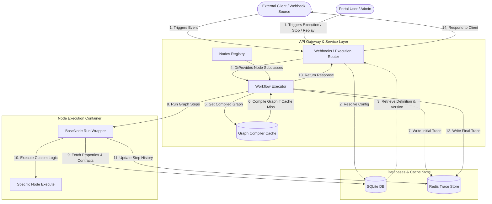
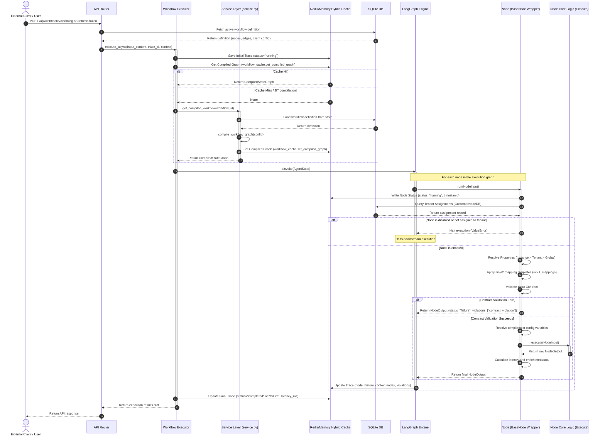
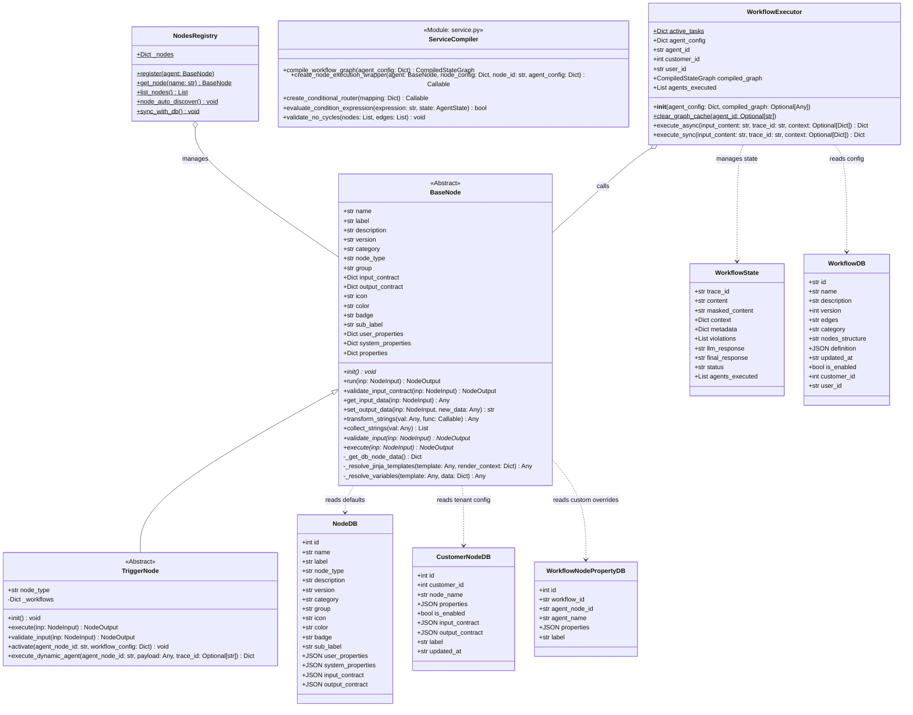

# Product Requirements Document (PRD): Workflow Execution Engine

## Document Metadata
* **Document ID:** PRD-EXEC-001  
* **Title:** Workflow Execution Engine Specification  
* **Status:** Under Review  
* **Version:** 1.0.0 (Living Document)  
* **Author:** AdiTech (Lead Architect) & AdI Jain (Business Analyst)  
* **Target Release:** v0.4.0  

---

## 1. Executive Summary

The **Workflow Execution Engine** is the core orchestration layer of the Enterprise LLM Gateway. Built on top of `langgraph`, it enables multi-tenant, dynamic, and stateful execution of workflows composed of heterogeneous nodes (Triggers, LLMs, Guardrails, DB Connectors, Vector DBs, Custom Agents). 

This document provides a comprehensive blueprint of the execution engine. It covers the end-to-end execution lifecycle, runtime routing, property resolution rules, contract validation, and integration boundaries. It serves as a living document to guide future feature updates, performance optimizations, and security patches.

---

## 2. Parent Epics & Reference Documents

The execution engine implementation coordinates several features defined in the following epics:

* **[Epic: Workflow Observability, Run Control, and Multi-Version Commits](file:///Users/vivekjain/projects/enterprise-llm-gateway/epic/epic_workflow_observability_control.md)**: Outlines the design for trace indexing, stopping/cancelling executing workflows, and replay controls.
* **[PRD: Workflow Observability and Run Control (Part 1)](file:///Users/vivekjain/projects/enterprise-llm-gateway/epic/prd_workflow_observability.md)**: Defines functional requirements for real-time node monitoring, payload auditing, and Redis logging.
* **[Epic: Support for Multiple Entry Points (Triggers) per Workflow](file:///Users/vivekjain/projects/enterprise-llm-gateway/epic/epic_multiple_triggers.md)**: Specifies the support for multiple triggers per canvas and how runtime graph execution selects the correct starting node.
* **[Epic: Tenant & Owner Scoped Observability Logging](file:///Users/vivekjain/projects/enterprise-llm-gateway/epic/epic_tenant_scoped_logging.md)**: Outlines security partitioning of execution logs using multi-tenant Redis indexes.
* **[Epic: Simple Customer Node Assignment & Onboarding Scoping](file:///Users/vivekjain/projects/enterprise-llm-gateway/epic/epic_customer_nodes.md)**: Details the explicit node entitlement mapping for customers using the `customer_nodes` schema.

---

## 3. Core Feature List

| ID | Feature Name | Description | Requirements / Constraints |
|:---|:---|:---|:---|
| **FE-1** | **Dynamic Graph Construction** | Parses JSON-defined workflow structures (nodes, edges) and compiles them into executable LangGraph state machines. | Must perform cycle detection (DFS validation) on compile. Caches compiled graphs globally using `agent_id` to avoid rebuild overhead. |
| **FE-2** | **Multi-Tenant Scoping & Control** | Restricts node execution based on customer entitlements and active tenant limits. | Queries `customer_nodes` at runtime. Halts execution with an authorization error if a node is disabled or not assigned to the tenant. |
| **FE-3** | **Standardized Node Lifecycle** | Executes every node through a five-step lifecycle: Property Resolution, Mapping Translation, Input Contract Validation, Variable Replacement, and Execution. | Enforced by the `BaseNode.run()` wrapper. Handles exceptions gracefully by appending a `node_exception` violation instead of crashing the process. |
| **FE-4** | **Jinja2 Mapping Templates** | Dynamically resolves and maps outputs of preceding nodes (or global context) into the input of subsequent nodes. | Supports nested fields, array index maps (e.g. `root[].field`), and standard Python castings. |
| **FE-5** | **Input Contract Validation** | Validates node inputs against schemas defined in the Node Catalog or overridden by the Tenant Admin. | Emits `contract_violation` status code 400 and halts execution if constraints are breached. |
| **FE-6** | **In-Flight Redis Trace Store** | Logs real-time step transitions, inputs, outputs, and status to Redis trace keys. | Emits status transitions: `running` -> `success`, `failure`, `exception`, or `stopped`. TTL expires in 24 hours. |
| **FE-7** | **Active Task Registry & Interruption** | Registers active coroutines in an in-memory dictionary to support immediate task cancellation. | Maps `trace_id -> asyncio.Task`. Handles `asyncio.CancelledError` and marks the trace as `Stopped`. |
| **FE-8** | **Failed Task Replay** | Re-triggers failed workflows with identical inputs using lineage mapping. | Generates a new `trace_id` while linking to the original `parent_trace_id` in metadata. |

---

## 4. Property Resolution & Configuration Precedence

Properties define how nodes behave. The gateway enforces three layers of configuration:
1. **Global Default Properties (`NodeDB`):** Set by System Admins.
2. **Tenant Overrides (`CustomerNodeDB`):** Configured by Tenant Admins (excluding locked system properties).
3. **Workflow Instance Properties (`WorkflowNodePropertyDB`):** Custom parameters set on the canvas.

During runtime, the execution engine resolves properties using the following strict priority order (higher priority overrides lower priority):

$$\text{Instance-Level Overrides} \succ \text{Tenant-Level Custom Configuration} \succ \text{Global Node Defaults}$$

> [!IMPORTANT]
> **System Properties Isolation:**  
> Infrastructure settings (e.g., `port`, `host`, `timeout_ms`) are defined under `system_properties` in `NodeDB`. These are sacrosanct and cannot be overridden by tenant admins or workflow designers. The system explicitly strips them from save requests made by non-system-admins.

---

## 5. System Diagrams

### 5.1 Data Flow Diagram (DFD)

This diagram visualizes how data flows from external clients or event sources through the API routers, databases, execution handlers, and observability stores during execution.

---

### 5.2 Sequence Diagram: End-to-End Workflow Run

This diagram outlines the synchronous/asynchronous lifecycle of a workflow execution, detailing the operations performed at the node execution boundaries.

---

### 5.3 Class Diagram

This diagram maps the Python classes responsible for building and executing workflows, alongside the SQLAlchemy ORM models they interact with.

